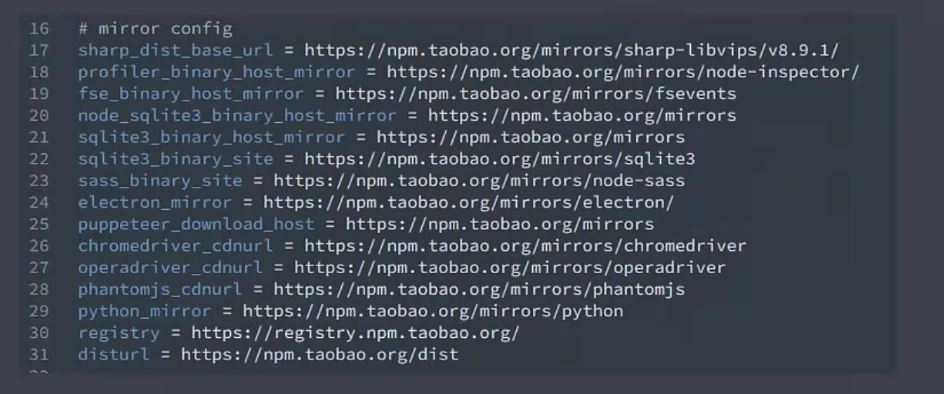

## Sub Generator

Sub Generator是yeoman提供的一个生成器，主要用于实现在已有项目上创建一些特定类型的文件，比如ES-Lint，README，babel等配置文件，这个生成器可以自动生成这些文件。

```bash
# 使用yeoman运行subGenerator
yo node:cli
```
运行以后会提示是否更新packag.json，更新以后package.json会添加如下内容

```json
"bin": "lib/cli.js",
"dependencies": {
    "meow": "^3.7.0"
}
```
除此之外，在lib目录下的cli.js中里面提供了cli应用的基础代码结构，这样以后就可以将这个模块作为一个全局的命令行模块使用了

我们可以将该cli链接到全局范围内

```bash
# 将该cli link到全局范围
yarn link

# 如果没有安装依赖，可以通过yarn依赖
yarn
```

然后就可以使用之前创建的名字来使用该cli了，这是generator提供的子集生成器提供的，但是并不是每一个generator都提供自己生成器。所以在使用之前需要查看文档该generator是否提供了子集生成器。

## yeoman的使用步骤

1. 明确你的需求
2. 找到合适的Generator,在[yeoman官网](yeoman.io/generators)中查找
3. 全局范围安装找到的Generator
4. 通过yo运行对应的Generator
5. 通过命令行交互填写选项
6. 生成你所需要的项目结构
   
可以根据对应的镜像源下载对应的包，[常见镜像源](https://www.jianshu.com/p/2e3242cd51be)




