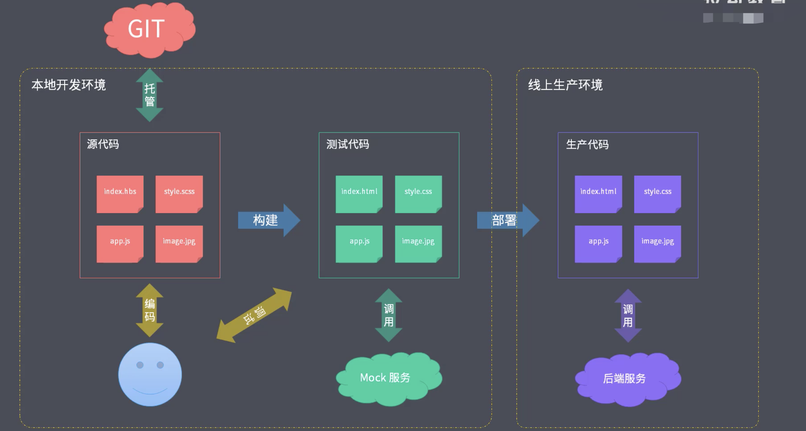

## 工程化 != 工具

目前大多数开发人员有一种错觉，把某些工具当做了工程化，比如：只要使用了webpack就是工程化，但它其实只是工具。

工具并不是工程化的核心，其核心是对项目的整体规划或者架构，而工具只是实现这种规划或者架构的手段。

以一个普通的项目为例

首先规划项目整体的工作流框架，包括文件的组织结构、源代码的开发范式（即开发中使用的语法、规范和标准来编写代码），前后端分离的方式。

有了规划以后再具体考虑搭配的工具和配置选项来实现。

## 成熟的工程化集成

- create-react-app
- vue-cli
- angular-cli
- gatsby-cli

以上几种不是简单的脚手架，不同于之前的工具，这里的工具其实是对于特定类型的项目，官方给出的集成式工程化方案

例如vue-cli，不仅帮我们创建了项目，更重要的是约定了项目的结构，并且还提供了工具，热更新服务、自动编译vue的单文件组件（vue-loader）以及其他的模块文件（less-loader、sass-loader等），除此之外还有代码风格和的校验（ES-lint），这些都集成在vue-cli中。

所以这些工具，重要的还是创建项目后提供的一系列集成服务，而这就是工程化中的主要维度，也叫做工程化的集成。
