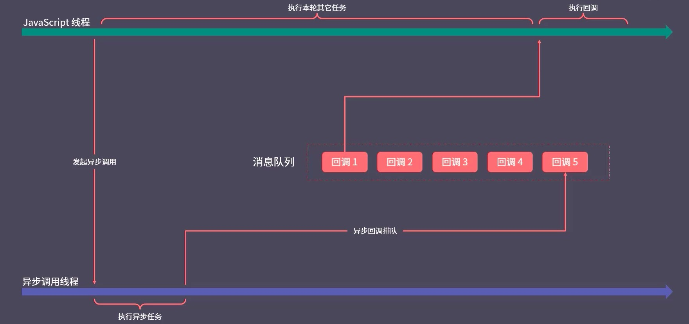

## 为什么 JS 是单线程

最早 JS 语言是一种运行在浏览器端的脚本语言，它的目的是实现页面上的动态交互（核心是 DON 操作），这也就决定了它必须使用单线程模型，否则就会出现复杂的线程同步问题。

试想在 JavaScript 中同时有多个线程一起工作，其中有一个线程修改了某一个 DOM 元素，而另一个线程此时又删除了这个元素，此时浏览器就无法明确以哪个线程的工作结果为准，所以为了这种线程同步问题，JS 就被设计未单线程模式。

单线程最大的优点就是简单、安全，缺点就是后续任务都要排队等待任务的结束（如果遇到一个耗时任务，就会被拖延，出现假死的情况）。

为了解决耗时任务阻塞的问题，JS 将执行模式分为`同步模式(Synchronous)`和`异步模式(Asynchronous)`

## 同步模式和异步模式

### 同步模式

同步模式就是依次执行，前一个任务结束后再开始下一个任务；在单线程下，大部分任务都是同步模式(排队执行)。

我们执行函数就会将其压入调用栈中，调用完毕，就将其弹出调用栈；函数的声明不会产生调用，也就不会压入栈中。

这个调用栈可以认为是一个 JS 工作过程中的工作表，当调用栈中的所有认为都清空了，工作就结束了。

同步模式非常简单，但是耗时较大的同步任务，就会阻塞后续任务，这样在页面就可能形成卡顿，所以我们需要引入异步模式。

### 异步模式

不同于同步模式，异步模式的 API 不会去等待这个任务的结束才开始下一个任务，开启过后就立即往后执行下一个任务，后续逻辑一般会通过回调函数的方式定义

setTimeout 是一个异步任务，遇到 setTimeout，会在**WebAPIS**中添加一个倒计时器，这个倒计时是单独工作的，不会对 JS 执行产生影响，setTimeout 会入栈，开启定时器就出栈了。

假设**WebAPIs**中有两个 timer 倒计时器，等倒计时结束了，就会进入消息队列(Queue)中，先进先出，当执行栈中的任务执行完毕，就会开启事件循环，将消息队列中的第一个压入执行栈。

直到消息队列和调用栈中都没有执行的任务时，执行就结束了。



当然 JS 是单线程，但是浏览器不是单线程，例如 setTimeout 函数的倒计时器，就是另一个线程在执行。

## 回调函数

所有异步方案的根本都是回调函数

由于你不知道任务什么时候结束，因此可以把这件事情传给一个任务的执行者，让执行者去帮你执行，确定什么时候完成。

例如我要给一个桌子刷漆我又没有油漆，但是我很忙，就将刷漆的步骤写下来，交给另一个人，让他买完油漆后，根据步骤进行刷漆。在这个过程中，`我`就是`调用者`，`另一个人`就是`执行者`。

由调用者定义，交给执行者去执行就是回调函数。

## Promise

手写promise

```javascript
const PENDING = "pending";
const FULFILLED = "fulfilled";
const REJECTED = "rejected";

const isFunction = (target) => typeof target === "function";

class MyPromise {
  value = undefined;
  reason = undefined;
  status = PENDING;
  successCallbacks = [];
  failCallbacks = [];

  constructor(executor) {
    try {
      executor(this.resolve, this.reject);
    } catch (e) {
      this.reject(e);
    }
  }

  resolve = (value) => {
    this.value = value;
    this.status = FULFILLED;
    while (this.successCallbacks.length) {
      this.successCallbacks.shift()();
    }
  };
  reject = (reason) => {
    this.reason = reason;
    this.status = REJECTED;
    while (this.failCallbacks.length) {
      this.failCallbacks.shift()();
    }
  };

  then(successCallback, failCallback) {
    successCallback = isFunction(successCallback) ? successCallback : (v) => v;
    failCallback = isFunction(failCallback)
      ? failCallback
      : (err) => throw new Error(err);
    const promise2 = new MyPromise((resolve, reject) => {
      const baseQueueMicroTask = (callback, isSuccess) => {
        return () => {
          queueMicroTask(() => {
            const x = callback(isSuccess ? this.value : this.reason);
            promiseResolve(promise2, x, resolve, reject);
          });
        };
      };

      if (this.status === FULFILLED) {
        baseQueueMicroTask(successCallback, true);
      } else if (this.status === REJECTED) {
        baseQueueMicroTask(failCallback, false);
      } else {
        this.successCallbacks.push(successCallback);
        this.failCallbacks.push(failCallback);
      }
    });
    return promise2;
  }

  static all(promiseArr) {
    const res = [];
    const addData = (key, value, resolve) => {
      res[key] = value;
      if (res.length === promiseArr.length) {
        resolve(res);
      }
    };
    return new MyPromise((resolve, reject) => {
      for (let i = 0; i < promiseArr.length; i++) {
        const current = promiseArr[i];
        if (current instanceof MyPromise) {
          current.then(
            (value) => addData(i, value, resolve),
            (err) => reject(err)
          );
        } else {
          addData(i, current, resolve);
        }
      }
    });
  }

  static allSettled(promiseArr) {
    const res = [];
    const addData = (key, value, resolve, status) => {
      if (status === FULFILLED) {
        res[key] = { status, value };
      } else {
        res[key] = { status, reason: value };
      }
      if (res.length === promiseArr.length) {
        resolve(res);
      }
    };
    return new MyPromise((resolve, reject) => {
      for (let i = 0; i < promiseArr.length; i++) {
        const current = promiseArr[i];
        if (current instanceof MyPromise) {
          current.then(
            (value) => addData(i, value, resolve, FULFILLED),
            (err) => addData(i, err, resolve, REJECTED)
          );
        } else {
          addData(i, current, resolve, FULFILLED);
        }
      }
    });
  }

  static race(promiseArr) {
    return new MyPromise((resolve, reject) => {
      for (let i = 0; i < promiseArr.length; i++) {
        const current = promiseArr[i];
        if (current instanceof MyPromise) {
          current.then(
            (value) => resolve(value),
            (err) => reject(err)
          );
        } else {
          resolve(current);
        }
      }
    });
  }

  static resolve(value) {
    if (value instanceof MyPromise) return value;
    return new MyPromise((resolve) => resolve(value));
  }

  finally(callback) {
    return this.then(
      (value) => MyPromise.resolve(callback()).then(() => value),
      (err) => MyPromise.resolve(callback()).then(() => err)
    );
  }
  catch(callback) {
    return this.then(undefined, callback);
  }
}
const promiseResolve = (promise2, x, resolve, reject) => {
  if (promise2 === x) {
    throw new TypeError("myPromise出现循环引用");
    return;
  }
  if (x instanceof MyPromise) {
    x.then(
      (value) => resolve(value),
      (err) => reject(err)
    );
  } else {
    resolve(x);
  }
};
```
