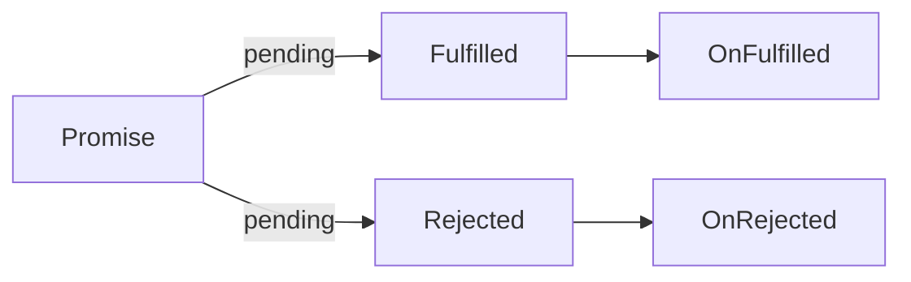

## 为什么 JS 是单线程

最早 JS 语言是一种运行在浏览器端的脚本语言，它的目的是实现页面上的动态交互（核心是 DON 操作），这也就决定了它必须使用单线程模型，否则就会出现复杂的线程同步问题。

试想在 JavaScript 中同时有多个线程一起工作，其中有一个线程修改了某一个 DOM 元素，而另一个线程此时又删除了这个元素，此时浏览器就无法明确以哪个线程的工作结果为准，所以为了这种线程同步问题，JS 就被设计未单线程模式。

单线程最大的优点就是简单、安全，缺点就是后续任务都要排队等待任务的结束（如果遇到一个耗时任务，就会被拖延，出现假死的情况）。

为了解决耗时任务阻塞的问题，JS 将执行模式分为`同步模式(Synchronous)`和`异步模式(Asynchronous)`

## 同步模式和异步模式

### 同步模式

同步模式就是依次执行，前一个任务结束后再开始下一个任务；在单线程下，大部分任务都是同步模式(排队执行)。

我们执行函数就会将其压入调用栈中，调用完毕，就将其弹出调用栈；函数的声明不会产生调用，也就不会压入栈中。

这个调用栈可以认为是一个 JS 工作过程中的工作表，当调用栈中的所有任务都清空了，工作就结束了。

同步模式非常简单，但是耗时较大的同步任务，就会阻塞后续任务，这样在页面就可能形成卡顿，所以我们需要引入异步模式。

### 异步模式

不同于同步模式，异步模式的 API 不会去等待这个任务的结束才开始下一个任务，开启过后就立即往后执行下一个任务，后续逻辑一般会通过回调函数的方式定义

setTimeout 是一个异步任务，遇到 setTimeout，会在**WebAPIS**中添加一个倒计时器，这个倒计时是单独工作的，不会对 JS 执行产生影响，setTimeout 会入栈，开启定时器就出栈了。

假设**WebAPIs**中有两个 timer 倒计时器，等倒计时结束了，就会进入消息队列(Queue)中，先进先出，当执行栈中的任务执行完毕，就会开启事件循环，将消息队列中的第一个压入执行栈。

直到消息队列和调用栈中都没有执行的任务时，执行就结束了。


当然 JS 是单线程，但是浏览器不是单线程，例如 setTimeout 函数的倒计时器，就是另一个线程在执行。

## 回调函数

所有异步方案的根本都是回调函数

由于你不知道任务什么时候结束，因此可以把这件事情传给一个任务的执行者，让执行者去帮你执行，确定什么时候完成。

例如我要给一个桌子刷漆我又没有油漆，但是我很忙，就将刷漆的步骤写下来，交给另一个人，让他买完油漆后，根据步骤进行刷漆。在这个过程中，`我`就是`调用者`，`另一个人`就是`执行者`。

由调用者定义，交给执行者去执行就是回调函数。

## Promise

### Promise 概念

如果我们直接使用回调函数的方式去处理复杂的异步流程，就无法避免大量的回调函数嵌套，就会出现常见的`回调地狱`问题。

```javaScript
$.get("/url1", function(data1) {
  $.get("url2", function(data2) {
    $.get("url3", function(data3) {
      $.get("url4", function(data4) {
        // ...
      }
    }
  })
})
```

为了避免回调地狱的问题，CommonJS 社区就提出了 Promise 规范，后来在 ES2015 中被标准化，成为语言规范。

Promise 就是一个对象，用来表示一个异步任务，它执行之后是成功还是失败，一开始 pending 状态，最终都会成功或者失败，成功或者失败后也会执行相应的任务，并且只可能出现成功或者失败一种结果，不会发生改变。



### Promise 示例

```javascript
const promise = new Promise(function (resolve, reject) {
  // promise默认接收一个回调函数，有两个参数
  // resolve(100); 将promise的状态修改为fulFilled，同时异步任务的操作结果会通过参数传递过去
  // reject(new Error("promise rejected")); 将promise状态修改为rejected，同时传递一个错误对象
  // promise的状态修改后就不能修改，所以只能执行resolve和reject其一
});

// 我们通过promise.then来指定onFulfilled和onRejected的回调函数
promise.then(
  function (value) {
    console.log("resolved", value);
  },
  function (error) {
    console.log("rejected", error);
  }
);
```

即便 promise 中没有任何的异步操作，then 方法中指定的回调函数仍然会放入回调队列中执行

### Promise 封装 ajax

```javascript
function ajax(url) {
  return new Promise(function (resolve, reject) {
    let xhr = new XMLHttpRequest();
    xhr.open("GET", url);
    xhr.responseType = "json";
    xhr.onload = function () {
      if (this.status === 200) {
        resolve(this.response);
      } else {
        reject(new Error(this.statusText));
      }
    };
    xhr.send();
  });
}
```

### Promise 常见误区

我们使用 promise 时，还是会写成之前回调的方式

```javascript
ajax("url1").then(function (res1) {
  ajax("url2").then(function (res2) {
    ajax("url3").then(function (res3) {
      // ...
    });
  });
});
```

这样使用 promise 还不如回调函数的方式，我们应该使用 Promise.then()方法链式调用的特点，来保证异步任务的扁平化

### Promise 链式调用

- promise.then 方法默认会返回一个新的 promise 对象，所以我们可以通过链式调用 then 方法来执行回调
- 后一个 then 方法实际是在为上一个 then 方法返回的 Promise 注册回调
- 前面的 then 方法中回调函数的返回值会作为后面 then 方法回调的参数
- 如果回调中返回的是 Promise，后面 then 方法的回调会等待它的结束

```javascript
ajax("url1").then(function(res) => {
  console.info(11)
  return ajax("url1")
}).then(function(res) {
  console.info(22)
  console.info(res) // ajax("url1").then的结果
  return 111
}).then(function(res) {
  console.info(33)
  console.info(res) // 111
})
```

### Promise 异常处理

我们在 promise 中执行未定义的函数或者主动抛出异常`throw new Error()`，可以使用 then 的第二个参数来处理异常

```javascript
promise.then(
  function (value) {
    console.log("resolved", value);
  },
  function (error) {
    // 处理异常
    console.log("rejected", error);
  }
);
```

我们通常使用 promise 的 catch 方法来注册 onRejected 回调，`promise.catch()` 实际是`promise.then(undefined, function (error) {});`的语法糖

我们在调用 catch 方法时，实际是给上一个 then 指定 onRejected 回调，并不是给第一个 then 方法指定，不过由于是同一个 promise 链条，前面的 promise 的异常会一直向下传递，所以可以在最后的 catch 中捕获到错误

```javaScript
promise
  .then(function (value) {
      console.log("resolved", value);
  })
  .then(function (res) {
    console.log(111);
  })
  .catch(function (err) {
    console.info(err);
  })

```

我们还可以使用`unhandledrejection`来全局捕获 Promise 异常，不过这种方式**不推荐**

```javascript
// js中
window.addEventListener(
  "unhandledrejection",
  (event) => {
    const { reason, promise } = event;
    console.log(reason, promise);
    // reason => promise失败的原因，一般是一个错误对象
    // promise => 出现异常的Promise对象
    event.preventDefault();
  },
  false
);

// node中

process.on("unhandledRejection", (reason, promise) => {
  console.log(reason, promise);
  // reason => promise失败的原因，一般是一个错误对象
  // promise => 出现异常的Promise对象
});
```

### Promise 的静态方法

#### Promise.resolve()

我们使用`Promise.resolve()`就会直接返回一个状态为 resolved 的 Promise 对象

```javascript
Promise.resolve("foo").then(function (value) {
  console.info(value); // foo
});

// Promise.resolve("foo") 就是下面的语法糖， 直接返回一个只会成功的promise

new Promise(function (resolve) {
  resolve("foo");
});
```

如果`Promise.resolve()`接收的是另一个 promise 对象，那么这个 Promise 对象会被原样返回

```javaScript
const promise = $.ajax("url")
const promise2 = Promise.resolve($.ajax("url"))
console.log(promise === promise2); // true
```

如果`Promise.resolve()`中传入的是一个对象，且该对象具有和 Promise 一样的 then 方法，那这个对象也可以作为 Promise 被执行

```javaScript
Promise.resolve({
  then: function(onFulfilled, onRejected) {
    onFulfilled("foo");
  }
})
  .then(res => {
    console.info(res); // foo
    return 1;
  })
  .then(res => {
    console.info(111, res); // 111, 1
  })

```

这个方法的对象可以说是一种实现了**thenable**的接口，就是一种可以 then 的对象，这种对象存在的原因是在原生 Promise 还没有普及之前我们都是使用第三方库去实现 Promise，如果需要将第三方的 Promise 转换成原生的 promise，就可以采用这种方式。

#### Promise.reject()

和`Promise.resolve()`类似，是快速创建一个失败的 Promise 对象

```javascript
Promise.reject(new Error("error")).catch((err) => {
  console.info(err);
});
```

### Promise 并行执行

#### Promise.all()

当我们需要将多个 Promise 同时执行时，虽然可以手动一个个执行，别接受返回值，但是这样过于繁琐，Promise 为我们提供了 all 方法

```javascript
ajax("/urls.json")
  .then((res) => {
    const urls = Object.values(res);
    const tasks = urls.map((url) => ajax(url));
    return Promise.all(tasks);
  })
  .then((value) => {
    console.log(value);
  });
```

- Promise.all 中可以传入一个 Promise 数组
- 只有当所有的 Promise 都 fulfill 的，才会 resolve 返回一个包含每个 Promise 执行完毕后数据的数组
- 如果其中有一个 reject，那个就会返回第一个 reject 的错误内容

#### Promise.race()

`Promise.race()`也是传入一个 Promise 数组，但是它的执行结果是只要其中一个 Promise 执行完毕后，就直接返回结果（无论是失败还是成功）

```javaScript
const request = ajax("/api/json")
const timeout = new Promise(function (resolve, reject) {
  setTimeout(() => {reject(new Error("Timeout"))}, 500);
})

Promise.race([request, timeout])
  .then(function (value) {
    console.info(value);
  })
  .catch(function (e) {
    console.error(e);
  });
```

#### Promise.allSettled()

`Promise.allSettled()`传入一个 Promise 数组，返回一个在所有给定的承诺被履行或拒绝后履行的承诺，其中包含一个对象数组，每个对象描述每个承诺的结果。

```js
Promise.allSettled([
  Promise.resolve(33),
  new Promise((resolve) => setTimeout(() => resolve(66), 0)),
  99,
  Promise.reject(new Error("an error")),
]).then((values) => console.log(values));

// [
//   { status: 'fulfilled', value: 33 },
//   { status: 'fulfilled', value: 66 },
//   { status: 'fulfilled', value: 99 },
//   { status: 'rejected', reason: Error: an error }
// ]
```

#### Promise.any()

`Promise.any()`传入一个 Promise 数组，返回一个实现的承诺（拒绝会被置空）

```js
const promise1 = Promise.reject(0);
const promise2 = new Promise((resolve) => setTimeout(resolve, 100, "quick"));
const promise3 = new Promise((resolve) => setTimeout(resolve, 500, "slow"));

Promise.any([promise1, promise2, promise3]).then((value) => console.log(value));

// Expected output: "quick"
```

### Promise 执行时序

虽然 Promise 没有任何异步操作，但是他的回调函数还是会进入回调队列中排队。

回调队列中的任务称为**宏任务**，在宏任务执行过程中可以临时加上一些额外需求，对于这些临时的需求可以选择作为一个新的宏任务重新进入到队列中排队，也可以作为当前任务的**微任务**，直接在当前任务执行过后立即执行，而不是重新排队

- Promise 回调就是作为微任务执行的
- 微任务的目的就是提高整体的响应能力
- 目前大部分异步调用都是作为宏任务执行
- 除了 Promise 还有 MutationObserver 和 Process.nextTick()

```javascript
console.log("global start");

setTimeout(() => {
  console.log("timeout");
}, 0);

Promise.resolve()
  .then(() => {
    console.info("promise");
  })
  .then(() => {
    console.info("promise 2");
  })
  .then(() => {
    console.info("promise 3");
  });

console.log("global end");

// global start
// global end
// promise
// promise 2
// promise 3
// timeout
```

### Generator 异步方案

- 生成器函数(Generator)实际就是在传统函数上多了一个\*号
- 当我们调用 Generator 时它并不会执行该函数，而是得到一个生成器对象
- 只有我们手动调用生成器对象的 next 方法，这个函数的函数体才会执行
- 我们在函数内部可以`yield`一个值，我们可以在 next 方法的返回中拿到这个值
- 返回的对象中还有一个 done 属性，用于标识这个生成器是否执行完毕
- 如果我们在 next 方法中传入参数，会作为 yield 的返回值
- 如果我们在生成器的 throw 去抛出一个异常，就可以在生成器函数中用`try-catch`捕获到

```javascript
function* foo() {
  console.log("start");
  try {
    const res = yield "foo";
    console.log(res); // bar
  } catch (e) {
    console.error(e);
  }
}

const generator = foo();

const result = generator.next();
console.log(result); // foo

// generator.next("bar")

generator.throw(new Error("failed"));
```

我们可以使用 Generator 配合 Promise 来实现异步方案

```javascript
function* main() {
  const users = yield ajax("/api/users.json");
  console.log(users);

  const posts = yield ajax("/api/posts.json");
  console.log(posts);
}

const g = main();

const result = g.next(); // {value: ajax, done: false}

result.value.then(function (value) {
  const result2 = g.next(value);

  if (result2.done) return;
  result2.value.then(function (data) {
    const result3 = g.next(data);
    if (result3.done) return;
  });
});
```

由于上述有很多重复的操作，我们实际可以实现一个递归方法来实现后续操作

```javaScript
function * main () {
  try {
    const users = yield ajax("/api/users.json")
  console.log(users);

  const posts = yield ajax("/api/posts.json")
  console.log(posts);
  } catch (e) {
    console.info(e);
  }
}

// const g = main();

// const handleResult = (result) => {
//   if (result.done) return;
//   result.value.then((value) => {
//     handleResult(g.next(value));
//   }, error => {
//     g.throw(error);
//   })
// }

// handleResult(g.next());

// 我们也可以将其封装成一个co方法
const co = generator => {
  const g = generator();

  const handleResult = (result) => {
    if (result.done) return;
    result.value.then((value) => {
      handleResult(g.next(value));
    }, error => {
      g.throw(error);
    })
  }

  handleResult(g.next());
}
co(main)；
```

co 方法之前是很流行的，社区也有一个更完善的 co 方法，但是由于`async await`的提出，就使用的少了。

### Async/Await

- async/await 实际就是 generator/co 的语法糖
- 使用 async 的函数会返回一个 promise
- 不能在没有被 async 包裹的函数或者全局作用域中使用 await，不过现在正在开发中。

```javaScript
async function main () {
  try {
    const users = await ajax("/api/users.json")
  console.log(users);

  const posts = await ajax("/api/posts.json")
  console.log(posts);
  } catch (e) {
    console.info(e);
  }
}

main().then(() => {
  console.log("all completed");
})

```
