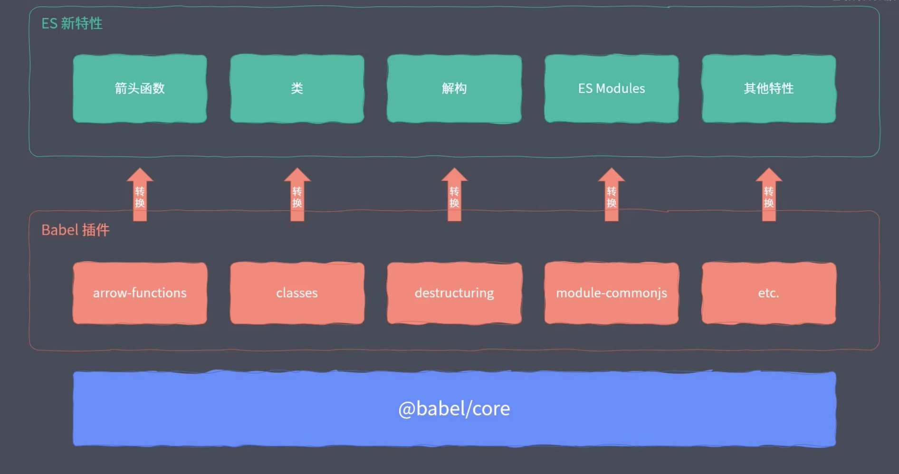
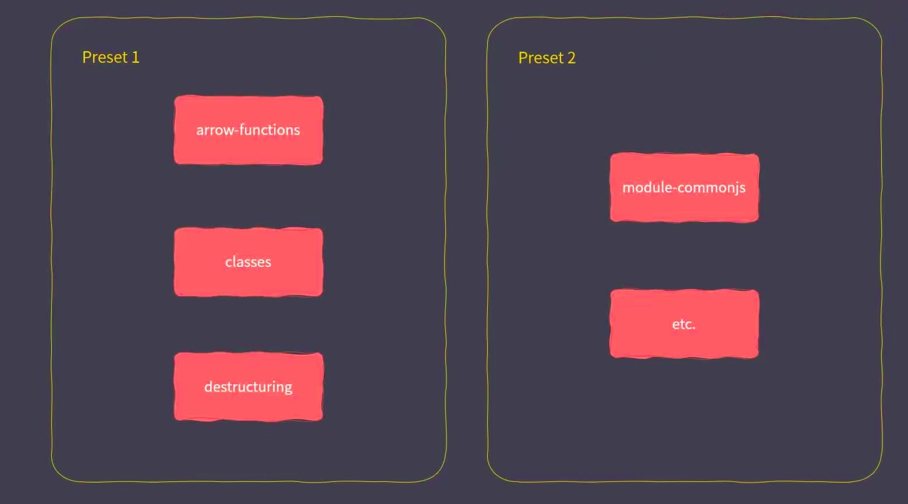

Node 8.5以上，内部就已经开始以实验特性支持`ES Modules`了，即我们可以直接以原生的形式去使用`ES Modules`代码了，考虑到`ES Modules`和`CommonJS`相差较大，目前还是处于过度状态

## Node中使用ESM

1. 首先将**js**文件的扩展名修改为`.mjs`
2. 执行文件，需要加入后缀，`--experimental-modules`(当然在node 12版本已经不需要了)
```bash
node --experimental-modules index.mjs
```
这里会报一个警告**ExperimentalWarning: The ESM module loader is experimental.**，告诉你这是一个实验特性，希望不要在生产环境中使用(当我使用Node 14版本以后，就没有这个警告了，但是文件后缀还是需要修改为.mjs)

原生模块和第三模块也同样可以使用ES Modules方式导入

```javaScript
// 原生模块
import fs from "fs"
fs.writeFileSync("./foo.txt", "es module working")

// 第三方模块
import _ from "lodash"
console.info(_.camelCase("ES Module"))
```
但是第三方模块不能使用`{}`语法导入，原生模块是可以的

```javaScript
import {camelCase} from 'lodash';
camelCase("ES Module"); // 报错, 因为他并不是一个解构

import { writeFileSync } from 'fs';// 原生模块可以, 因为原生模块做了兼容性处理
```

## ESM中载入CommonJS

在两个文件中分别使用CommonJS导出和ES Modules导入

```javaScript
// common.js
module.exports = {
    foo: "commonjs exports value"
}

// index.mjs
import mod from "./common.js"
console.info(mod) // { foo: "commonjs exports value" }
```
注意：

* import不能直接提取CommonJS导出的成员，因为CommonJS导出的是一个默认成员，所以只能整个导入
* 在Node中不能直接通过CommonJS模块中载入ES Module(当然webpack打包处理后可以)

### 总结

* ES Module 中可以导入 CommonJS模块
* CommonJS中不能导入 ES Module模块
* CommonJS始终只会导出一个默认成员
* 注意 import 不是解构导出对象

## ESM与CommonJS的差异

// 将下面代码分别在CommonJS下和ES Module下运行
```javaScript

// 加载模块函数
console.info(require)

// 模块对象
console.info(module)

// 导出对象别名
console.info(exports)

// 当前文件的绝对路径
console.info(__filename)

// 当前文件所在目录
console.info(__dirname)
```
我们发现，在CommonJS下能获取相应的内容，而ES Module中在不能被访问，因为这五个成员都是CommonJS把模块包装成函数，通过参数提供进来的成员，但是在ES Module中没有CommonJS中那些模块的全局变量了。

但是在ES Module中也有其他的解决方法

* 可以使用`import`和`export`去替代`require`、`module`、`exports`
* 使用**import.meta.url**可以获取当前工作的文件地址，再使用url模块的`fileURLToPath`方法，将文件url转换成路径，从而代替`__filename`
```javaScript
import { fileURLToPath } from "url"
const __filename = fileURLToPath(import.meta.url) // 当前文件的绝对路径
```
* 使用path模块中的`dirname`方法，可以将整个完整的文件路径提取出文件夹的部分，来代替`__dirname`
```javaScript
import { fileURLToPath } from "url"
import { dirname } from "path"

const __filename = fileURLToPath(import.meta.url) // 当前文件的绝对路径
const __dirname = dirname(__filename)
```

CommonJS对模块处理的源代码，就可以发现最终传入了这个函数。在外侧包裹一个韩城。从而实现私有模块作用域，所以他们是伪全局对象
```javaScript
let wrap = function (script) {
    return Module.wrapper[0] + script + Module.wrapper[1]
}

const wrapper = [
    'function (exports, require, module, __filename, __dirname) {',
    '\n});'
];
```

## 新版本进一步支持

将Node切换到12.10.0的版本(我的版本是12.18.0)

Node 12版本可以添加一个package.json，在其中添加一行代码
```json
{
    "type": "module"
}
```
此时，项目中所有的js文件默认就是以ES Modules规范工作了，就不用将扩展名改成`.mjs`了

但是js文件就不能使用CommonJS规范了(会报错)，我们可以将js文件扩展名改为`.cjs`就可以使用CommonJS规范了

## Babel兼容方案

早期node版本，可以使用babel对ES Modules进行兼容

Babel主要依赖插件进入转换，如下图


之前安装的`preset-env`就包含了所以ES的新特性，就可以借助`perset-env`进行转换



新增一个文件**babel.config.js**(也可以是 **.babelrc** )，就可以直接使用`yarn babel-node index.js`

```javaScript
// .babelrc
module.exports = {
    presets: [
        "@babel/perset-env"
    ]
}
```

当然也可以单独使用一个插件`@babel/plugin-transform-modules-commonjs`

```javaScript
module.exports = {
    // presets: [
    //     "@babel/perset-env"
    // ],
    plugins: [
        "@babel/plugin-transform-modules-commonjs"
    ]
}
```

`persets`代表的是一组插件，而`plugins`代表单独的一个一个的插件

对于某些环境已经支持一些特性，我们只针对特定需要的特性去添加，性能可能会好一些