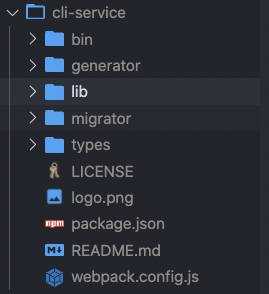
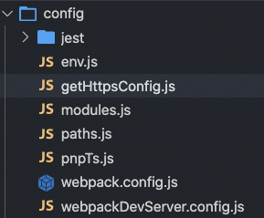
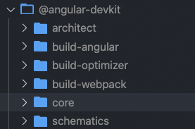

## Webpack出现背景

### 前端发展的阶段

#### Web早期
互联网发展早期，前端只负责写**静态页面**，纯粹的展示功能，JavaScript的作用也只是进行一些**表单的验证**和**增加特效**。当然为了动态在页面中填充一些数据，也出现了JSP、ASP、 PHP这样的开发模式。
#### Web近期
随着AJAX技术的诞生改变了前端的发展历史，使得开发者发现，前端的作用**不仅仅是展示页面**，可以**管理数据**以及和**用户互动**。 由于**用户交互**、**数据交互**的需求 增多，也让**jQuery**这样优秀的前 端工具库大放异彩。
#### 现代web
而现代的Web开发事实上变得更 加多样化和复杂化。开发的多 样性包括我们需要开发PC Web 页面、移动端Web页面、小程序、 公众号、甚至包括App，都属于 前端开发的范畴。 当然也包括一系列复杂性的问提。

### 前端开发的复杂化
* 开发过程中我们需要通过**模块化的方式**来开发;
* 会使用一些**高级的特性**来加快我们的**开发效率**或者**安全性**，比如通过**ES6+**、**TypeScript**开发脚本逻辑， 通过**sass**、**less**等方式来编写css样式代码;
* 开发过程中，我们还希望试试的监听文件的变化来**并且反映到浏览器**上，提高开发的效率;
* 开发完成后我们还需要将代码进行**压缩**、**合并**以及**其他相关的优化**;

### 流行的三大框架
目前前端流行的三大框架:Vue、React、Angular
* 但是事实上，这三大框架的创建过程我们都是借助于脚手架(CLI)的;
* 事实上Vue-CLI、create-react-app、Angular-CLI都是基于webpack来帮助我们支持模块化、less、TypeScript、打包优 化等的;

  
## Webpack简介

> Webpack is a static module bundler for modern JavaScript applications

webpack是一个静态的模块化打包工具，为现代的JavaScript应用程序

对上述的解释进行拆解：
* 打包bundler：webpack可以帮助我们进行打包，所以它是一个打包工具
* 静态的static：这样表述的原因是我们最终可以将代码打包成最终的静态资源（部署到静态服务器）
* 模块化module：webpack默认支持各种模块化开发，例如：ES Module、CommonJS、AMD等
* 现代的modern：正是因为现代前端开发面临各种各样的问题，才催生了webpack的出现和发展

### 工作中的Webpack

1. 在项目中使用webpack进行特殊的配置，如：
    * 给某些目录结构起别名
    * 让项目支持**sass**、**less**等预处理器
    * 在项目中手动添加**TypeScript**支持
2. 希望将在原有的脚手架上来定制一些自己的特殊配置提供性能
    * 安装性能分析工具
    * 使用**gzip**压缩代码
    * 引用cdn的资源
    * 公共代码抽取
    * 编写属于自己的**loader**和**plugin**
3. webpack也是成为高级前端开发甚至架构师必备的

### Webpack和Vite

#### Vite支持

* 目前Vue的项目支持Vite，也支持使用Webpack
* React、Angular的脚手架目前没有支持，暂时也没有转向Vite的打算
* Vite最终打包的过程，依然需要借助于Rollup实现，它只是提升了开发阶段的效率

#### Vite的核心思想并非创

* Vite的很多思想和之前的snowpack是重合的，而且相对目前来说snowpack会更加成熟。
* 后续发展来看Vite可能会超越snowpack，但是

#### webpack的更新迭代

* webpack在发展过程中，也会不断改进自己，借鉴其他工具的一些优势和思想
* 在这么多年的发展中，无论是自身的优势还是生态都是非常强大的


#### 总结

Vite如果想取代Webpack还有很长的路，但是无论是Vite的出现还是以后新的工具的出现，**不要有任何排斥的思想**，要知道，工具都是为了更好的给我们提供服务的

## 尝试使用

### Webpack的安装

webpack 4.x以后需要分别安装：`webpack`和`webpack-cli`，但是`webpack-cli`不是必须的，它的作用是解析配置项参数(类似`--config w.config.js`)

二者的关系：
* 执行webpack命令，会执行node_modules下的.bin目录下的webpack
* webpack在执行时是依赖webpack-cli的，如果没有安装就会报错
* 而webpack-cli中代码执行时，才是真正利用webpack进行编译和打包的过程
* 所以在安装webpack时，我们需要同时安装webpack-cli(第三方脚手架事实上是没有使用webpack-cli的，而是类似于自己的vue-service-cli的东西)

```bash
# 全局安装
yarn global add webpack webpack-cli
# or npm install webpack webpack-cli -g

# 局部安装（在项目中安装）
yarn add webpack webpack-cli --dev
# or npm install webpack webpack-cli -D
```

### 尝试全局Webpack

全局安装`webpack`和`webpack-cli`以后，新建一个文件夹，分别使用**CommonJS**和**ES Module**两种模块化规范

```javaScript
// src/js/math.js
// 使用ES Module
export const sum = (num1, num2) => {
    return num1 + num2
}

export const mul = (num1, num2) => {
    return num1 * num2
}
```

```javaScript
// src/js/format.js
// 使用CommonJS
const dateFormat = data => {
    return "2021-07-04"
}

const priceFormat = price => {
    return "100.00"
}

module.exports = { dateFormat, priceFormat }
```

```javaScript
// src/index.js
import { sum, mul } from './js/math.js'
const { dateFormat, priceFormat } = require("./js/formate.js")

console.info(sum(20, 30))
console.info(mul(20, 30))
console.info(dateFormat())
console.info(priceFormat())
```

在html中直接引用会报错，因为浏览器不能直接使用**CommonJS**规范，此时我们在当前文件夹使用`webpack`命令，它就会去找`src`下的`index.js`文件，以此文件作为入口，对整个项目进行打包，如果没有`src`目录或者`没有index.js`就会报错。我们引用打包后会生成一个`dist`目录就可以直接在html中使用了。

全局使用webpack的弊端：

### 局部使用webpack

先init项目添加package.json（个人使用yarn），然后分别安装`webpack`和`webpack-cli`

此时发现如果直接在当前目录使用webpack还是使用的全局的webpack，要使用局部的webpack有3中方法
1. 在**node_modules/.bin/webpack**下使用webpack
2. 使用`npx webpack`命令
3. 在**package.json**文件下新建scripts，添加build命令
```json
{
    "script": {
        "build": "webpack"
    }
}
```
此时我们执行build命令，就会去node_modules的.bin目录下寻找webpack然后执行

> 注意：如果局部没有安装webpack，就会去找全局的webpack
