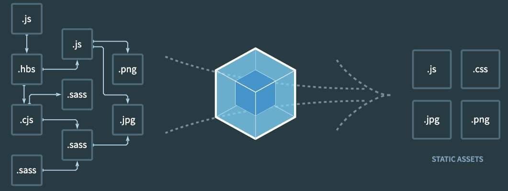

## 基本配置

### 指定入口和出口

webpack 默认查找的入口文件是 index.js，在 webpack 中如果找不到入口文件就会报错，我们就可以自己指定入口

指定入口的方式有很多种，

1. 可以直接在项目运行的根目录使用命令行指定入口

```bash
# 指定入口（entry）文件为main.js，出口（output-path）为
npx webpack --entry ./src/main.js -output-path ./build
```

弊端：每次使用命令行都需要输入很长的字符串，而且容易输错

2. 在 scripts 的 build 的命令中添加指定选项，关于配置选项可以在[webpack 配置](https://webpack.docschina.org/api/cli/)中查到

```json
{
  "scripts": {
    "build": "webpack --entry ./src/main.js -output-path ./build"
  }
}
```

弊端：这样指定比较麻烦，配置多了就很长，可阅读性很差

3. 在当前目录下创建一个 webpack.config.js 文件，在该文件进行配置

```javaScript
const path = require("path")

// webpack是使用CommonJS的方式导入的，所以此处需要使用CommonJS的方式导出
module.exports = {
    entry: "./src/main.js", // 指定入口
    output: { // output一般是对象
        filename: "bundle.js", // 打包后文件的名字
        path: path.resolve(__dirname, "./build"), // 指定输入的路径，只能使用绝对路径，dirname可以获取当前目录的绝对路径,resolve可以用于拼接路径
    }
}
```

### 手动指定配置文件

当我们执行`yarn build`时，就会执行 webpack，在执行 webpack 时就会查找当前运行目录下有无**webpack.config.js**文件，有就会根据该文件去编译打包，如果没有就会自己将 src 的 index.js 作为入口编译打包。

如果我们将**webpack.config.js**的文件名修改为**wk.config.js**，我们就可以在`scripts`中添加配置，指定配置文件的路径

```json
{
  "scripts": {
    "build": "webpack --config ./wk.config.js" // 在当前文件夹下的话./可以省略
  }
}
```

### webpack 依赖关系图

webpack 在对项目进行打包时：

- 会根据命令或者配置文件找到入口文件
- 从入口开始，会生成一个**依赖关系图**, 这个**依赖关系图**会包含应用程序中所需要的所有模块(例如：js 文件，css 文件，图片，字体等)
- 然后遍历图结构，打包一个个模块(根据文件的不同使用不同的 loader 来解析)

如果有一个文件没有在**依赖关系图**中(即没有跟入口文件及其关联文件**关联**)，就不会被打包


还有一个问题是，例如：一个函数如果没有被引用到，webpack 默认还是会打包进去，我们就需要`tree-shaking`来处理(后续)

## Loader

- loader 可以用于对**模块的源代码**进行转换

### 编写案例

通过 js 创建一个元素，并且给它设置一些样式，然后再入口文件引入

```javaScript
// src/component.js
import "../css/index.css"

function component() {
    const element = document.createElement("div")

    element.innerHTML = ["hello", "Webpack"].join(" ")
    element.className = "content"

    return element
}

document.body.appendChild(component())
```

```css
.content {
  color: red;
}
```

此时我们执行`yarn build`，会发现报错（需要一个 loader 来解析）

我们可以将 css 文件看成一个**模块**，我们是用过`import`来加载这个模块的，在加载这个模块时，`webpack`其实不知道如何对其进行加载，我们必须制定对应的 loader 来完成这个功能

### css-loader 使用

对于加载 css 文件来说，我们需要一个读取 css 文件的 loader，常用的就是 css-loader

#### 安装 css-loader

```bash
# 安装css-loader
yarn add css-loader --dev
# or npm install css-loader -D
```

#### css-loader 的使用方案

css-loader 的使用方案有 3 种：

1. 内联方式：这种方式使用较少，因为不方便管理
   - 在引入的样式前面加上使用的 loader，并使用`!`分割

```javaScript
import "css-loader!../css/style.css"
```

2. CLI 方式：在 webpack5 的文档中已经没有了`--module-bind`，实际应用中也比较少，因为比方便管理
3. loader 配置方式

在 webpack.config.js 中的 module.rules 中对 loader 进行配置

module.rules 的配置如下：
- rules 是一个数组：[rule]
- 数组中存放的是一个个 rule，rule 是一个对象，对象中可以设置多个属性
    + test属性：用于对resource(资源)进行匹配，通常会设置成正则表达式
    + use属性：对应的值是一个数组：[UseEntry]， UseEntry是一个对象，可以通过对象的属性来设置一些其他属性
        * loader：必须有，对应的值是一个字符串
        * options：可选的属性，值是一个字符串或者对象，值会被传入到loader中
        * query：目前已经使用options来替代
    > 传递字符串(如:use: [ 'style-loader' ])是 loader 属性的简写方式(如:use: [ { loader: 'style-loader'} ])
    + loader属性：rule.use: [{loader}]的简写

```javaScript
// loader配置的代码
module.exports = {
    ...,
    module: {
        rules: [
            {
                test: /\.css$/, // 用于匹配资源，使用正则表达式匹配
                // loader: "css-loader" // 方式1
                // use: ["css-loader"] // 方式2
                use: [
                    { loader: "css-loader" } // 方式3
                ],
                
            }
        ]
    }
}
```

### style-loader

通过css-loader来加载css文件后我们发现这个css在我们代码中并没有生效，原因是：

* 我们知道在页面插入css有3中方式：行内样式、内联样式、外联样式
* 因为css-loader只是负责将`.css`文件进行解析，并不会将解析后的**css插入到页面**中
* 如果我们希望完成**插入style**的操作，那么我们还需要另外一个loader，就是`style-loader`

#### 安装style-loader

```bash
yarn add style-loader --dev
# or npm install style-loader -D
```

#### 配置style-loader

在配置文件中添加style-loader
> 注意：因为loader的执行顺序是从后往前的，所以我们需要将`style-loader`写到`css-loader`前面

```javaScript
// webpack.config.js
module.exports = {
  ...,
  rules: [
      {
        test: /\.css$/,
        use: ["style-loader", "css-loader"]
      }
    ]
}
```
此时再重新编译`yarn build`，就发现打包后的css生效了

目前我们的css是通过页内样式的方式添加进来的，后续我们也会将css抽取到单独的文件中，并且进行压缩等操作

### less-loader

在开发中，我们可能会使用`less`、`scss`、`stylus`的**预处理器**来编写css样式，效率会很高

为了让我们的环境支撑这些**预处理器**，我们需要确定，`less`、`scss`等编写的css需要通过工具转换成普通的css

例如我们编写如下less样式

```less
@fontSize: 30px;
@fontWeight: 700;
.content {
  font-size: @fontSize;
  font-weight: @fontWeight;
}
```

我们将其引入以后，直接编译肯定是报错的，此时需要安装`less`对其编译（注意：不是less-loader），因为其实我们是可以在安装后直接执行less命令将**less文件**转换为css的

```bash
# 安装less
yarn add less --dev

# 将less文件编译成css文件
npx less ./src/css/title.less > title.css
```

只是在我们在项目中会编写大量的css，为了让他进行自动转换，这时我们可以使用`less-loader`，来自动使用**less工具**将less文件转换为css

```bash
# 安装less-loader
yarn add less-loader --dev
```

然后配置webpack.config.js，注意：此时处理的是less文件

```javaScript
module.exports = {
  ...,
  module: {
    ...,
    rules: [
      ...,
      {
        test: /\.less$/,
        use: ["style-loader", "css-loader", "less-loader"]
      }
    ]
  }
}
```
再次执行`yarn build`，less就可以自动转换为css，并且页面也会生效了

## 浏览器兼容性

在开发中，我们会遇到很多浏览器的兼容性问题(不是指屏幕大小的变化适配)，是针对不同浏览器支持的特性(例如：css特性、js语法)

### 浏览器市场占用率
目前市面上大量的浏览器：Chrome、Safari、IE、Edge、Chrome for Android、UC Browser、QQ Browser等等，我们在开发时不可能单独一个个去考虑兼容性

实际在很多的脚手架配置中，都能看到类似下面的配置
```
> 1%
last 2 versions
not dead
```

其中的1%就是指市场占用率的含义，我们可以使用[caniuse](https://caniuse.com/usage-table)来查看浏览器在市场中的占用率

如何在css兼容和js兼容下共享配置的兼容性
- 当我们设置了一个条件： > 1%
- 就意味着是css、js都要兼容市场占用率大于1%的浏览器
- 我们通常会通过工具来达到这种兼容性，例如：`postcss-prest-env`，`babel`、`autoprefixer`等

此时我们就可以使用`Browerslist`来共享这些配置

### Browserslist

`Browerslist`是一个在不同前端工具之间，共享目标浏览器和Node.js版本的配置
#### 浏览器查询过程

我们可以编写类似于这样的配置

```
> 1%
last 2 versions
not dead
```

之后，这些工具会根据我们的配置来获取相关的浏览器信息，以便决定是否需要进行兼容性的支持

条件查询使用的是`caniuse-lite`的工具，这个工具的数据来自于[caniuse](https://caniuse.com)的网站

#### Browserslist编写规则(加粗部分是最常用的)：

1. **defaults: Browserslist的默认浏览器(> 0.5%, last 2 version, Firefox ESR, not dead)**
2. **5%： 通过全局使用情况统计信息选择的浏览器版本。`>=`、`<`和`<=`**
  - 5% in US：使用美国使用情况统计信息。它接受两个字母的国家/地区代码。
  -  \> 5% in alt-AS：使用亚洲地区使用情况统计信息。有关所有区域代码的列表，请参见caniuse-lite/data/regions
  -  \> 5% in my stats：使用自定义用法数据。
  -  \> 5% in browserslist-config-mycompany stats：使用 来自的自定义使用情况数据browserslist-config-mycompany/browserslist-stats.json。
  -  cover 99.5%：提供覆盖率的最受欢迎的浏览器。
  -  cover 99.5% in US：与上述相同，但国家/地区代码由两个字母组成。
  -  cover 99.5% in my stats：使用自定义用法数据。
3. **dead: 24个月内没有官方支持或更新的浏览器。现在是IE10、IE_Mob 11、BlackBerry 10、BlackBerry 7、Samsung 4和OperaMobile 12.1。**
4. **last 2 versions：每个浏览器的最后两个版本**
  - last 2 Chrome versions：最近2个版本的Chrome浏览器
  - last 2 major version或last 2 iOS marjor versons：最近2个主要版本的所有次要/不定版本
5. node 10和node 10.4：选择最新的Node.js10.x.x 或10.4.x版本。
  - current node：Browserslist现在使用的Node.js版本。
  - maintained node versions：所有Node.js版本，仍由 Node.js Foundation维护。
6. iOS 7：直接使用iOS浏览器版本7。
  - Firefox > 20：Firefox的版本高于20 >=，<并且<=也可以使用。它也可以与Node.js一起使用。
  - ie 6-8：选择一个包含范围的版本。
  - Firefox ESR：最新的[Firefox ESR]版本。
  - PhantomJS 2.1和PhantomJS 1.9：选择类似于PhantomJS运行时的Safari版本。
7. extends browserslist-config-mycompany：从browserslist-config-mycompanynpm包中查询 。
8. supports es6-module：支持特定功能的浏览器。 es6-module这是“我可以使用” 页面feat的URL上的参数。有关所有可用功能的列表，请参见 。caniuselite/data/features
9. browserslist config：在Browserslist配置中定义的浏览器。在差异服务中很有用，可用于修改用户的配置，例如 browserslist config and supports es6-module。
10. since 2015或last 2 years：自2015年以来发布的所有版本（since 2015-03以及since 2015-03-10）。
11. unreleased versions或unreleased Chrome versions：Alpha和Beta版本。
12. **not ie <= 8：排除先前查询选择的浏览器。**

#### 命令行使用browserslist

我们可以直接通过命令行来查询某些条件所匹配到的浏览器
```bash
npx browerslist ">1%, last 2 version, not dead"
```
结果如下：
```bash
and_chr 91
and_ff 89   
and_qq 10.4 
and_uc 12.12
android 91  
baidu 7.12  
chrome 91   
chrome 90   
edge 91
edge 90
firefox 90
firefox 89
ie 11
ios_saf 14.5-14.7
ios_saf 14.0-14.4
kaios 2.5
op_mini all
op_mob 62
opera 77
opera 76
safari 14.1
safari 14
samsung 14.0
samsung 13.0
```
但是我们使用这个插件的目的是用来根据获取到的浏览器来决定是否对其进行兼容性考虑，所以我们需要在项目中对`browerslist`进行配置

#### 配置browserslist

配置`browerslist`有两种方法：
1. 在package.json中配置
```json
{
  "browserslist": [
    "last 2 version",
    "not dead",
    "> 0.2%"
  ]
}
```
2. 新建一个browerslistrc文件，在这个文件中对其进行配置
```
> 0.5%
last 2 version
not dead
```

如果没有配置的话也有一个默认配置：

```javaScript
browserslist.defaults = [
  "> 0.5%"
  "last 2 versions",
  "Firefox ESR"
  "not dead"  
]
```

编写的条件关系如下：

| 类型 | 图例 | 例子 |
| --- | --- | --- |
| `or/,` | 并集 | `> .5% or last 2 versions` <br />`> .5%, last 2 versions` |
| `and` | 交集 | `> .5% and last 2 versions` |
| `not` | 差集 | 下列三个等价<br /> `> .5% and not last 2 versions`<br />`> .5% or not last 2 versions`<br />`> .5%, not last 2 versions`|

## PostCSS工具

### 定义

PostCSS定义：
- PostCSS是一个通过`JavaScript`来转换样式的**工具**
- 这个工具可以帮助我们进行一些CSS的转换和适配，比如**自动添加浏览器前缀**、**css样式的重置**
- 但是实现这些功能，我们需要借助于PostCSS对应的插件

PostCSS使用步骤
1. 查找PostCSS在构建工具中的扩展，比如webpack中的postcss-loader
2. 选择可以添加需要的PostCSS插件

### 命令行使用PostCSS

我们可以在终端直接使用PostCSS，但是我们需要单独安装一个工具postcss-cli

1. 安装
```bash
# 安装postcss和postcss-cli
yarn add postcss postcss-cli --dev
# or npm install postcss postcss-cli -D
```
2. 编写一个需要前缀的css，我们可以在[autoprefixer CSS](https://autoprefixer.github.io/)查询一些需要添加css属性的样式

```css
:fullscreen {}
.content {
  user-select: none;
}
```
3. 使用PostCSS
此时在命令行输入
```bash
# 先指定输出目录，再指定入口
npx postcss -o result.css .src/css/text.css
```
此时会发现报错了，因为postcss本身能帮助的事情很少，它需要依赖这个工具对应的一些插件才能工作

### autoprefixer插件

1. 因为我们需要添加前缀，所以要安装autoprefixer
```bash
# 安装autoprefixer
yarn add autoprefixer --dev
# or npm install autoprefixer -D
```
2. 直接使用postcss工具，并且定制使用autoprefixer

```bash
npx postcss --use autoprefixer -o end.css ./src/css/style.css
```

转化后的样式如下
```css
/* 根据browserslist获取的浏览器，看哪些浏览器没兼容，就做相应的适配 */
:-webkit-full-screen {}
：-ms-fullscreen {}
:fullscreen {}
.content {
  -webkit-user-select: none;
  -moz-user-select: none;
  -ms-user-select: none;
  user-select: none;
}
```

### postcss-loader

真实开发中我们必然不会直接使用命令行工具来对css进行处理，而是借助于构建工具，在`webpack`中使用postcss就是使用`postcss-loader`来处理的

1. 安装postcss-loader

```bash
yarn add postcss-loader --dev
# or npm install postcss-loader -D
```

2. 修改加载css的loader
> 注意：因为postcss需要有对应的插件才会起作用，所以我们需要配置它的plugin
```javaScript
use: [
  ...,
  {
    loader: "postcss-loader",
    options: {
      postcssOptions: {
        plugins: [
          require("autoprefixer")
        ]
      }
    }
  }
]
```
此时运行`yarn build`就发现会自动给需要添加前缀的样式添加前缀了

### postcss-preset-env

事实上，在配置postcss-loader时，我们配置插件并不需要使用autoprefixer

我们可以使用另外一个插件：`postcss-preset-env`，它是postcss的一个插件，作用是：

- postcss-preset-env可以帮助我们将一些现代的CSS特性，转成大多数浏览器认识的CSS，并且会根据目标浏览器或者运行时环境添加所需的polyfill
- 也包括会自动帮我们添加autoprefixer（所以相当于已经内置了autoprefixer）

1. 安装postcss-preset-env
```bash
yarn add postcss-preset-env --dev
# or npm install postcss-preset-env -D
```

2. 使用postcss-preset-env

```javaScript
use: [
  ...,
  {
    loader: "postcss-loader",
    options: {
      postcssOptions: {
        plugins: [
          "postcss-preset-env" // 此处该插件可以使用字符串的形式，具体使用哪种根据官网配置查看
        ]
      }
    }
  }
]
```

3. 编写一个十六进制颜色设置8位的例子，一些浏览器可能不认识这种语法，最好转成RGBA的形式，postcss-prest-env可以帮助我们完成转换

```css
/* 转换前 */
.content {
  color: #ff000055;
}
/* 转换后 */
.content {
  color: rgba(255, 0, 0, 0.2);
}
```
### 单独的postcss配置文件

我们可以将这些配置信息放到一个单独的文件中进行管理

在根目录下创建postcss.config.js

```javaScript
module.exports = {
    plugins: [
        "postcss-preset-env"
    ]
}
```