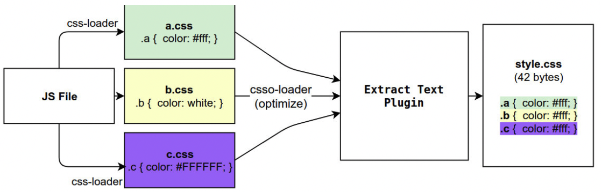

## 其他资源处理

### 案例

常见的使用图片的方式有两种：

1. img 元素，设置**src 属性**
2. 其他元素（例如 div），设置**background-image 的 css 属性**

我们在页面中分别添加 img 和 div 背景

```javaScript
// component.js
import zznhImage from "../img/zznh.png"

...

// 创建一个img元素，设置src属性
const imgEl = new Image()
// imgEl.src = require("../img/zznh.png").default; // file-loader 5.x以后返回的是一个对象，我们需要使用它的default属性
imgEl.src = zznhImage
element.appendChild(imgEl)

// 创建一个div，设置背景图片
const bgDivEl = document.createElement("div")
bgDivEl.style.width = 200 + 'px'
bgDivEl.style.height = 200 + 'px'
bgDivEl.className = "bg-image"
bgDivEl.style.backgroundColor = "red"
element.appendChild(bgDivEl)

```

```css
.bg-image {
  display: inline-block;
  background-image: url("../img/nhlt.jpg") contain;
}
```

这个时候就会发现，`yarn build`打包会报错，因为没有解析图片文件的 loader

### file-loader

要处理 jpg、png 等格式的图片，我们也需要有对应的 loader：`file-loader`

`file-loader`的作用就是帮助我们处理**import/require()**方式引入的文件资源，并且会将它放到我们输出的文件夹中

#### 安装 file-loader

```bash
yarn add file-loader --dev
# or npm install file-loader -D
```

#### 配置处理图片的 rule

```javaScript
rules: [
  {
    test: /\.(png|jpe?g|gif|svg)$/i, // 此时使用jpe?g可以代替jpeg|jpg
    use: {
      loader: "file-loader"
    }
  }
]
```

> 注意：file-loader 5.x 以后**require()**返回的是一个对象，我们需要使用它的 default 属性才能获取资源(之前是直接获取资源)，也可以使用 import 来获取文件

### 文件的名称规则

有时候我们处理的**文件名称**按照一定的规则进行显示，例如：保留原来的**文件名**、**扩展名**，同时为了防止重复，包含一个**hash 值**等

这个时候我们可以使用`placeholder`来完成，webpack 给我们提供了大量的 placeholders 来显示不同的内容，可以在[webpack 的文档](https://v4.webpack.js.org/loaders/file-loader/#placeholders)中查阅（现在的 webpack5 的文档中已经没有 file-loader 了）

常用的 placeholder：

- [ext]：处理文件的扩展名
- [name]：处理文件的名称
- [hash]：文件的内容，使用 MD4 的散列函数(hash 函数)处理，生成一个 128 位的 hash 值(32 个十六进制)
- [contentHash]：在 file-loader 中和[hash]结果是一致的(在 webpack 的一些其他地方不一样)
- [hash: \<length\>]：截取 hash 的长度，默认 32 个字符太长了
- [path]：文件相对于 webpack 配置文件的路径

#### 实际操作

```javaScript
{
  test: /\.(jpe?g|png|svg)$/,
  use: [
    {
      loader: "file-loader",
      options: {
        name: "img/[name].[hash:6].[ext]", // 指定输出的文件名
        // outputPath: "img" // 一般不用，一般直接写在上面的name中
      }
    }
  ]
}
```

我们设置名称的时候也可以直接在 name 中指定输出的文件夹，这也是 vue 的写法，也可以在`outputPath`中指定输出文件夹

### url-loader

`url-loader`和`file-loader`的工作方式是相似的，但是可以将较小的文件，转成**base64 的 URL**

#### 安装 url-loader

```bash
yarn add url-loader --dev
# or npm install url-loader -D
```

#### 使用

```javaScript
{
  test: /\.(jpe?g|png|svg)$/,
  use: [
    {
      loader: "url-loader",
      options: {
        name: "img/[name].[hash:6].[ext]", // 指定输出的文件名
      }
    }
  ]
}
```

显示结果和之前一样，并且图片可以正常显示，但是`dist`文件夹中，我们会看不到图片文件：`url-loader`默认情况下会将所有的图片转成 base64 编码

#### url-loader 的 limit

但是开发中我们往往是**小的图片需要转换**，但是**大的图片直接使用图片**即可

- 因为**小的图片转换 base64**之后可以和页面一起被请求，减少不必要的请求过程
- 而大的图片也进行转换，反而会**影响页面的请求速度**

我们可以利用`url-loader`的**limit**属性，限制哪些大小的图片转换和不转换

```javaScript
{
  test: /\.(jpe?g|png|svg)$/,
  use: [
    {
      loader: "url-loader",
      options: {
        name: "img/[name].[hash:6].[ext]", // 指定输出的文件名
        limit: 100 * 1024
      }
    }
  ]
}
```

这样大于 100k 的图片就不会转换和小于 100k 的图片就会转换

### Asset module type

#### 介绍

我们当前使用的 webpack 版本是 webpack5：

- 在 webpack5 之前，加载这些资源我们需要使用一些 loader，例如`raw-loader`、`url-loader`、`file-loader`
- 在 webpack5 之后，我们可以直接使用**资源模块类型(asset module type)**，来替代上面的这些 loader

**资源模块类型(asset module type)**，通过添加 4 种新的模块类型，来替换所有这些 loader

- asset/resource：发送一个单独的文件并导出 URL。（类似之前通过`file-loader`实现）
- asset/inline：导出一个资源的 dataURL。（类似之前通过`url-loader`实现）
- asset/source：导出资源的源代码。（类似之前通过`row-loader`实现）
- asset：在导出一个 data URL 和发送一个单独的文件之间自动选择。（类似之前通过使用`url-loader`，并配置资源体积限制实现）

#### 使用

加载图片可以使用下面的方式

```javaScript
rules: [
  {
    test: /\.(jpe?g|png|svg)$/,
    type: "asset/resource",
  }
]
```

我们也可以通过以下两种方式自定义文件的输出路径和文件名

- 方式 1：修改 output，添加 assetModuleFilename 属性

```javaScript
output: {
  filename: "js/bundle.js",
  path: path.resolve(__dirname, "./dist"),
  assetModuleFilename: "img/[name].[hash:6][ext]"
}
```

- 方式 2： 在 Rule 中，添加一个 generator 属性，并且设置 filename

```javaScript
rules: [
  {
    test: /\.(jpe?g|png|svg)$/,
    type: "asset/resource",
    generator: {
      filename: "img/[name].[hash:6][ext]"
    },
  }
]
```

如果想实现 url-loader 的 limit 效果，则需要两个步骤

- 步骤 1：将 type 修改为 asset
- 步骤 2：添加一个 parser 属性，并且制定 dataUrl 的条件，添加 maxSize 属性

```javaScript
rules: [
  {
    test: /\.(jpe?g|png|svg)$/,
    type: "asset",
    generator: {
      filename: "img/[name].[hash:6][ext]"
    },
    parser: {
      dataUrlCondition: {
        maxSize: 100 * 1024
      }
    }
  }
]
```

### 加载字体文件

如果我们需要使用某些**特殊的字体或者字体图标**，那么我们会引入很多字体相关的文件，这些文件的处理也是相同的

#### 案例

1. 我们从阿里图标库中下载一些字体图标
2. 在 component.js 中引入，并且添加一个 i 元素用于显示字体图标

```javaScript
const iEl = document.createElement("i")
iEl.className = "iconfont icon-ashbin icon-common"
element.appendChild(iEl)
```

```css
/* 引入css */
@import "../font/iconfont.css";
.icon-common {
  color: red;
  font-size: 50px;
}
```

3. 此时使用`yarn build`打包，会发现报错了

#### 字体打包解决

我们可以使用`file-loader`来处理，也可以直接使用 webpack5 的资源模块类型来处理

```javaScript
{
  test: /\.(ttf|eot|woff2?)$/i,
  type: "asset/resource",
  generator: {
    filename: "font/[name].[hash:6][ext]"
  }
}
```

## Plugin

### 认识 Plugin

webpack 的另一个核心就是**Plugin**，官方有一段对**Plugin**的描述：

> While loaders are used to transform certain types of modules, plugins can be leveraged to perform a wider range of tasks like bundle optimization, asset management and injection of environment variables.

上面表达的含义翻译过来就是：

- Loader 是用于**特定的模块类型**进行转换
- Plugin 可以用于**执行更加广泛的任务**，例如：打包优化、资源管理、环境变量注入等



### CleanWebpackPlugin

在前面我们每次修改配置后使用`yarn build`进行打包时，都需要**手动删除 dist 文件夹**，我们可以借助于一个插件来帮助我们完成，这个插件就是`CleanWebpackPlugin`

#### 安装 CleanWebpackPlugin

```bash
yarn add clean-webpack-plugin --dev
# or npm install clean-webpack-plugin -D
```

#### 使用

```javaScript
const { CleanWebpackPlugin } = require("clean-webpack-plugin")

module.exports = {
  // 其他省略
  plugins: [
    new CleanWebpackPlugin()
  ]
}
```

现在每次修改配置后就不需要再删除 dist 文件夹了，会自动帮助我们删除

### HtmlWebpackPlugin

还有一个问题就是

- 我们在 HTML 文件是在编写的根目录下的，而最终打包的**dist 文件夹中是没有 index.html 文件**的。
- 而在**进行项目部署**的时候，必然也是需要**有对应的入口文件 index.html**，所以我们也需要对**index.html 进行打包处理**。

对 HTML 进行打包处理我们可以使用另外一个插件：`HtmlWebpackPlugin`

#### 安装 HtmlWebpackPlugin

```bash
yarn add html-webpack-plugin --dev
# or npm install html-webpack-plugin -D
```

#### 基本使用

```javaScript
const { CleanWebpackPlugin } = require("clean-webpack-plugin")
const HtmlWebpackPlugin = require("html-webpack-plugin")
module.exports = {
  // 其他省略
  plugins: [
    new CleanWebpackPlugin(),
    new HtmlWebpackPlugin({ title: "SunRain Webpack" }) // 可以在里面传一个对象，title属性就是配置index.html的title
  ]
}

```

#### 生成的 index.html 分析

此时 dist 文件夹中，会生成一个 index.html 文件，该文件已经自动添加了我们打包的 bundle.js 文件

```html
<!DOCTYPE html>
<html>
  <head>
    <meta charset="utf-8" />
    <title>SunRain Webpack</title>
    <meta name="viewport" content="width=device-width,initial-scale=1" />
    <script defer="defer" src="bundle.js"></script>
  </head>

  <body></body>
</html>
```

这个文件生成的流程是：默认情况下是根据`ejs`的一个模块来生成的，在`html-webpack-plugin`的源码中，有一个 default_index.ejs 模块

#### 自定义模板数据填充

在上面的模板代码中，会有一些类似`<% 变量 %>`的语法，这个是**EJS 模块填充数据的方式**

在配置 HtmlWebpackPlugin 时，我们可以添加如下配置:

- template：指定我们要使用的模块所在的路径;
- title：在进行 htmlWebpackPlugin.options.title 读取时，就会读到该信息;

```javaScript
const HtmlWebpackPlugin = require("html-webpack-plugin")
module.exports = {
  // 其他省略
  plugins: [
    new CleanWebpackPlugin(),
    new HtmlWebpackPlugin({
      title: "SunRain Webpack", // 可以在里面传一个对象，title属性就是配置index.html的title
      template: "./public/index.html" // 模板路径
    })
  ]
}
```

这样 index.html 就会根据你自定义的模板生成文件

### DefinePlugin

我们经常看到`vue`的 index.html 模板中有**BASE_URL**这个常量，如果我们再 webpack 中直接使用，打包就会报错，因为我们并没有定义它

 我们就可以使用`DefinePlugin`这个插件来定义全局的常量，`DefinePlugin`允许在编译时创建配置的全局常量，是一个 webpack**内置**插件

#### 使用

```javaScript
const { DefinePlugin } = require("webpack")

module.exports = {
  // 其他省略
  plugins: [
    new DefinePlugin({
      BASE_URL: '"./"', // 如果不加''就类似 const BASE_URL = ./
    })
  ]
}

```

此时 template 就可以正确编译，读取**BASE_URL**的值

### CopyWebpackPlugin

在 vue 的打包过程中，如果我们将一些文件**放到 public 的目录**下，那么这个目录会**被复制到 dist 文件夹**中，这个复制的公共我们可以使用`CopyWebpackPlugin`来完成

#### 安装 CopyWebpackPlugin

```bash
yarn add copy-webpack-plugin --dev
# or npm install copy-webpack-plugin -D
```

#### 配置

配置 CopyWebpackPlugin 的参数：

- from：设置从哪一个源中开始复制
- to：复制到的位置：可以省略，会默认复制到打包的目录下
- globOptions：设置一些额外的选项，其中可以编写需要忽略的文件(ignore)
  - .DS_Store:mac 目录下回自动生成的一个文件;
  - index.html:也不需要复制，因为我们已经通过 HtmlWebpackPlugin 完成了 index.html 的生成;

```javaScript
const CopyWebpackPlugin = require("copy-webpack-plugin")

module.exports = {
  // 其他省略
  plugins: [
    new CopyWebpackPlugin({
      patterns: [
        {
          from: "public",
          globOptions: {
            ignore: [ // 设置需要忽略复制的文件
              "**/.DS_Store", // 文件前要加通用匹配符**
              "**/index.html"
            ]
          }
        }
      ]
    })
  ]
}

```
