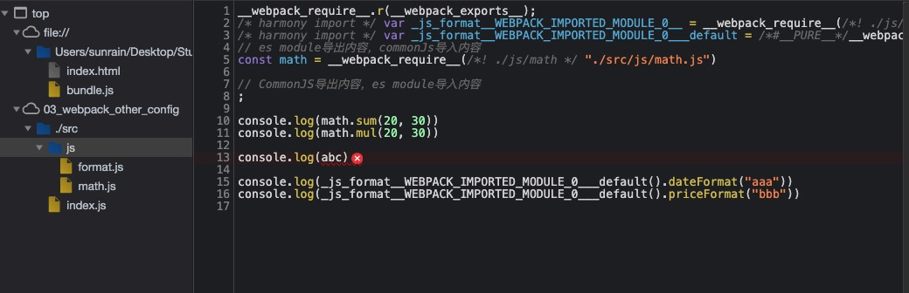
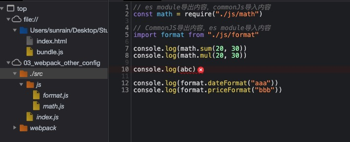
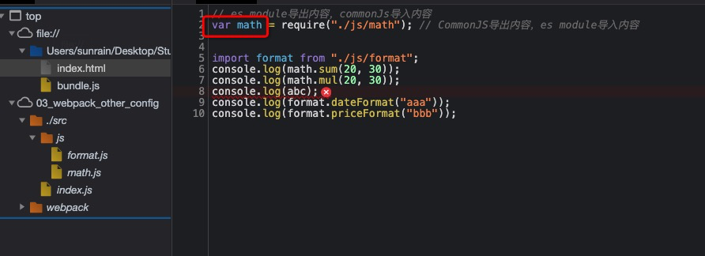
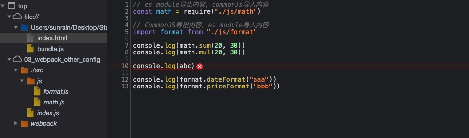
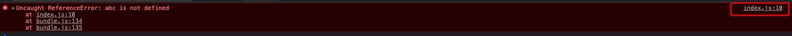
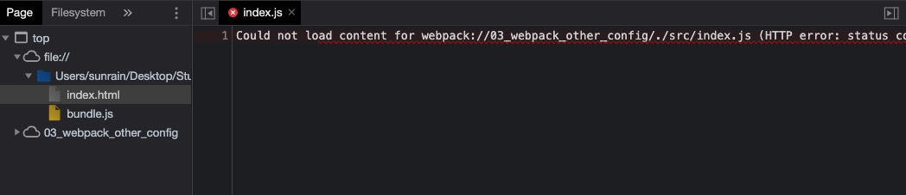

## source-map 基础

### 认识 source-map

我们的代码通常在浏览器上时，是通过**打包压缩**的，也就是真实跑在浏览器上的代码和我们编写的代码其实是有差异的，例如：

- **ES6**的代码可能被转换成**ES5**
- **对应的代码行号、列号**在经过编译后肯定会不一致
- 代码在**丑化压缩**时，会将**编码名称**等修改
- 我们使用了**TypeScript**等方式编写的代码，最终转换成**JavaScript**

但是当代码报错需要**调试(debug)**时，调试**转换后的代码**是很困难的，我们是不能保证代码不出错的

为了可以**调试转换后不一致**的代码，我们就可以使用`source-map`

- source-map 是从**已经转换的代码**，映射到**原始的源文件**
- 使浏览器可以**重构原始源**并在调试器中**显示重建的原始源**

### 如何使用 source-map

使用 source-map 有两步

1. 根据源文件，生成 source-map 文件，webpack 在打包时，可以通过配置生成 source-map
2. 在转换后的代码，最后添加一个注释，它指向 source-map（`// #sourceMappingURL=common.bundle.js.map`）

浏览器会根据我们的注释，查找相应的 source-map，并且根据 source-map 还原我们的代码，方便进行调试

在 Chrome 中，我们可以按照如下方式打开 source-map

### 分析 source-map

最初 source-map 生成的文件是原始文件的 10 倍，第二版减少了约 50%，第三版又减少了 50%，所以默契一个 133kb 的文件，最终的 source-map 的大小大概在 300kb 左右

目前生成的 source-map 文件的结构分析：

- version：当前使用的版本，也就是最新的第三版
- sources：从哪些文件转换过来的 source-map 和打包的代码（最初始的文件目录）
- names：转换前的变量和属性名称（因为我目前使用的 development 模式，所以不需要保留转换前的名称）
- mappings：source-map 用来和源文件映射的信息（比如位置信息等），是一串 base64 VLQ(veriable length quantity 可变长度值)编码
- file：打包后的文件（浏览器加载的文件）
- sourceContent：转换前的具体代码信息（和 sources 是对应关系）
- sourceRoot：所有的 sources 相对的根目录

可以参考[sourceMap MDN](https://developer.mozilla.org/en-US/docs/Mozilla/JavaScript_code_modules/SourceMap.jsm)来查看，不过目前好像已经没有维护了

### 生成 source-map

webpack 为我们提供了非常多的选项（目前是 26 个），来处理 source-map，可以查看[webpack 的 devtool](https://webpack.docschina.org/configuration/devtool/)

选择不同的值，生成的 source-map 会稍有差异，打包的过程也会 有**性能的差异**，可以根据不同的情况进行选择

下面几个值不会生成 source-map

- false：不使用 source-map，也就是没有任何和 source-map 相关的内容
- none：production 模式下的默认值，意思是不写 devtool，也就不生成 source-map
- eval：development 模式下的默认值，不生成 source-map（但是打包后真正要执行的代码，会用 eval 包裹，因为需要添加一个注释，这个注释回去对应真是文件）
  - 但是它会在 eval 执行的代码中，添加`//# sourceURL=`
  - 它会被浏览器在执行时解析，并且在调试面板中生成对应的一些文件目录，方便我们调试代码

## source-map 的值

```javaScript
// 出错的源文件
// es module导出内容，commonJs导入内容
const math = require("./js/math")

// CommonJS导出内容，es module导入内容
import format from "./js/format"

console.log(math.sum(20, 30))
console.log(math.mul(20, 30))

console.log(abc)

console.log(format.dateFormat("aaa"))
console.log(format.priceFormat("bbb"))
```

上面的内容的 abc 未定义，会报错，使用该文件来进行打包（使用不同的 devtool）

### eval

当**devtool**的值设置为`eval`时，打包后的文件中转换后的内容会用 eval 函数包裹，会有**列映射**，但是同时会在结尾添加**sourceUrl 注释**，用于对应源文件的目录

```javaScript
// bundle.js中，打包后的部分内容
eval("__webpack_require__.r(__webpack_exports__);\n/* harmony import */ var _js_format__WEBPACK_IMPORTED_MODULE_0__ = __webpack_require__(/*! ./js/format */ \"./src/js/format.js\");\n/* harmony import */ var _js_format__WEBPACK_IMPORTED_MODULE_0___default = /*#__PURE__*/__webpack_require__.n(_js_format__WEBPACK_IMPORTED_MODULE_0__);\n// es module导出内容，commonJs导入内容\nconst math = __webpack_require__(/*! ./js/math */ \"./src/js/math.js\")\n\n// CommonJS导出内容，es module导入内容\n;\n\nconsole.log(math.sum(20, 30))\nconsole.log(math.mul(20, 30))\n\nconsole.log(abc)\n\nconsole.log(_js_format__WEBPACK_IMPORTED_MODULE_0___default().dateFormat(\"aaa\"))\nconsole.log(_js_format__WEBPACK_IMPORTED_MODULE_0___default().priceFormat(\"bbb\"))\n\n//# sourceURL=webpack://03_webpack_other_config/./src/index.js?");
```



可以看出，在浏览器中虽然页面对应的内容不是源文件内容，但是源文件的目录是对应上的

### source-map

当**devtool**的值设置为`source-map`时，会生成一个独立的 source-map 文件(bundle.js.map)，并且在**bundle.js**的最后有一个注释，指向这个 source-map 文件

注释的内容是

```javaScript
// # sourceMappingURL=bundle.js.map
```

开发工具会根据这个注释找到 source-map 文件，并根据它进行解析，生成原始的文件结构和内容



> 注意：此处显示了列映射是因为配置了 loader，好像需要 loader 处理后才会显示列映射

```bash
# 安装loader和对应插件
yarn add babel-loader @babel/core @babel/preset-env --dev
# or npm install babel-loader @babel/core @babel/preset-env -D
```

```javaScript
// babel-loader配置
module: {
    rules: [
        {
            test: /\.js$/,
            use: {
                loader: "babel-loader",
                options: {
                  presets: [
                    ["@babel/preset-env", { targets: "defaults" }]
                  ]
                }
            }
        }
    ]
},
```

### eval-source-map

当**devtool**的值设置为`eval-source-map`时，真正运行的内容会放在 eval 中，同时会生成 sourcemap，但是 source-map 是以**DataUrl 添加到 eval 函数的后面**，并且会转换成**base64**的形式，浏览器对应的内容与`source-map`基本一致，也有对应的**列映射**

缺点在于：将所有的内容都打包到 bundle 中，初次加载时速度会变慢

```javaScript
// 打包后bundle.js中部分内容
eval("const dateFormat = data => {\n  return \"2021-07-04\";\n};\n\nconst priceFormat = price => {\n  return \"100.00\";\n};\n\nmodule.exports = {\n  dateFormat,\n  priceFormat\n};//# sourceURL=[module]\n//# sourceMappingURL=data:application/json;charset=utf-8;base64,eyJ2ZXJzaW9uIjozLCJzb3VyY2VzIjpbIndlYnBhY2s6Ly8wM193ZWJwYWNrX290aGVyX2NvbmZpZy8uL3NyYy9qcy9mb3JtYXQuanM/OGU0MiJdLCJuYW1lcyI6WyJkYXRlRm9ybWF0IiwiZGF0YSIsInByaWNlRm9ybWF0IiwicHJpY2UiLCJtb2R1bGUiLCJleHBvcnRzIl0sIm1hcHBpbmdzIjoiQUFBQSxNQUFNQSxVQUFVLEdBQUdDLElBQUksSUFBSTtBQUN2QixTQUFPLFlBQVA7QUFDSCxDQUZEOztBQUlBLE1BQU1DLFdBQVcsR0FBR0MsS0FBSyxJQUFJO0FBQ3pCLFNBQU8sUUFBUDtBQUNILENBRkQ7O0FBSUFDLE1BQU0sQ0FBQ0MsT0FBUCxHQUFpQjtBQUFFTCxFQUFBQSxVQUFGO0FBQWNFLEVBQUFBO0FBQWQsQ0FBakIiLCJzb3VyY2VzQ29udGVudCI6WyJjb25zdCBkYXRlRm9ybWF0ID0gZGF0YSA9PiB7XG4gICAgcmV0dXJuIFwiMjAyMS0wNy0wNFwiXG59XG5cbmNvbnN0IHByaWNlRm9ybWF0ID0gcHJpY2UgPT4ge1xuICAgIHJldHVybiBcIjEwMC4wMFwiXG59XG5cbm1vZHVsZS5leHBvcnRzID0geyBkYXRlRm9ybWF0LCBwcmljZUZvcm1hdCB9Il0sImZpbGUiOiIuL3NyYy9qcy9mb3JtYXQuanMuanMiLCJzb3VyY2VSb290IjoiIn0=\n//# sourceURL=webpack-internal:///./src/js/format.js\n");
```

### inline-source-map

当**devtool**的值设置为`inline-source-map`时，也会生成 sourcemap，但是 source-map 是以**DataUrl**添加到**bundle.js**文件的最后面，也是转换成**base64**

```javaScript
// 打包文件最后的dataUrl

//# sourceMappingURL=data:application/json;charset=utf-8;base64,eyJ2ZXJzaW9uIjozLCJzb3VyY2VzIjpbIndlYnBhY2s6Ly8wM193ZWJwYWNrX290aGVyX2NvbmZpZy8uL3NyYy9qcy9mb3JtYXQuanMiLCJ3ZWJwYWNrOi8vMDNfd2VicGFja19vdGhlcl9jb25maWcvLi9zcmMvanMvbWF0aC5qcyIsIndlYnBhY2s6Ly8wM193ZWJwYWNrX290aGVyX2NvbmZpZy93ZWJwYWNrL2Jvb3RzdHJhcCIsIndlYnBhY2s6Ly8wM193ZWJwYWNrX290aGVyX2NvbmZpZy93ZWJwYWNrL3J1bnRpbWUvY29tcGF0IGdldCBkZWZhdWx0IGV4cG9ydCIsIndlYnBhY2s6Ly8wM193ZWJwYWNrX290aGVyX2NvbmZpZy93ZWJwYWNrL3J1bnRpbWUvZGVmaW5lIHByb3BlcnR5IGdldHRlcnMiLCJ3ZWJwYWNrOi8vMDNfd2VicGFja19vdGhlcl9jb25maWcvd2VicGFjay9ydW50aW1lL2hhc093blByb3BlcnR5IHNob3J0aGFuZCIsIndlYnBhY2s6Ly8wM193ZWJwYWNrX290aGVyX2NvbmZpZy93ZWJwYWNrL3J1bnRpbWUvbWFrZSBuYW1lc3BhY2Ugb2JqZWN0Iiwid2VicGFjazovLzAzX3dlYnBhY2tfb3RoZXJfY29uZmlnLy4vc3JjL2luZGV4LmpzIl0sIm5hbWVzIjpbImRhdGVGb3JtYXQiLCJkYXRhIiwicHJpY2VGb3JtYXQiLCJwcmljZSIsIm1vZHVsZSIsImV4cG9ydHMiLCJzdW0iLCJudW0xIiwibnVtMiIsIm11bCIsIm1hdGgiLCJyZXF1aXJlIiwiY29uc29sZSIsImxvZyIsImFiYyIsImZvcm1hdCJdLCJtYXBwaW5ncyI6Ijs7Ozs7Ozs7O0FBQUEsTUFBTUEsVUFBVSxHQUFHQyxJQUFJLElBQUk7QUFDdkIsU0FBTyxZQUFQO0FBQ0gsQ0FGRDs7QUFJQSxNQUFNQyxXQUFXLEdBQUdDLEtBQUssSUFBSTtBQUN6QixTQUFPLFFBQVA7QUFDSCxDQUZEOztBQUlBQyxNQUFNLENBQUNDLE9BQVAsR0FBaUI7QUFBRUwsWUFBRjtBQUFjRTtBQUFkLENBQWpCLEM7Ozs7Ozs7Ozs7Ozs7Ozs7QUNSTyxNQUFNSSxHQUFHLEdBQUcsQ0FBQ0MsSUFBRCxFQUFPQyxJQUFQLEtBQWdCO0FBQy9CLFNBQU9ELElBQUksR0FBR0MsSUFBZDtBQUNILENBRk07QUFJQSxNQUFNQyxHQUFHLEdBQUcsQ0FBQ0YsSUFBRCxFQUFPQyxJQUFQLEtBQWdCO0FBQy9CLFNBQU9ELElBQUksR0FBR0MsSUFBZDtBQUNILENBRk0sQzs7Ozs7O1VDSlA7VUFDQTs7VUFFQTtVQUNBO1VBQ0E7VUFDQTtVQUNBO1VBQ0E7VUFDQTtVQUNBO1VBQ0E7VUFDQTtVQUNBO1VBQ0E7VUFDQTs7VUFFQTtVQUNBOztVQUVBO1VBQ0E7VUFDQTs7Ozs7V0N0QkE7V0FDQTtXQUNBO1dBQ0EsY0FBYywwQkFBMEIsRUFBRTtXQUMxQyxjQUFjLGVBQWU7V0FDN0IsZ0NBQWdDLFlBQVk7V0FDNUM7V0FDQSxFOzs7OztXQ1BBO1dBQ0E7V0FDQTtXQUNBO1dBQ0Esd0NBQXdDLHlDQUF5QztXQUNqRjtXQUNBO1dBQ0EsRTs7Ozs7V0NQQSw2Q0FBNkMsd0RBQXdELEU7Ozs7O1dDQXJHO1dBQ0E7V0FDQTtXQUNBLHNEQUFzRCxrQkFBa0I7V0FDeEU7V0FDQSwrQ0FBK0MsY0FBYztXQUM3RCxFOzs7Ozs7Ozs7Ozs7OztBQ05BO0FBQ0EsTUFBTUUsSUFBSSxHQUFHQyxtQkFBTyxDQUFDLG1DQUFELENBQXBCLEMsQ0FFQTs7O0FBQ0E7QUFFQUMsT0FBTyxDQUFDQyxHQUFSLENBQVlILElBQUksQ0FBQ0osR0FBTCxDQUFTLEVBQVQsRUFBYSxFQUFiLENBQVo7QUFDQU0sT0FBTyxDQUFDQyxHQUFSLENBQVlILElBQUksQ0FBQ0QsR0FBTCxDQUFTLEVBQVQsRUFBYSxFQUFiLENBQVo7QUFFQUcsT0FBTyxDQUFDQyxHQUFSLENBQVlDLEdBQVo7QUFFQUYsT0FBTyxDQUFDQyxHQUFSLENBQVlFLDREQUFBLENBQWtCLEtBQWxCLENBQVo7QUFDQUgsT0FBTyxDQUFDQyxHQUFSLENBQVlFLDZEQUFBLENBQW1CLEtBQW5CLENBQVosRSIsImZpbGUiOiJidW5kbGUuanMiLCJzb3VyY2VzQ29udGVudCI6WyJjb25zdCBkYXRlRm9ybWF0ID0gZGF0YSA9PiB7XG4gICAgcmV0dXJuIFwiMjAyMS0wNy0wNFwiXG59XG5cbmNvbnN0IHByaWNlRm9ybWF0ID0gcHJpY2UgPT4ge1xuICAgIHJldHVybiBcIjEwMC4wMFwiXG59XG5cbm1vZHVsZS5leHBvcnRzID0geyBkYXRlRm9ybWF0LCBwcmljZUZvcm1hdCB9IiwiZXhwb3J0IGNvbnN0IHN1bSA9IChudW0xLCBudW0yKSA9PiB7XG4gICAgcmV0dXJuIG51bTEgKyBudW0yXG59XG5cbmV4cG9ydCBjb25zdCBtdWwgPSAobnVtMSwgbnVtMikgPT4ge1xuICAgIHJldHVybiBudW0xICogbnVtMlxufSIsIi8vIFRoZSBtb2R1bGUgY2FjaGVcbnZhciBfX3dlYnBhY2tfbW9kdWxlX2NhY2hlX18gPSB7fTtcblxuLy8gVGhlIHJlcXVpcmUgZnVuY3Rpb25cbmZ1bmN0aW9uIF9fd2VicGFja19yZXF1aXJlX18obW9kdWxlSWQpIHtcblx0Ly8gQ2hlY2sgaWYgbW9kdWxlIGlzIGluIGNhY2hlXG5cdHZhciBjYWNoZWRNb2R1bGUgPSBfX3dlYnBhY2tfbW9kdWxlX2NhY2hlX19bbW9kdWxlSWRdO1xuXHRpZiAoY2FjaGVkTW9kdWxlICE9PSB1bmRlZmluZWQpIHtcblx0XHRyZXR1cm4gY2FjaGVkTW9kdWxlLmV4cG9ydHM7XG5cdH1cblx0Ly8gQ3JlYXRlIGEgbmV3IG1vZHVsZSAoYW5kIHB1dCBpdCBpbnRvIHRoZSBjYWNoZSlcblx0dmFyIG1vZHVsZSA9IF9fd2VicGFja19tb2R1bGVfY2FjaGVfX1ttb2R1bGVJZF0gPSB7XG5cdFx0Ly8gbm8gbW9kdWxlLmlkIG5lZWRlZFxuXHRcdC8vIG5vIG1vZHVsZS5sb2FkZWQgbmVlZGVkXG5cdFx0ZXhwb3J0czoge31cblx0fTtcblxuXHQvLyBFeGVjdXRlIHRoZSBtb2R1bGUgZnVuY3Rpb25cblx0X193ZWJwYWNrX21vZHVsZXNfX1ttb2R1bGVJZF0obW9kdWxlLCBtb2R1bGUuZXhwb3J0cywgX193ZWJwYWNrX3JlcXVpcmVfXyk7XG5cblx0Ly8gUmV0dXJuIHRoZSBleHBvcnRzIG9mIHRoZSBtb2R1bGVcblx0cmV0dXJuIG1vZHVsZS5leHBvcnRzO1xufVxuXG4iLCIvLyBnZXREZWZhdWx0RXhwb3J0IGZ1bmN0aW9uIGZvciBjb21wYXRpYmlsaXR5IHdpdGggbm9uLWhhcm1vbnkgbW9kdWxlc1xuX193ZWJwYWNrX3JlcXVpcmVfXy5uID0gZnVuY3Rpb24obW9kdWxlKSB7XG5cdHZhciBnZXR0ZXIgPSBtb2R1bGUgJiYgbW9kdWxlLl9fZXNNb2R1bGUgP1xuXHRcdGZ1bmN0aW9uKCkgeyByZXR1cm4gbW9kdWxlWydkZWZhdWx0J107IH0gOlxuXHRcdGZ1bmN0aW9uKCkgeyByZXR1cm4gbW9kdWxlOyB9O1xuXHRfX3dlYnBhY2tfcmVxdWlyZV9fLmQoZ2V0dGVyLCB7IGE6IGdldHRlciB9KTtcblx0cmV0dXJuIGdldHRlcjtcbn07IiwiLy8gZGVmaW5lIGdldHRlciBmdW5jdGlvbnMgZm9yIGhhcm1vbnkgZXhwb3J0c1xuX193ZWJwYWNrX3JlcXVpcmVfXy5kID0gZnVuY3Rpb24oZXhwb3J0cywgZGVmaW5pdGlvbikge1xuXHRmb3IodmFyIGtleSBpbiBkZWZpbml0aW9uKSB7XG5cdFx0aWYoX193ZWJwYWNrX3JlcXVpcmVfXy5vKGRlZmluaXRpb24sIGtleSkgJiYgIV9fd2VicGFja19yZXF1aXJlX18ubyhleHBvcnRzLCBrZXkpKSB7XG5cdFx0XHRPYmplY3QuZGVmaW5lUHJvcGVydHkoZXhwb3J0cywga2V5LCB7IGVudW1lcmFibGU6IHRydWUsIGdldDogZGVmaW5pdGlvbltrZXldIH0pO1xuXHRcdH1cblx0fVxufTsiLCJfX3dlYnBhY2tfcmVxdWlyZV9fLm8gPSBmdW5jdGlvbihvYmosIHByb3ApIHsgcmV0dXJuIE9iamVjdC5wcm90b3R5cGUuaGFzT3duUHJvcGVydHkuY2FsbChvYmosIHByb3ApOyB9IiwiLy8gZGVmaW5lIF9fZXNNb2R1bGUgb24gZXhwb3J0c1xuX193ZWJwYWNrX3JlcXVpcmVfXy5yID0gZnVuY3Rpb24oZXhwb3J0cykge1xuXHRpZih0eXBlb2YgU3ltYm9sICE9PSAndW5kZWZpbmVkJyAmJiBTeW1ib2wudG9TdHJpbmdUYWcpIHtcblx0XHRPYmplY3QuZGVmaW5lUHJvcGVydHkoZXhwb3J0cywgU3ltYm9sLnRvU3RyaW5nVGFnLCB7IHZhbHVlOiAnTW9kdWxlJyB9KTtcblx0fVxuXHRPYmplY3QuZGVmaW5lUHJvcGVydHkoZXhwb3J0cywgJ19fZXNNb2R1bGUnLCB7IHZhbHVlOiB0cnVlIH0pO1xufTsiLCIvLyBlcyBtb2R1bGXlr7zlh7rlhoXlrrnvvIxjb21tb25Kc+WvvOWFpeWGheWuuVxuY29uc3QgbWF0aCA9IHJlcXVpcmUoXCIuL2pzL21hdGhcIilcblxuLy8gQ29tbW9uSlPlr7zlh7rlhoXlrrnvvIxlcyBtb2R1bGXlr7zlhaXlhoXlrrlcbmltcG9ydCBmb3JtYXQgZnJvbSBcIi4vanMvZm9ybWF0XCJcblxuY29uc29sZS5sb2cobWF0aC5zdW0oMjAsIDMwKSlcbmNvbnNvbGUubG9nKG1hdGgubXVsKDIwLCAzMCkpXG5cbmNvbnNvbGUubG9nKGFiYylcblxuY29uc29sZS5sb2coZm9ybWF0LmRhdGVGb3JtYXQoXCJhYWFcIikpXG5jb25zb2xlLmxvZyhmb3JtYXQucHJpY2VGb3JtYXQoXCJiYmJcIikpIl0sInNvdXJjZVJvb3QiOiIifQ==
```

### cheap-source-map

当**devtool**的值设置为`cheap-source-map`时，会生成 sourcemap，但是会更**高效**一些（cheap**开销更低**），因为它没有生成**列映射**（Column Mapping），因为在开发中，我们通常只需要行信息就能定位到错误了

但是`cheap-source-map`可能会因为被**loader**处理后无法获取真实的源代码，可能受 loader 的影响



根据上图可以看出，经过 loader 处理后的 <font color="red">const</font> 变成了 <font color="red">var</font>，可以看到`cheap-source-map`的弊端

### cheap-module-source-map

当**devtool**的值设置为`cheap-module-source-map`时，会生成 sourcemap，类似于 cheap-source-map，但是对**源自 loader 的 sourcemap 处理更好**，其实是如果 loader 对我们的源码进行了特殊的处理（例如：babel），`cheap-module-source-map`就能更好的得到源码



由上图可以看出，使用`cheap-module-source-map`，只是没有对应的列映射，但是可以完美还源代码，包括 loader 的处理

### hidden-source-map 值

当**devtool**的值设置为`hidden-source-map`时，会生成 sourcemap 文件，但是**不会对 source-map 文件进行引用**，相当于**删除了打包文件中对 source-map 的引用注释**

此时如果我们手动添加注释，那么 source-map 就会生效了

该值存在的作用只是隐藏打包后在浏览器中回显源文件

### nosources-source-map

当**devtool**的值设置为`hidden-source-map`时，会生成 sourcemap，但是生成的 sourcemap**只有错误信息的提示**，<font color="red">不会生成源代码文件</font>

更加下面两张图可以看到，生成了对应的错误信息，但无法在浏览器中直接定位到错误的位置，只能根据错误信息，在对应的代码中查找





### 多个值的组合

事实上，webpack 提供给我们了 26 个值，是可以进行多值组合的

组合的规则如下：

- inline- |hidden- |eval-：三个值只能选其一
- nosources：可选值
- cheap 可选值，并且可以跟随 module 的值(cheap-module)

`[inline-|hidden-|eval-][nosources-][cheap-[module-]]source-map`

在开发中的最佳实践是：

- **开发阶段**：推荐使用`source-map`或者<font color="red">cheap-module-source-map</font>（更推荐）
  - 这分别是**vue**和**react**使用的值，可以获取调试信息，方便快速开发
- **测试阶段**：推荐使用`source-map`或者<font color="red">cheap-module-source-map</font>（更推荐）
  - 测试阶段我们也希望在浏览器下看到正确的错误提示
- **发布阶段**：false、缺省值（不写）
