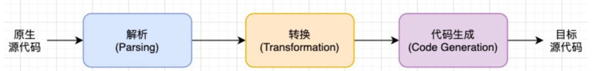
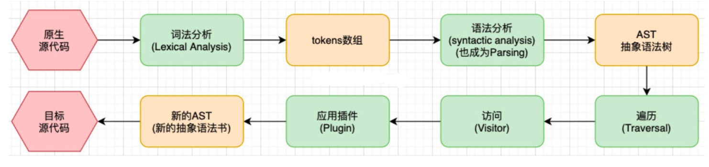
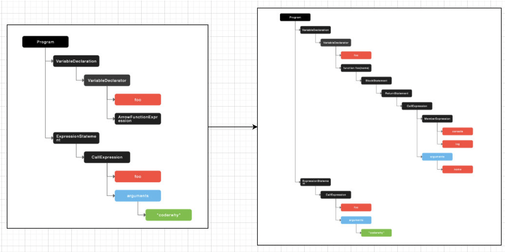

## Babel 基础

### 为什么需要 babel

事实上，在开发中我们很少直接接触`babel`，但`babel`对于前端开发来说，目前是不可缺少的一部分

开发中，我们想要使用**ES6+**的语法，想要使用**TypeScript**，开发 React 项目，它们都是离不开`Babel`的，所以学习`Babel`对于我们理解代码从编写到线上的转变过程至关重要。

那么，Babel 到底是什么呢

Babel 是一个工具链，主要用于就浏览器或者缓解中将**ECMAScript2015+**代码转换为向后兼容版本的 JavaScript，包括**语法转换**、**源代码转换**、**Polyfill**实现目标缓解缺少的功能等

```javaScript
// babel转换的例子
// ES6语法
[1, 2, 3].map(n => n + 1)

// 转换后变成ES5语法
[1, 2, 3].map(function(n) {
  return n + 1
})
```

### Babel 命令行使用

`babel`本身可以作为一个独立的工具（和 postcss 一样），不和 webpack 等构建工具配置也可单独使用

如果我们需要在命令行尝试使用 babel，需要安装如下库：

- @babel/core: 这是 babel 的核心代码，必须安装
- @babel/cli: 可以让我们在命令行使用 babel

```bash
yarn add @babel/cli @babel/core --dev
# or npm install @babel/cli @babel/core -D
```

在命令行使用 babel

```bash
npx babel src --out-dir dist
```

- src：是源文件的目录（也可以是文件名）
- --out-dir： 指定要输出的文件夹 dist

但是这样使用，发现转换出来的代码没有变化，因为@babel/core 只是 babel 的核心，类似于 postcss，它还需要其他的插件来对代码进行编译，才能进行特定的转换

### 插件的使用

例如我们需要转换箭头函数，那么我们就可以使用箭头函数转换相关的插件：

```bash
yarn add @babel/plugin-transform-arrow-functions --dev
# or npm install @babel/plugin-transform-arrow-functions -D

npx babel src --out-dir dist --plugins=@babel/plugin-transform-arrow-functions
```

查看转换后的结果发现，箭头函数被转换成了**function 函数**。但是**const**并没有转换成**var**

这是因为`plugin-transform-arrow-functions`，并没有提供这样的功能，我们需要使用`plugin-tarnform-block-scoping`来完成这样的功能

```bash
yarn add @babel/plugin-tarnform-block-scoping --dev
# or npm install @babel/plugin-tarnform-block-scoping -D

npx babel src --out-dir dist --plugins=@babel/plugin-transform-block-scoping,@babel/plugin-transform-arrow-functions
```

这样源代码的**const**、**let**就会转换成**var**，箭头函数也会转换成**function 函数**

### babel 的预设 preset

如果要转换的内容过多，一个个设置是比较麻烦的，我们可以使用预设(preset)

安装@babel/preset-env 预设

```
yarn add @babel/preset-env --dev
# or npm install @babel/preset-env --D
```

执行如下如下命令，即可将当前版本适用的 ES6 转换成 ES5

```bash
npx babel src --out-dir dist --presets=@babel/preset-env
```

## Babel 的底层原理

babel 是如何做到将一段代码（ES6、TypeScript、React）转成另一段代码（ES5）的？

- 从一种源代码（原生语言）转换成另一种源代码（目标语言）就是**编译器**在工作，事实上我们可以将 babel 看成就是一个编译器
- Babel 编译器的作用就是将我们的源代码，转换成浏览器可以识别的另一段源代码

Babel 也拥有编译器的工作流程

- 解析阶段（Parsing）
- 转换阶段（Transformation）
- 生成阶段（Code Generation）

### babel 编译器执行原理

下面是 babel 的执行阶段


每个阶段又会有自己具体的工作流程：


下面具体分析一下

1. 下面是一段 ES6 原生源代码

```javaScript
const name = "Hello World";
const foo = (name) => console.log(name);
foo(name);
```

2. 通过<font color="red">词法分析</font>以后会生成以下的 tokens
   [可点击查看转换后的 tokens](./006.md#tokens-数组以及转换前后的-ast-抽象语法树)

3. 然后经过<font color="red">语法分析</font>就会将**tokens 数组**转换成**AST 语法树**
   [可点击查看转换前的 AST 抽象语法树](./006.md#tokens-数组以及转换前后的-ast-抽象语法树)
4. 然后通过<font color="red">遍历</font>**AST 抽象语法树**，在遍历的过程中<font color="red">访问</font>，并应用<font color="red">对应的插件</font>对每个节点进行转换，最后形成新的**AST 抽象语法树**
   [可点击查看转换后的 AST 抽象语法树](./006.md#tokens-数组以及转换前后的-ast-抽象语法树)

5. 最后再将**AST 抽象语法树**转换成目标源代码

```JS
"use strict";

var name = "Hello World";

var foo = function foo(name) {
  console.log(name)
}

foo(name)
```



<font color="red">转换前后的 AST 树</font>

## Babel 的使用

### babel-loader

在实际开发中，我们通常会在构建工具中通过配置 babel 来对其进行使用，比如在 webpack 中，此时需要安装相关的依赖

安装@babel/core 和 babel-loader

```bash
yarn add babel-loader @babel/core --dev

#or npm install babel-loader @babel/core -D
```

然后在 webpack.config.js 中设置 babel

```javaScript
module: {
  rules: [
    {
      test: /\.m?js$/,
      use: {
        loader: "babel-loader"
      }
    }
  ]
}
```

然后需要制定需要的插件

```javaScript
module: {
  rules: [
    {
      test: /\.m?js$/,
      use: {
        loader: "babel-loader",
        options: {
          plugins: [
            "@babel/plugin-transform-block-scoping", // 处理const，let
            "@babel/plugin-transform-arrow-functions" // 处理箭头函数
          ]
        }
      }
    }
  ]
}
```

### babel-preset

如果我们一个个去安装使用插件，那么需要手动来管理大量的 babel 插件，我们可以直接给 webpack 提供一个 preset，webpack 会根据我们的预设来加载对应的插件列表，并且将其传递给 babel。

常见的预设有三个

- env
- react
- TypeScript
- 还有一个是 flow，vue2 源码中就是使用的 flow 来规范代码

#### 基本使用

安装 preset-env

```bash
yarn add @babel/preset-env --dev
# or npm install @babel/preset-env -D
```

配置 preset-env

```js
module: {
  rules: [
    {
      test: /\.m?js$/,
      use: {
        loader: "babel-loader",
        options: {
          plugins: [["@babel/preset-env"]],
        },
      },
    },
  ];
}
```

#### 设置目标浏览器 browserslist

我们最终的 JavaScript 代码，需要运行在目标浏览器上，就需要告知 babel 我们的目标浏览器

- browserslist 工具
- target 属性

我们可以对比不同配置下，打包的区别

1. defaults 的 browserslist 设置打包后的代码

```js
var message = "Hello World";
console.log(message);
var names = ["abc", "cba", "nba"];
names.forEach(function(item) {
  return console.info(item);
});
```

2. 设置为 chrome 88 后打包的结果

```js
const message = "Hello World";
console.log(message);
const names = ["abc", "cba", "nba"];
names.forEach((item) => console.info(item));
```

由上面两个可以看出，preset 是根据浏览器版本来确定编译需要使用的插件，转换为目标浏览器兼容的代码

#### 设置目标浏览器 targets

也可以通过 targets 来进行配置

```js
module: {
  rules: [
    {
      test: /\.m?js$/,
      use: {
        loader: "babel-loader",
        options: {
          plugins: [
            [
              "@babel/preset-env",
              {
                targets: "last 2 version",
              },
            ],
          ],
        },
      },
    },
  ];
}
```

如果同时设置了 browserslist 和 targets 的话，配置的 targets 属性会覆盖 browserslist

但是在开发中，更推荐通过 browserslist 来配置，因为类似于 postcss 工具，也会使用 browserslist，进行统一浏览器的适配

### Stage-X

#### Stage-X 的 preset

要了解 Stage-X，我们需要先了解一下<font color="red">TC39</font>的组织:

- TC39 是指技术委员会（Techical Committee）第 39 号
- 它是 ECMA 的一部分，ECMA 是“ECMAScript”规范下的 JavaScript 语言标准化的机构
- ECMAScript 规范定义了 JavaScript 如何一步一步的进化、发展

TC39 遵循的原则是：分阶段加入不同的语言特性，新流程设计四个不同的 Stage

- Stage 0：strawman（稻草人），任何尚未提交作为正式提案的讨论、想法变更或者补充都被认为是第 0 阶段的“稻草人”
- Stage 1：proposal（提议），提案已经被正式化，并期望解决此问题，还需要观察与其他提案的相互影响
- Stage 2：draft（草稿），Stage 2的提案应提供规范初稿、草稿。此时，语言的实现开始观察runtime的具体实现是否合理
- Stage 3：candidate（候补），Stage 3提案是建议的候选提案。在这个高级阶段，规范的编辑人员和评审人员必须在最规范上签字。Stage 3 的提案不会有太大的改变，在对外发布之前只是修正一些问题;
- Stage 4：finished(完成)，进入 Stage 4 的提案将包含在 ECMAScript 的下一个修订版中;

#### Babel的Stage-X设置

在babel7之前（比如babel6中），我们会经常看到这个设置方式
- 它表达的含义是使用对应的babel-preset-stage-x预设
- 但是babel7开始，已经不建议使用了，建议使用preset-env设置

```javaScript
module.exports = {
  module: {
  rules: [
    {
      test: /\.m?js$/,
      use: {
        loader: "babel-loader",
        options: {
          plugins: [
            [
              "presets": ["stage-0"]
            ],
          ],
        },
      },
    },
  ];
}
}
```

### Babel的配置文件

我们也可以将babel的配置放在一个独立的文件中，babel给我们提供了两种配置文件的编写：
- babel.config.json（或者.js，.cjs，.mjs）文件
- .babelrc.json（或者.babelrc，.js，.cjs，.mjs）文件

目前很多的项目都采用了多包管理的方式（babel本身、element-plus、umi等），这两种文件的区别在于：
- .babel.json：早期使用较多的配置方式，但是对于配置Monorepos项目是比较麻烦的
- .babel.config.json（babel7）：可以直接作用于Monorepos项目的子包，更加推荐
> Monorepos（多包管理）是项目管理的一种方式，对应的是multirepos（多仓库管理）


### tokens 数组以及转换前后的 AST 抽象语法树

tokens 数组

```javaScript
[
  {
      "type": "Keyword",
      "value": "const"
  },
  {
      "type": "Identifier",
      "value": "foo"
  },
  {
      "type": "Punctuator",
      "value": "="
  },
  {
      "type": "Punctuator",
      "value": "("
  },
  {
      "type": "Identifier",
      "value": "name"
  },
  {
      "type": "Punctuator",
      "value": ")"
  },
  {
      "type": "Punctuator",
      "value": "=>"
  },
  {
      "type": "Identifier",
      "value": "console"
  },
  {
      "type": "Punctuator",
      "value": "."
  },
  {
      "type": "Identifier",
      "value": "log"
  },
  {
      "type": "Punctuator",
      "value": "("
  },
  {
      "type": "Identifier",
      "value": "name"
  },
  {
      "type": "Punctuator",
      "value": ")"
  },
  {
      "type": "Punctuator",
      "value": ";"
  },
  {
      "type": "Identifier",
      "value": "foo"
  },
  {
      "type": "Punctuator",
      "value": "("
  },
  {
      "type": "String",
      "value": "\"coderwhy\""
  },
  {
      "type": "Punctuator",
      "value": ")"
  },
  {
      "type": "Punctuator",
      "value": ";"
  }
]
```

转换前 AST 抽象语法树

```json
{
  "type": "Program",
  "body": [
    {
      "type": "VariableDeclaration",
      "declarations": [
        {
          "type": "VariableDeclarator",
          "id": {
            "type": "Identifier",
            "name": "foo"
          },
          "init": {
            "type": "ArrowFunctionExpression",
            "id": null,
            "params": [
              {
                "type": "Identifier",
                "name": "name"
              }
            ],
            "body": {
              "type": "CallExpression",
              "callee": {
                "type": "MemberExpression",
                "computed": false,
                "object": {
                  "type": "Identifier",
                  "name": "console"
                },
                "property": {
                  "type": "Identifier",
                  "name": "log"
                }
              },
              "arguments": [
                {
                  "type": "Identifier",
                  "name": "name"
                }
              ]
            },
            "generator": false,
            "expression": true,
            "async": false
          }
        }
      ],
      "kind": "const"
    },
    {
      "type": "ExpressionStatement",
      "expression": {
        "type": "CallExpression",
        "callee": {
          "type": "Identifier",
          "name": "foo"
        },
        "arguments": [
          {
            "type": "Literal",
            "value": "coderwhy",
            "raw": "\"coderwhy\""
          }
        ]
      }
    }
  ],
  "sourceType": "script"
}
```

转换后 AST 抽象语法树

```json
{
  "type": "Program",
  "body": [
    {
      "type": "VariableDeclaration",
      "declarations": [
        {
          "type": "VariableDeclarator",
          "id": {
            "type": "Identifier",
            "name": "foo"
          },
          "init": {
            "type": "FunctionExpression",
            "id": {
              "type": "Identifier",
              "name": "foo"
            },
            "params": [
              {
                "type": "Identifier",
                "name": "name"
              }
            ],
            "body": {
              "type": "BlockStatement",
              "body": [
                {
                  "type": "ReturnStatement",
                  "argument": {
                    "type": "CallExpression",
                    "callee": {
                      "type": "MemberExpression",
                      "computed": false,
                      "object": {
                        "type": "Identifier",
                        "name": "console"
                      },
                      "property": {
                        "type": "Identifier",
                        "name": "log"
                      }
                    },
                    "arguments": [
                      {
                        "type": "Identifier",
                        "name": "name"
                      }
                    ]
                  }
                }
              ]
            },
            "generator": false,
            "expression": false,
            "async": false
          }
        }
      ],
      "kind": "var"
    },
    {
      "type": "ExpressionStatement",
      "expression": {
        "type": "CallExpression",
        "callee": {
          "type": "Identifier",
          "name": "foo"
        },
        "arguments": [
          {
            "type": "Literal",
            "value": "coderwhy",
            "raw": "\"coderwhy\""
          }
        ]
      }
    }
  ],
  "sourceType": "script"
}
```
