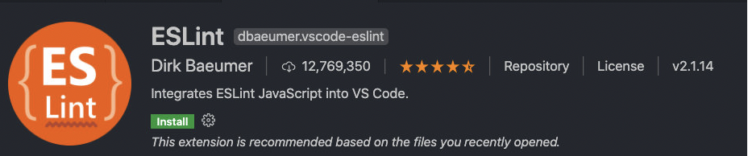
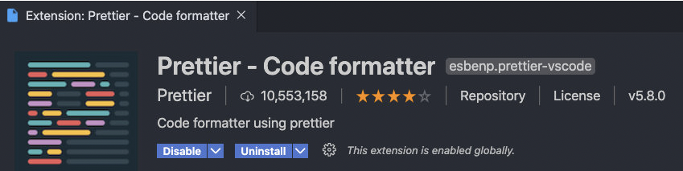
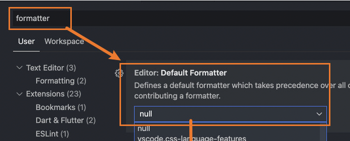

## 认识 ESLint

- ESLint 是一个静态代码工具（Static program analysis，在没有任何程序执行的情况下，对代码进行分析）
- ESLint 可以帮助我们在项目中建立统一的团队代码规范，保证正确、统一的代码风格，提高代码的可读性、可维护性
- ESLint 的规则是可配置的，我们可以自定义属于自己的规则
- 早期还有一些其他的工具，比如 JSLint、JSHint、JSCS 等，目前使用最多的是 ESLint

## 使用 ESLint

安装 ESLint

```bash
yarn add eslint --dev
# or npm install eslint -D
```

创建 ESLint 的配置文件

```bash
npx eslint --init
```

然后选择想要使用的 ESLint

```bash
How would you like to use ESLint? …
  To check syntax only #
❯ To check syntax and find problems
  To check syntax, find problems, and enforce code style
```

执行检测命令

```bash
npx eslint ./src/main.js
```

### ESLint 的文件解析

默认创建的环境如下：

- env：运行的环境，比如浏览器，并且我们会使用 es2021（对应的 ecmaVersion 是 12）的语法
- extends：可以扩展当前的配置，让其继承自其他的配置信息，可以跟字符串或者数组（多个）
- parserOptions：这里指定 ECMAScript 的版本、sourceType 的类型
  - parser：默认情况下是`espree`（也是一个 JS Parser，用于 ESLint），如果我们需要编译 TypeScript，需要指定对应的解释器
- plugins：指定我们用到的插件
- rules：自定义的一些规则

```js
// * 生成的.eslintrc.js
module.exports = {
  env: {
    browser: true,
    commonjs: true,
    es2021: true,
  },
  extends: "eslint:recommended",
  parserOptions: {
    ecmaVersion: 12,
    sourceType: "module", // 选择commonjs的情况下，需要添加该属性，才能使用es module
  },
  rules: {},
};
```

### 规则的配置

一方面我们可以修改代码来修复错误，另外我们可以通过配置规则

格式是：配置名称: 对应的值可以是数字、字符串、数组

- 字符串对应有 3 个值：off、warn、error
- 数字对应有 3 个值：0、1、2（分别对应上面的值）
- 数组我们可以告知对应的提示以及希望获取到的值：比如["error", "double"]

```js
// * 部分规则
module.exports = {
  // 省略上面的
  rules: {
    // 0 => off
    // 1 => warn
    // 2 => error
    "no-unused-vars": 0, // 定义未使用
    quotes: ["warn", "single"], // 使用单引号
    "no-console": 0, // console
    "import/no-extraneous-dependencies": 0, // import或者require的需要在dependency中
  },
};
```

具体可以查看[eslint 网站查询对应的规则](https://eslint.org/docs/rules/)

### ESLint-Loader 的使用

我们在编译的时候，希望进行代码的 eslint 检测，这个时候可以使用`eslint-loader`来完成

```bash
yarn add eslint-loader --dev
# or npm install eslint-loader -D
```

```js
{
  test: /\.m?js$/,
  exclude: /node_modules/,
  use: [
    "babel-loader",
    "eslint-loader"
  ]
}
```

### VSCode 的插件使用

#### ESLint 插件

如果每次都在编译时来进行 eslint 检测，有点麻烦，所以我们可以 VSCode 的插件：`ESLint`

这个插件就会根据你设置 eslint 来进行检测，如果不符合就会给出相应的提示


#### Prettier 插件

ESlint 会帮助我们提示错误（或者警告），但是不会帮助我们自动修复，在开发中我们希望文件在保存时，可以自动修复这些问题，我们就可以选择另外一个工具：`prettier`



我们安装这个插件后我们需要在设置中开启这个配置



同时可以添加一个.prettierrc 的文件，来规定一些项目的格式规范

```json
{
  "printWidth": 100, // 一行宽度超过多少换行
  "singleQuote": true // 单引号
}
```

## Webpack 中配置 vue

### 示例

```js
import App from "./App.vue";
new Vue({
  render: (h) => h(App),
}).$mount("#app");
```

```vue
<template>
  <div class="title">{{ message }}</div>
</template>

<script>
export default {
  data() {
    return {
      message: "Hello World",
    };
  },
};
</script>
<style scoped lang="less">
.title {
  color: red;
}
</style>
```

### 配置 Vue 加载

安装相关的依赖

```bash
yarn add vue-loader vue-template-compiler --dev
# or npm install vue-loader vue-template-complier -D
```

配置 webpack

```js
const { CleanWebpackPlugin } = require("clean-webpack-plugin");
const HtmlWebpackPlugin = require("html-webpack-plugin");
const VueLoaderPlugin = require("vue-loader/lib/plugin");
module.exports = {
  module: {
    rules: [
      {
        test: /\.less/,
        use: [
          "style-loader",
          {
            loader: "css-loader",
            options: {
              importLoaders: 2,
            },
          },
          "postcss-loader",
          "less-loader",
        ],
      },
      {
        test: /\.vue$/,
        use: "vue-loader",
      },
    ],
  },
  plugins: [
    new CleanWebpackPlugin(),
    new HtmlWebpackPlugin({
      title: "SunRain Webpack",
      template: "./index.html",
    }), // 可以在里面传一个对象，title属性就是配置index.html的title
    new VueLoaderPlugin(),
  ],
};
```

- 解析 vue 需要 vue-loader
- vue 的加载需要配置添加**VueLoaderPlugin**
- vue 中的 style 如果是 less，需要添加 less 的配置