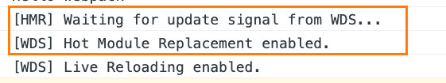
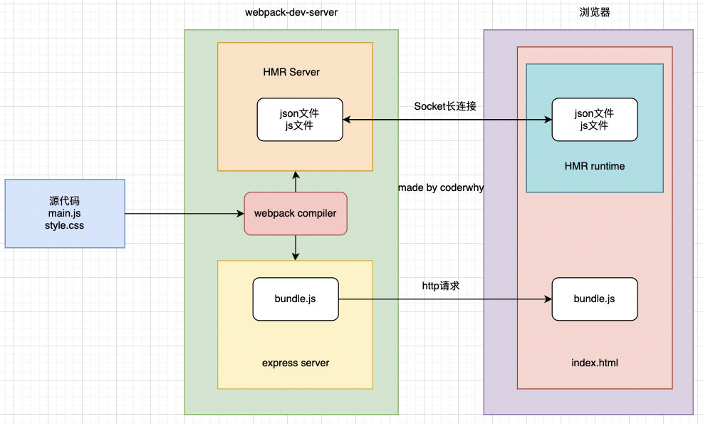
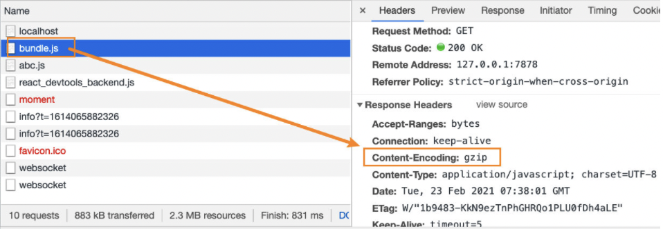
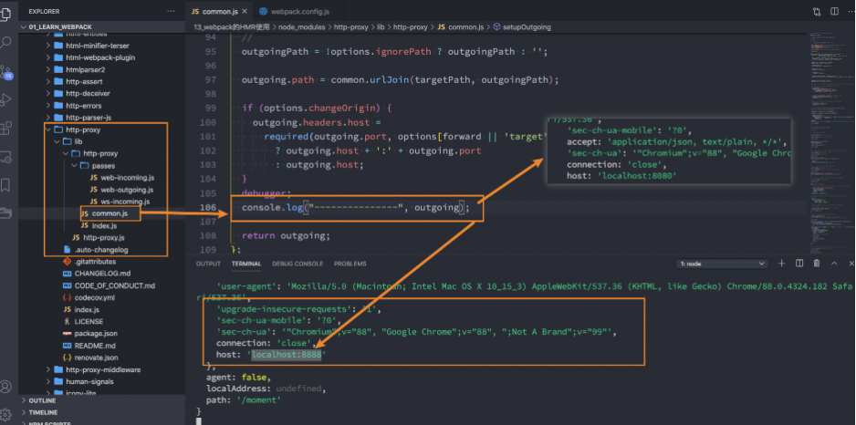

## 本地服务搭建

### 为什么要搭建本地服务器

目前我们开发的代码，为了运行需要两个操作：

- npm run build，编译相关的代码;
- 通过 live server 或者直接通过浏览器，打开 index.html 代码，查看效果;

但是这个过程经常操作会影响我们的开发效率，我们希望可以做到，当文件发生变化时，可以自动的完成编译和展示;
为了完成自动编译，webpack 提供了几种可选的方式:

- webpack watch mode;
- webpack-dev-server;
- webpack-dev-middleware

### Webpack watch

webpack 给我们提供了 watch 模式：

- 在该模式下，webpack 依赖图中的所有文件，只要有一个发生了更新，那么代码将被重新编译
- 我们不需要再手动去`yarn build`

开启 watch 的方式有两种：

- 在导出的配置中，添加 watch: true;

```js
module.exports = {
  watch: true,
};
```

- 在启动 webpack 的命令中，添加 --watch 的标识;

```json
{
  "script": {
    "watch": "webpack --watch"
  }
}
```

但是这种方式效率不高：

- 对所有的源代码都重新进行编译
- 编译成功后，都会生成新的文件（文件操作 file system）
- live-server 属于 VSCode 插件（vim/webStorm） -> 不属于 webpack 给我们的解决方案
- live-serve 每次都会重新刷新整个页面

### webpack-dev-server

上面的方式可以监听到文件的变化，但是事实上它本事是没有自动刷新浏览器的功能的，当然我们目前是可以使用 VSCode 中的`live-server`来完成，但是我们不希望这样，那么我们就可以使用`webpack-dev-server`

安装 webpack-dev-server

```bash
yarn add webpack-dev-server -D
# or npm install webpack-dev-server -D
```

添加一个新的 scripts 脚本

```json
{
  "scripts": {
    "serve": "webpack serve"
  }
}
```

我们直接运行`yarn serve`就可以开启一个服务了

`webpack-dev-server`在编译之后不会写入到任何输出文件。而是将 bundle 文件保留在内存中

- 事实上`webpack-dev-server`使用了一个库叫 memfs（以前使用的是 memory-fs，后来废弃了）

### webpack-dev-middleware

默认情况下，webpack-dev-server 已经帮助我们做好了一切

- 比如通过 express 启动一个服务，比如 HMR（热模块替换）
- 如果我们想要有更好的自由度，可以使用`webpack-dev-middleware`

- `webpack-dev-middleware`是一个封装器(wrapper)，它可以把 webpack 处理过的文件发送到一个 server
- `webpack-dev-server`在内部使用率它，然后它也可以作为一个单独的 package 来使用，以便根据需求进行更多自定义设置

#### 使用 webpack-dev-middleware

安装 express 和 webpack-dev-middleware

```bash
yarn add express webpack-dev-middleware -D
# or npm install express webpack-dev-middleware -D
```

在根目录添加一个 serve.js

```js
const express = require("express");
const webpackDevMiddleware = require("webpack-dev-middleware");
const webpack = require("webpack");

const app = express();

// 加载配置信息
const config = require("./webpack.config");

// 将配置信息传递给webpack进行编译
const compiler = webpack(config);

// 将编译后的结果传递给webpackDevMiddleware，之后的请求webpackDevMiddleware()返回的中间件处理
app.use(webpackDevMiddleware(compiler));

app.listen(8888, () => {
  console.log("服务运行在8888端口~");
});
```

然后使用 node 运行 serve.js，就相当于开启了一个类似于上面的 serve 服务了

## HMR

### 认识模块热替换（HMR）

- HMR 的全称是 Hot Module Replacement，翻译为模块热替换
- 模块热替换是指在应用程序运行过程中，替换、添加、删除模块，而无需重新刷新整个页面

HMR 通过如下方式来提高开发速度：

- 不重新加载整个页面，这样可以保留某些应用程序的状态不丢失
- 只更新需要变化的内容，节省开发的时间
- 修改了 css、js 源代码，会立即在浏览器更新，相当于直接在浏览器的 devtools 中直接修改样式

使用 HMR

- 默认情况下，`webpack-dev-server`已经支持 HMR，我们只需要开启即可
- 在不开启 HMR 的情况下，当我们修改了源代码之后，整个页面会自动刷新，使用的是 live reloading

### 开启 HMR

修改 webpack 的配置

```js
module.exports = {
  hot: true,
};
```

浏览器可以看到如下效果



但是会发现，当我们修改了某一个模块的代码，依然是刷新的整个页面，这是因为我们需要去指定哪些模块发生更新时，进行 HMR

```js
if (module.hot) {
  module.hot.accept("./util.js", () => {
    console.log("util更新了");
  });
}
```

### 框架的 HMR

在开发其他项目时，我们不需要手动去写入`module.hot.accept`相关的 API

- 在 vue 开发中，我们使用`vue-loader`，此 loader 支持 vue 组件的 HMR，提供开箱即用的体验
- 在 react 开发中，使用`react-refresh`，实时调整 react 组件（目前 react 官方已经弃用`React Hot Loader`了）

#### React

使用`react-refresh`来实现 HMR，还需要安装相关依赖`@pmmmwh/react-refresh-webpack-plugin`

```bash
yarn add @pmmmwh/react-refresh-webpack-plugin react-refresh -D
# or npm install @pmmmwh/react-refresh-webpack-plugin react-refresh -D

# 安装react相关
yarn add react react-dom
# or npm install react react-dom

# 安装相关babel
yarn add @babel/core babel-loader @babel/preset-env @babel/preset-react -D
# or npm install @babel/core babel-loader @babel/preset-env @babel/preset-react -D
```

修改 webpack.config.js 和 babel.config.js 文件

```js
// webpack.config.js
const ReactRefreshWebpackPlugin = require("@pmmmwh/react-refresh-webpack-plugin");

module.exports = {
  // 省略
  module: {
    rules: [
      {
        test: /\.jsx?$/,
        loader: "babel-loader",
      },
    ],
  },
  plugin: [
    // 省略
    new ReactRefreshWebpackPlugin(),
  ],
};
```

```js
// babel.config.js
module.exports = {
  presets: [["@babel/preset-env"], ["@babel/preset-react"]],
  plugins: [
    ["react-refresh/babel"], // react要实现HMR需要该plugin
  ],
};
```

编写入口文件

```js
import React from "react";
import ReactDom from "react-dom";
import ReactApp from "./App.jsx";

ReactDom.render(<ReactApp />, document.getElementById("root"));
```

此时运行`yarn serve`就可以启动一个热更新服务

#### Vue

vue 的加载我们需要使用 vue-loader，而 vue-loader 加载的组件默认会帮助我们进行 HMR 的处理

安装所需要的依赖

```bash
# 安装vue
yarn add vue

# 安装加载vue的依赖
yarn add vue-loader vue-template-compiler -D

# 安装对应的loader
yarn add css-loader style-loader babel-loader @babel/core @babel/preset-env
```

配置 webpack.config.js

```js
const VueLoaderPlugin = require("vue-loader/lib/plugin");
module.exports = {
  // 省略
  module: {
    rules: [
      {
        test: /\.vue$/,
        loader: "vue-loader",
      },
      {
        test: /\.css/,
        use: ["style-loader", "css-loader"],
      },
    ],
  },
  plugin: [
    // 省略
    new VueLoaderPlugin(),
  ],
};
```

修改入口文件

```js
import Vue from "vue";
import VueApp from "./App.vue";

new Vue({
  render: (h) => h(VueApp),
}).$mount("#app");
```

然后就可以使用 vue 的热更新服务了

### HMR 的原理

webpack-dev-server 会创建两个服务：提供静态资源的服务(express)和 Socket 服务(net.Socket)

- express server 直接提供静态资源的服务（打包后的资源直接被浏览器请求和解析）
- HMR Socket Server 是一个 socket 的长连接
  - 长连接有一个最好的好处是建立连接后双方可以通信（服务器可以直接发送文件到客户端）
  - 当服务器监听到对应的模块发生变化时，会生成两个文件`.json(manifest文件)`和`.js(update chunk文件)`
  - 通过长连接，可以直接将这两个文件主动发送给客户端（浏览器）
  - 浏览器拿到两个新的文件后，通过 HMR runtime 机制，加载这两个文件，并且针对修改的模块进行更新

下面是 HMR 的原理图



## devServer 的配置

### output 的 publicPath

output 的 path 的作用是告知 webpack 之后的输出目录，比如静态资源的 js、css 等输出到哪里，常见的会设置为 dist、build 文件夹等

output 中海油一个 publicPath 属性，该属性是指定 index.html 文件打包引用的一个基本路径

- 它的默认值是一个空字符串，所以我们打包后引入 js 文件是，路径是`bundle.js`
- 在开发中，我们也将其设置为`/`，路径是`/bundle.js`，那么浏览器会根据所在域名+ 路径去请求对应的资源(域名 + publicPath + bundle.js)
- 如果我们希望在本地直接打开 html 文件来运行，可以将其设置为`./`，路径为`./bundle.js`，可以根据相对路径去查找资源

### devServer 的 publicPath

devServer 中也有一个 publicPath 属性，该属性是指定本地服务所在的文件夹

- 它的默认值是`/`，也就是我们直接访问端口即可访问其中的资源`http://localhost:8080`
- 如果我们将其设置为`/abc`，那么我们需要通过`http://localhost:8080/abc`才能访问到对应的打包后的资源
- 并且这个时候，我们其中的 bundle.js 通过`http://localhost:8080/bundle.js`无法访问
  - 所以必须将**output.publicPath**也设置为`/abc`
  - 官方其实有提到，建议 devServer.publicPath 与 output.publicPath 相同

### devServer 的 contentBase

devServer 中 contentBase 对于我们直接访问打包后的资源其实并没有太大的作用，它的主要作用是如果我们打包后的资源，又依赖于其他的一些资源，那么就需要指定从哪里来查找这个内容

例如：我们在 index.html 中，需要依赖一个 abc.js 文件，这个文件我们存放在 public 文件中

在 index.html 中，我们应该如何去引入这个文件呢？

- 如果通过`<script src="./public/abc.js"></script>`引入，打包后浏览器可能无法通过相对路径去找到这个文件夹
- 我们需要使用`<script src="/abc.js"></script>`，这时就需要设置 contentBase 的值为`contentBase: "/public"`（contentBase 一般设置绝对路径）

如果我们需要监听这些 contentBase 下静态文件的变化，可以这个使用`watchContentBase: true`

## hotOnly 和 host 配置

hotOnly 为 false 时是当代码编译失败时，是否刷新整个页面

- 默认情况下当代码编译失败修复后，我们会刷新整个页面
- 如果不希望重新刷新整个页面，可以设置 hotOnly 为 true

host 设置主机地址：

- 默认值是 localhost
- 如果希望其他地方也可以访问，可以设置为 0.0.0.0

localhost 和 0.0.0.0 的区别：

- localhost：本质上是一个域名，通常情况下会被解析成 127.0.0.1
- 127.0.0.1：回环地址(Loop Back Address)，表达的意思其实是我们主机自己发出的包，直接被自己接收

  - 正常的数据库包经过 `应用层 - 传输层 - 网络层 - 数据链路层 - 物理层`
  - 而回环地址，是在网络层直接就获取到了，是不会经过数据链路层和物理层的
  - 比如我们监听 127.0.0.1 时，在同一个网段下的主机中，通过 ip 地址是不能访问的

- 0.0.0.0：监听 IPV4 上所有的地址，再根据端口找到不同的应用程序
  - 比如：我们监听 0.0.0.0 时，在同一网段下的主机中，通过 ip 地址是可以访问的

### port、open、compress

port 设置监听的端口，默认情况下是 8080

open 是否打开浏览器

- 默认值是 false，设置为 true 会打开浏览器
- 也可以设置为类似于 Google Chrome 等值

compress 是否为静态文件开发区 gzip compression

- 默认值是 false， 可以设置为 true

> 注意浏览器是会自动解析 gzip，将其解压的



### Proxy 代理

proxy 使我们开发中非常常用的一个配置选项，它的目的是设置代理来解决跨域的问题

- 比如我们的一个 api 请求是`http://localhost:8888`，但是本地启动服务器的域名是`http://localhost:8000`，这个时候发送网络请求就会出现跨域的问题
- 我们可以将请求发送到一个代理服务器，代理服务器和 API 服务器没有跨域的问题，就可以解决我们的跨域问题

我们可以对 proxy 进行如下设置

- target：表示的是代理到的目标地址，比如`/api/moment`会被代理都`http://localhost:8888/api/moment`
- pathRewrite: 默认情况下，我们的`/api`也会被写入到 URL 中，如果希望删除，可以使用 pathRewrite
- secure：默认情况下不接收转发到 https 的服务器上，如果希望支持，可以设置为 false
- changeOrigin：它表示十分更新代理后请求的 headers 中 host 地址
  - 我们真是的请求，其实是需要通过`http://localhost:8888`来请求
  - 但是因为使用了代理，默认情况下它的值是`http://localhost:8000`
  - 如果我们需要更改，那么可以将 changeOrigin 设置为 true 即可



### historyApiFallback

historyApiFallback 是开发中一个非常常见的属性，它主要的作用是解决 SPA 页面在路由跳转之后，进行页面刷新时，返回 404 的错误

- boolean 值：默认 false，如果设置为 true，那么在刷新时，返回 404 错误时，会自动返回 index.html 的内容
- object 类型的值，可以配置 rewrites 属性，可以配置 from 来匹配路径，决定要跳转到哪一个页面

事实上 devServer 中实现 historyApiFallback 功能是通过 connect-history-api-fallback 库的: 可以查看[connect-history-api-fallback](https://github.com/bripkens/connect-history-api-fallback) 文档

### resolve 模块解析

resolve 用于设置模块如何被解析

- 在开发中我们会有各种各样的模块依赖，这些模块可能来自于自己编写的代码，也可能来自第三方库
- resolve 可以帮助 webpack 从每个`require/import`语句中，找到需要引入到合适的模块代码
- webpack 使用[enhanced-resolve](https://github.com/webpack/enhanced-resolve)来解析文件路径

webpack 能解析三种文件路径

- 绝对路径：由于已经获得文件的绝对路径，因此不需要再做进一步解析
- 相对路径：在这种情况下，使用`import`或`require`的资源文件所处的目录，被认为是上下文目录；在`import/require`中给定的相对路径，会拼接此上下文路径，来生成模块的绝对路径
- 模块路径：在`resolve.modules`中指定的所有目录检索模块，默认值是['node_modules']，所以默认会从 node_modules 中查找文件，我们可以通过设置别名的方式来替换初始模块路径

确定是文件还是文件夹

- 如果是一个文件：具有扩展名，则直接打包文件，否则将使用 resolve.extensions 选项作为文件扩展名解析
- 如果是一个文件夹：会在文件夹中根据 resolve.mainFiles 配置选项中指定的文件顺序查找
  - resolve.mainFiles 的默认值是['index']
  - 再根据 resolve.extension 来解析扩展名

### extensions 和 alias 配置

extensions 是解析到文件时自动添加扩展名

- 默认值是`[".wasm", ".mjs", ".js", ".json"]`
- 所以如果我们代码中想要添加加载`.vue`或者`.jsx`或者`.ts`等文件时，我们必须自己写上扩展名

alias 可以配置别名

- 当我们项目的目录结构比较深的时候，或者一个文件的路径可能需要 ../../../这种路径片段;
- 我们可以给某些常见的路径起一个别名;

```js
devServer: {
  hot: true
  hotOnly: true, // 代码编译失败时，是否不刷新整个页面
  port: 8000, // 端口
  host: "0.0.0.0", // 主机地址
  open: true, // 启动后是否打开浏览器
  compress: true // 是否使用gzip压缩
  proxy: {
      "/api": {
          target: "localhost:8888",
          pathRewrite: "/",
          secure: false,
          changeOrigin: true
      }
  }
  historyApiFallback: {
      rewrites: [
          { from: /abc/, to: "./index.html" }
      ]
  }
  resolve: {
      extensions: [".js", ".vue", ".json", ".jsx"],
      alias: {
          "@": path.resolve(__dirname, "./src")
      }
  }
},
```