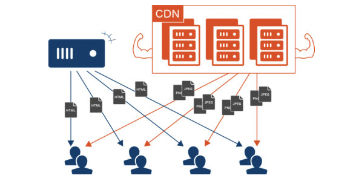

## 环境分离

### 如何区分开发环境

目前我们所有的 webpack 配置信息都放到了一个配置文件中：webpack.config.js

- 当配置越来越多，这个文件会变得越来越不容易维护
- 并且某些配置是在开发环境需要使用的，某些配置是在生成环境需要使用的，当然某些配置实在开发和生成环境都会使用的
- 所以我们最好对配置进行划分，方便我们维护和管理

在启动时区分不同的配置有两个方案

1. 编写两个不同的配置文件，开发和生成时，分别加载不同的配置文件即可
2. 使用相同的一个入口配置文件，通过设置参数来区分它们

```json
// build和serve命令是第一种方案
// build2和serve2命令是第二种方案
{
  "scripts": {
    "build": "webpack --config ./config/webpack.prod.js",
    "serve": "webpack serve --config ./config/webpack.dev.js",
    "build2": "webpack --config ./config/webpack.common.js --env production",
    "serve2": "webpack serve --config ./config/webpack.common.js --env development"
  }
}
```

### 入口文件解析

我们之前编写入口文件的规则是`./src/index.js`，但是如果我们的配置文件所在位置变成了 config 目录，我们是否应该变成`../src/index.js`

- 如果我们这样编写，会发现报错，依然要写成`./src/index.js`
- 这是因为入口文件其实是和另一个属性<font color="green">context</font>有关
  - <font color="green">context</font>的作用用于解析**入口(entry point)**和**加载器(loader)**
  - 官方说法：默认是当前路径（但经过测试，默认应该是 webpack 的启动目录）
  - 我们可以在配置找那个传入一个值
  ```js
  module.exports = {
    context: path.resolve(__dirname, "./"),
    entry: "../src/index.js"
  }
  // 或者
  module.exports = {
    context: path.resolve(__dirname, "../"),
    entry: "./src/index.js"
  ```

### 配置文件的分离

我们创建 3 个文件分别代表通用、开发和生成环境

:::tip 分析

1. 添加一个 paths 模块用于专门处理绝对路径
2. webpack.common.conf.js 会命令行传入的`--env [参数]`来获取一个参数，我们可以在该文件中使用 function 接收这个参数，从而判断当前环境
3. 使用`webpack-merge`来对不同配置进行合并
4. 由于 babel 也可能区分开发和生成环境，我们可以将`webpack.common.conf.js`获取到的 env 的值传入到`process.env.NODE_ENV`中，就可以在 babel 区分生成环境和开发环境

注意：process.env 这个对象的属性被赋值以后会变成字符串
:::

- paths.js

```js
const path = require("path");

// node中的api
const appDir = process.cwd();
const resolveApp = (relativePath) => path.resolve(appDir, relativePath);

module.exports = resolveApp;
```

- webpack.common.conf.js

```js
const HtmlWebpackPlugin = require("html-webpack-plugin");
const VueLoaderPlugin = require("vue-loader/lib/plugin");

const resolveApp = require("./paths");
const { merge } = require("webpack-merge");
const prodConfig = require("./webpack.prod");
const devConfig = require("./webpack.dev");

const commonConfig = {
  entry: "./src/index.js",
  output: {
    filename: "bundle.js",
    path: resolveApp("./build"),
  },
  resolve: {
    extensions: [".js", ".vue", ".json", ".jsx"],
    alias: {
      "@": resolveApp("./src"),
    },
  },
  module: {
    rules: [
      {
        test: /\.css$/,
        use: ["style-loader", "css-loader"],
      },
      {
        test: /\.vue$/,
        loader: "vue-loader",
      },
      {
        test: /\.jsx?$/,
        loader: "babel-loader",
      },
    ],
  },
  plugins: [
    new HtmlWebpackPlugin({
      template: "./index.html",
    }),
    new VueLoaderPlugin(),
  ],
};

module.exports = function(env) {
  const isProduction = env.production;
  process.env.NODE_ENV = isProduction ? "production" : "development";
  // ? process.env这个对象的属性被赋值以后会变成字符串
  const config = isProduction ? prodConfig : devConfig;
  return merge(commonConfig, config);
};
```

- webpack.dev.conf.js

```js
const ReactRefreshWebpackPlugin = require("@pmmmwh/react-refresh-webpack-plugin");

module.exports = {
  mode: "development",
  devtool: "cheap-module-source-map",
  devServer: {
    hot: true,
    hotOnly: true, // 代码编译失败时，是否不刷新整个页面
    port: 8000, // 端口
    host: "0.0.0.0", // 主机地址
    open: true, // 启动后是否打开浏览器
    compress: true, // 是否使用gzip压缩
    proxy: {
      "/api": {
        target: "localhost:8888",
        pathRewrite: {
          "/api": "/",
        },
        secure: false,
        changeOrigin: true,
      },
    },
    historyApiFallback: {
      rewrites: [{ from: /abc/, to: "./index.html" }],
    },
  },
  plugins: [
    // new ReactRefreshWebpackPlugin(),
  ],
};
```

- webpack.prod.conf.js

```js
const { CleanWebpackPlugin } = require("clean-webpack-plugin");

module.exports = {
  mode: "production",
  plugins: [new CleanWebpackPlugin()],
};
```

- babel.config.js

```js
const presets = [["@babel/preset-env"], ["@babel/preset-react"]];
let plugins = [];
// ? 但是我发现好像不用这个plugin也可以使用react的HMR
if (process.env.NODE_ENV === "development") {
  plugins.push(["react-refresh/babel"]);
}

module.exports = { presets, plugins };
```

## 代码分离

### 认识代码分离

代码分离（Code Splitting）是 webpack 一个非常重要的特性：

- 它主要的目的是将代码分离到不同的 bundle 中，之后我们可以按需加载，或者并行加载这些文件
- 例如：默认情况下，所有的 JS 代码（业务代码、第三方依赖、暂时没有用到的模块）在首页全部都加载就会影响首页的加载速度
- 代码分离可以分出更小的 bundle，以及控制资源加载优先级，提供代码的加载性能

webpack 中常用的代码分离有三种：

- 入口起点：使用 entry 配置手动分离代码
- 防止重复：使用`Entry Dependencies`或者`SplitChunksPlugin`去重和分离代码
- 动态导入：通过模块的内联函数调用来分离代码

### 多入口起点

入口起点的含义非常简单，就是配置多入口，例如配置一个`index.js`和`main.js`的入口

```js
module.exports = {
  entry: {
    index: "./src/index.js",
    main: "./src/main.js",
  },
  output: {
    filename: "[name].bundle.js", // 此处的name就对应上面entry的key
    path: resolveApp("./build"),
  },
};
```

### Entry Dependencies(入口依赖)

假如我们的 index.js 和 main.js 都依赖两个库：`lodash`和`dayjs`

- 如果我们单纯的进行入口分离，那么打包后的两个 bundle 都会有一份 lodash 和 dayjs
- 事实上我们可以对他们进行共享，将其打包到一个公用的 js 中

```js
module.exports = {
  entry: {
    index: { import: "./src/index.js", dependOn: "shared" },
    main: { import: "./src/main.js", dependOn: "shared" },
    shared: ["lodash", "dayjs"],
  },
  output: {
    filename: "[name].bundle.js", // 此处的name就对应上面entry的key
    path: resolveApp("./build"),
  },
};
```

### SplitChunks

另外一种分包的模式是**splitChunk**，它是使用`SplitChunksPlugin`来实现的：

- 因为该插件 webpack 已经默认安装和集成，所以我们并不需要安装和直接使用该插件
- 只需要提供 SplitChunksPlugin 相关的配置信息即可

webpack 提供了 SplitChunksPlugin 默认的配置，我们也可以手动来修改它的配置：

- 它的默认配置中`chunks`属性的值是 async（针对异步请求），我们也可以设置为 initial 或者 all(一般会设置为 all)

#### SplitChunks 的其它配置

- Chunks
  - 默认值是 async
  - 另一个值是 initial，表示对通过的代码进行处理 p all 表示对同步和异步代码都进行处理
- minSize：
  - 拆分包的大小，至少为 minSize
  - 如果一个包拆分出来达不到 minSize，那么这个包就不会拆分
- maxSize
  - 将大于 maxSize 的包，拆分为不小于 minSize 的包
  - maxSize 不能小于 minSize，通常相同
- minChunks：
  - 至少被引入的次数，默认值是 1
  - 如果我们取 2，那么引入一次就不会被单独拆分
- name：设置拆包的名称
  - 可以设置一个名称，也可以设置为 false
  - 设置为 false 后，需要爱 cacheGroups 中设置名称
- cacheGroups
  - 对于对拆分的包就行分组，比如一个 lodash 在拆分之后，并不会立即打包，而是会等到有没有其他符合规则的包一起来打包
  - 它是一个数组，可以设置多个，单个的属性如下
    - test 属性:匹配符合规则的包;
    - name 属性:拆分包的 name 属性;
    - filename 属性:拆分包的名称，可以自己使用 placeholder 属性;

### 动态导入

webpack 提供了两种实现动态导入的方式

- 使用 ECMAScript 的 import()语法来完成，也是目前推荐的方式
- 使用 webpack 遗留的 require.ensure，目前已经不推荐了

例如
我们有一个模块 bar.js，该模块我们希望在代码运行过程中来加载它（比如判断一个条件成立时加载）

因为我们并不确定这个模块中的代码一定会永达，所以最好拆分成一个独立的 js 文件

 这样可以保证不用到该内容时，浏览器不需要加载和处理该文件的 js 代码

这个时候就可以使用`动态导入`

> 注意：使用动态导入 bar.js
> 在 webpack 中，通过动态导入获取一个对象，真正导出的内容，在该对象的 default 属性中，所以我们要做一个简单的解构

```js
import("./bar").then(({ default: bar }) => {
  bar();
});
```

#### 动态导入的文件命名

因为动态导入通常是一定会打包成独立的文件的，所以并不会再 cacheGroups 中进行配置；那么它的命名我们通常会在 output 中，通过`chunkFilename`属性来命名

```js
module.exports = {
  filename: "[name].bundle.js",
  path: resolveApp("./build"),
  chunkFilename: "chunk_[id]_[name].js",
};
```

但是我们会发现默认情况下我们获取到的`[name]`是和`[id]`的值是保持一致的，如果我们希望修改 name 的值，可以通过 **magic comments(魔法注释)** 的方式

```js
import(/* webpackChunkName: "bar" */ "./bar").then(({ default: bar }) => {
  bar();
});
```

webpackChunkName 的值就对应 chunkFilename 中的 name

### 代码的懒加载

动态 import 使用最多的一个场景是懒加载(比如路由懒加载):

- 封装一个 component.js，返回一个 component 对象;
- 我们可以在一个按钮点击时，加载这个对象;

```js
// element.js
const element = document.createElement("div)
element.innerHTML = "hello Component"
export default element

// main.js
const button = document.createElement("button");
button.innerHTML = "获取组件";
button.addEventListener("click", () => {
  import(/* webpackChunkName: "component" */ "./element").then(
    ({ default: component }) => {
      document.body.appendChild(component);
    }
  );
});
document.body.appendChild(button);
```

### optimization.chunkIds 配置

optimization.chunkIds 配置用于告知 webpack 模块的 id 采用什么算法生成。

有三个比较常见的值:

- natural：按照数字的顺序使用 id（1， 2， 3）
- named：development 下的默认值，一个可读的名称的 id;
- deterministic：确定性的，在不同的编译中不变的短数字 id
  - 在 webpack4 中是没有这个值的;
  - 那个时候如果使用 natural，那么在一些编译发生变化时，就会有问题;

最佳实践：

- 开发过程，推荐使用`named`
- 打包过程中，推荐使用`deterministic`

webpack 官方也是这样实行的

### optimization.runtimeChunk 配置

配置 runtime 相关的代码是否抽取到一个单独的 chunk 中：

- runtime 相关的代码指的是在运行环境中，对模块进行解析、加载、模块信息相关的代码
- 例如，我们的 component、bar 两个通过 import 函数相关的代码加载，就是通过 runtime 代码完成的

抽离出来后，有利于浏览器缓存的策略：

- 例如：我们修改了业务代码(main)，那么 runtime 和 component、bar 的 chunk 是不需要重新加载的
- 例如：我们修改了 component、bar 的代码，那么 main 中的代码是不需要重新加载的

设置的值：

- true/multiple：针对每个入口打包一个 runtime 文件
- single：打包一个 runtime 文件
- 对象：name 属性决定 runtimeChunk 的名称
  - 可以是字符串
  - 名称的值也可以是一个function：接收一个参数（入口对象），它的 name 就是前面入口配置的属性

```js
module.exports = {
  optimization: {
    // runtimeChunk: {
    //   name: "runtime"
    // },
    runtimeChunk: {
      name: function(entryPoint) {
        return `rain-${entryPoint.name}`;
      },
    },
  },
};
```

### Prefetch 和 Preload

webpack v4.6.0+ 增加了对预获取和预加载的支持

在声明 import 时，使用下面的这些内置指令，来告知浏览器

- prefetch(预获取)：将来某些导航下可能需要的资源
- reload(预加载)：当前导航下可能需要资源

与 prefetch 指令相比，preload 指令有许多不同之处：

- `preload chunk`会在父 chunk 加载时，以并行方式开始加载。`prefetch chunk`会在父 chunk 加载结束后开始加载
- `preload chunk`具有中等优先级，并立即下载。`prefetch chunk`在浏览器闲置时下载
- `preload chunk`会在父 chunk 中立即请求，用于当下时刻。`prefetch chunk`会用于未来的某个时刻

### CDN

CDN 称之为内容分发网络(**C**ontent **D**elivery **N**etwork 或**C**ontent **D**istribution **N**etwork，缩写为 CDN)

- 它是指通过相互连接的网络系统，利用最靠近每个用户的服务器
- 更快、更可靠地将音乐、图片、视频、应用程序以及其他文件发送给用户
- 来提供高性能、可扩展以及低成本的网络内容传递给用户



在开发中，我们使用 CDN 主要是两种方式

- 方式 1：打包的所有静态资源，放到 CDN 服务器，用户所有资源都是通过 CDN 服务器加载的
- 方式 2：只有一些第三方资源放到 CDN 服务器上

#### 购买 CDN 服务器

如果所有的静态资源都想要放到 CDN 服务器上，我们需要购买自己的 CDN 服务器，目前阿里、腾讯、亚马逊、Google 等都可以购买 CDN 服务器

我们可以直接修改 publicPath，在打包时添加上自己的 CDN 地址

```js
// 配置文件
module.exports = {
  output: {
    publicPath: "https://rain.com/cdn/",
  },
};
```

```html
// 打包后的文件
<script
  defer="defer"
  src="https://rain.com/cdn/runtime~main.bundle.js"
></script>
```

### 第三方库的 CDN 服务器

通常一些比较出名的开源框架都会将打包后的源码放到一些比较出名的、免费的 CDN 服务器上

- 国际上使用比较多的是[unpkg](https://unpkg.com/)、[JSDelivr](https://www.jsdelivr.com/)、[cdnjs](https://cdnjs.com/)
- 国内也有一个比较好用的 CDN 是[bootcdn](https://www.bootcdn.cn/)

在项目中引入 CDN

- 在打包的时候我们不需要对类似于 lodash 或者 dayjs 这些库进行打包
- 在 html 模块中，我们需要自己加入对应的 CDN 服务器对峙

具体步骤

1. 通过 webpack 配置，来排除一些库的打包

```js
// webpack.prod.conf.js
module.exports = {
  externals: {
    lodash: "_", // 此处的值是node_modules中包导出的，lodash导出的就是 "_"
    dayjs: "dayjs", // dayjs导出的就是dayjs， 其他的可以去查询
  },
};
```

2. 在 html 模块中，加入 CDN 服务器地址，

```html
<!-- index.html -->
<!-- 我们可以使用ejs语法判断是否为生产环境 -->
<% if (process.env.NODE_ENV === "production") { %>
<script src="https://cdn.bootcdn.net/ajax/libs/lodash.js/4.17.21/lodash.core.min.js"></script>
<script src="https://cdn.bootcdn.net/ajax/libs/dayjs/1.10.6/dayjs.min.js"></script>
<% } %>
```

> 注意：我们一般在测试或者生产环境中使用 CDN，开发环境中使用本地包会更快

还有一个工具[webpack-cdn-plugin](https://www.npmjs.com/package/webpack-cdn-plugin)，可以自动帮你配置cdn
```js
module.exports = {
  // ...
  plugins: [
    new HtmlWebpackPlugin(),
    new WebpackCdnPlugin({
      modules: [
        {
          name: 'vue',
          var: 'Vue',
          path: 'dist/vue.runtime.min.js'
        },
        {
          name: 'vue-router',
          var: 'VueRouter',
          path: 'dist/vue-router.min.js'
        },
        {
          name: 'vuex',
          var: 'Vuex',
          path: 'dist/vuex.min.js'
        }
      ],
      publicPath: '/node_modules'
    })
  ]
  // ...
};
```
```html
<!-- 打包后的结果 -->
<script type="text/javascript" src="https://unpkg.com/vue@2.5.17/dist/vue.runtime.min.js"></script> 
<script type="text/javascript" src="https://unpkg.com/vue-router@3.0.1/dist/vue-router.min.js"></script> 
<script type="text/javascript" src="https://unpkg.com/vuex@3.0.1/dist/vuex.min.js"></script> 
```


### shimming

shimming 是一个概念，是某一类功能的统称：

- `shimming`翻译过来是**垫片**，相当于给我们的代码填充一些垫片来处理一些问题
- 例如：我们现在依赖一个第三方库，这个第三方的库本身依赖 lodash，但是默认没有对 lodash 进行导入（认为全局存在 lodash），那么我们就可以通过`ProvidePlugin`来实现 shimming 的效果

:::warning 注意
webpack 并不推荐随意的使用 shimming

- webpack 背后的整个理念是使用前端开发更加模块化，
- 也就是说，需要编写具有封闭性的、不存在隐含依赖(例如全局变量)的彼此隔离的模块
  :::

目前我们的 lodash、dayjs 都使用了 CDN 进行引入，所以相当于在全局是可以使用\_和 dayjs 的，假如一个文件中我们使用了 axios，但是没有对它进行引入，那么下面的代码就会报错

我们可以通过 ProvidePlugin 来实现 shimming 的效果

- ProvidePlugin 能够帮助我们在每个模块中，通过一个变量来获取一个 package
- 如果 webpack 看到这个模块，它将在最终的 bundle 中引入这个模块
- 另外 ProvidePlugin 是 webpack 默认的一个插件，所以不需要专门导入

```js
module.exports = {
  plugins: [
    new ProvidePlugin({
      axios: "axios", // 匹配的是值
      get: ["axios", "get"], // 表示匹配到get方法，然后添加axios依赖
    }),
  ],
};
```

### MiniCssExtractPlugin

MiniCssExtractPlugin 可以帮助我们将 css 提取到一个单独的 css 文件中，改插件需要在 webpack4+才可以使用

安装 mini-css-extract-plugin

```bash
yarn add mini-css-extract-plugin -D
# or npm install mini-css-extract-plugin -D
```

配置 rules 和 plugins

```js
module.exports = {
  plugins: [
    new MiniCssExtractPlugin({
      filename: "css/[name].[contenthash:8].css",
      chunkFilename: "css/[name].[contenthash:8].css",
    }),
  ],
  module: {
    rules: [
      {
        test: /\.css$/i,
        use: [MiniCssExtractPlugin.loader, "css-loader"],
      },
    ],
  },
};
```

### Hash、ContentHash、ChunkHash

在我们打包的文件进行命名的时候，会使用 placeholder，placeholder 中有几个属性比较相似

- hash、chunkhash、contenthash
- hash 本身是通过 MD4 的散列函数处理后，生成一个 128 位的 hash 值（32 个十六进制）

<font color="red">hash</font> 值的生成和整个项目有关系

- 例如：我们有两个入口 index.js 和 main.js，它们分别会输出到不同的 bundle 文件中，并且在文件名称中我们有使用 hash，这个时候，如果修改了 index.js 文件中的内容，那么 hash 会发生变化，那就意味着两个文件的名称都会发生变化
- 也就是说文件不管是否变化，如果使用`hash`那么每次输出的 bundle 文件的 hash 值都不同

<font color="red">chunkhash</font> 可以有效的解决上面的问题，它会根据不同的入口进行解析来生成 hash 值：

- 例如我们修改了 index.js，那么 main.js 的 chunkhash 是不会发生改变的
- 但是有一个弊端是，如果 index.js 引入了一个其他的文件，那么这个文件的 chunkhash 也会跟随改变
  - 比如我们的 index.js，引入了一个 style.css，style.css 有被抽取到一个独立的 css 文件中;
  - 这个 css 文件在命名时，如果我们使用的是 chunkhash;
  - 那么当 index.js 文件的内容发生变化时，css 文件的命名也会发生变化;

<font color="red">contenthash</font> 表示生成的文件的 hash 名称只和内容有关

- 这就可以解决上面的问题，没有修改的文件的 hash 值就不会变化，这样浏览器就不需要重新加载了
