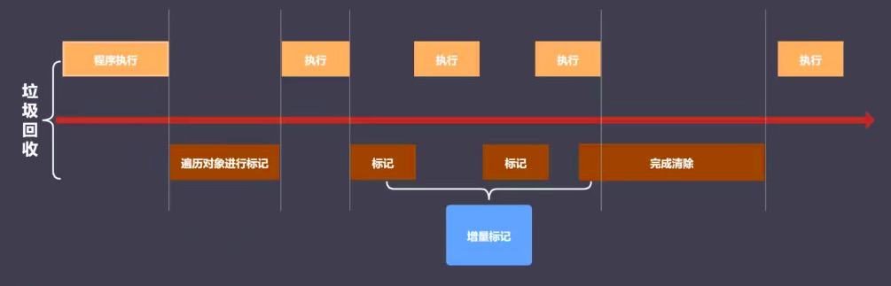

# V8引擎

- V8是一款主流的JavaScript执行引擎，能够高效运转JS
- V8采用即时编译(可以将源码翻译成机器码，执行速度很快)
- V8内存设限(64位1.5G，32位800M)
    + V8针对浏览器设计，现有的内存大小对于web应用足够使用
    + 当垃圾内存达到1.5G时采用增量标记进行垃圾回收只需要50ms，而采用非增量标记则需要1s，就使用1.5g为界限

对于新老生代都可以调整堆内存的大小，具体如下
```
// 新生代(单位kb)
node --max-new-space-size = 2048 xxx.js

// 老生代(单位mb)
node --max-old-space-size = 2048 xxx.js
```

## V8垃圾回收策略

- 采用分代回收的思想
- 内存分为新生代存储区和老生代存储区
- 针对不同对象采用不同的算法

## V8中常用GC算法

- 分代回收
- 空间复制
- 标记清除
- 标记整理
- 标记增量

## V8如何回收新老生代对象

### V8内存分配
- V8内存空间一分为二
- 小空间用于存储新生代对象（32M|16M）
- 新生代指的是存活时间较短的对象


图1 V8内存分配图示

### 新生代对象回收实现

- 回收过程采用复制算法+标记整理
- 新生代内存区分为两个等大空间（使用空间为From，空闲空间为To）
- 活动对象存储于From空间
- 标记整理后将活动对象拷贝至To空间（To中的内存是按顺序从头到尾放置的, 防止碎片化），非存活对象直接回收(From直接回收)
- From与To交换空间完成，From就被闲置，To变成正在使用，如此循环
- 新生代的劣势在于就是只使用了一半的空间，但处理生命周期很短的对象，效率很高

#### 回收细节说明

- 拷贝过程中可能出现`晋升`
- `晋升`就是将新生代对象移动至老生代
- `晋升的条件`
    - 一轮GC还存活的新生代需要`晋升`
    - To空间的使用率超过25%(当to空间使用率超过一定值后，当它变成from空间后，再添加新的对象就会导致空间不足)

### 老生代对象回收

#### 老生代对象说明
- 老生代对象存放在右侧老生代区域
- 64位操作系统中1.4G，32操作系统中是700M
- 老生代对象就是指存活时间较长的对象（全局变量、闭包）

#### 回收实现

- 主要采用标记清除、标记整理、增量标记算法
- 首先使用标记清除完成垃圾空间的回收
- 采用标记整理进行空间优化（一般在出现`晋升`时触发）
- 采用增量标记进行效率优化

#### 细节对比

- 新生代区域垃圾回收使用空间换时间，虽然一分为二，但处理的对象生命周期短，且对象不多，所以效率很高
- 老生代区域垃圾回收不适合复制算法，因为老生代空间比较大且存放的数据多，复制慢且浪费时间和空间

#### 增量标记

由于垃圾回收会阻塞js的运行，增量标记就是将原本一次性做完的标记，拆分成一段一段的执行，让标记和js运行交替执行，也就不会阻塞js的执行

看似程序运行期间停滞了很多次，但每一次标记时间很短，所有间隔很短，不会出现非增量标记时的长时间卡顿的问题


图2 增量标记图示

## V8垃圾回收总结

- V8是一款主流的JavaScript执行引擎
- V8内存设置上限
- V8采用基于分代回收思想实现垃圾回收
- V8内存分为新生代和老生代
- V8垃圾回收常见算法：分代回收、空间复制、标记清除、标记整理、增量标记

