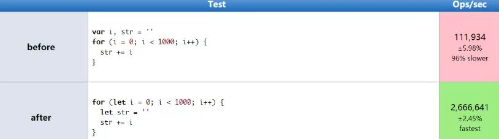
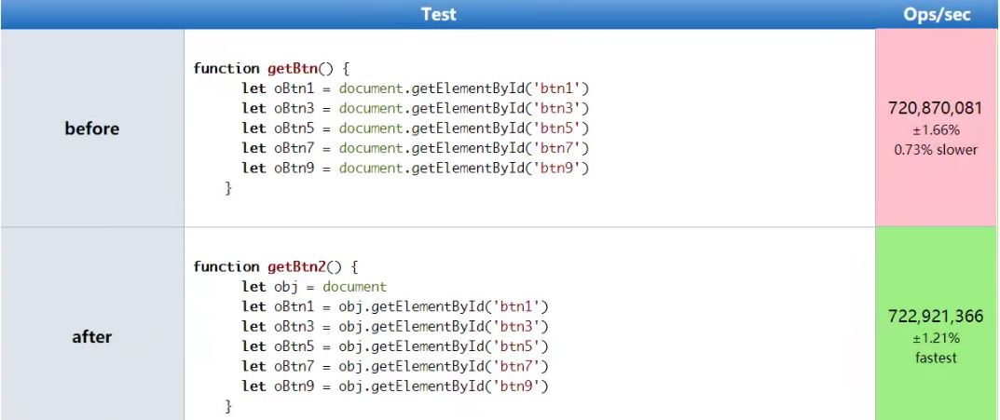
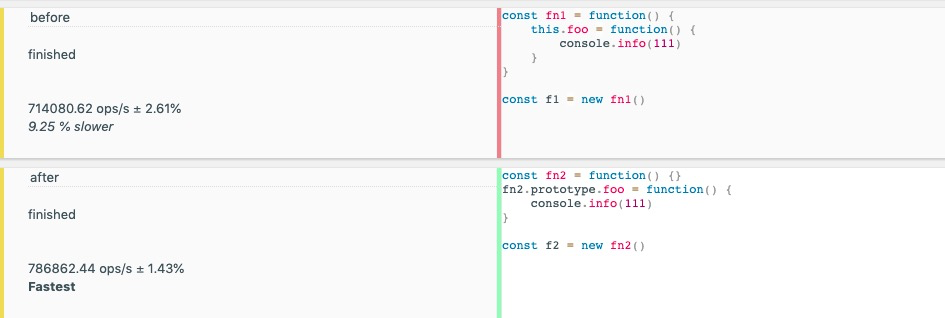
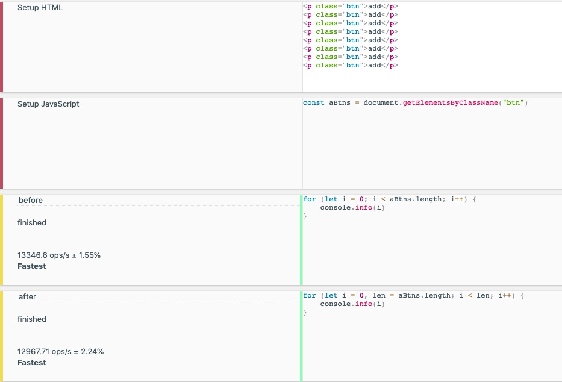
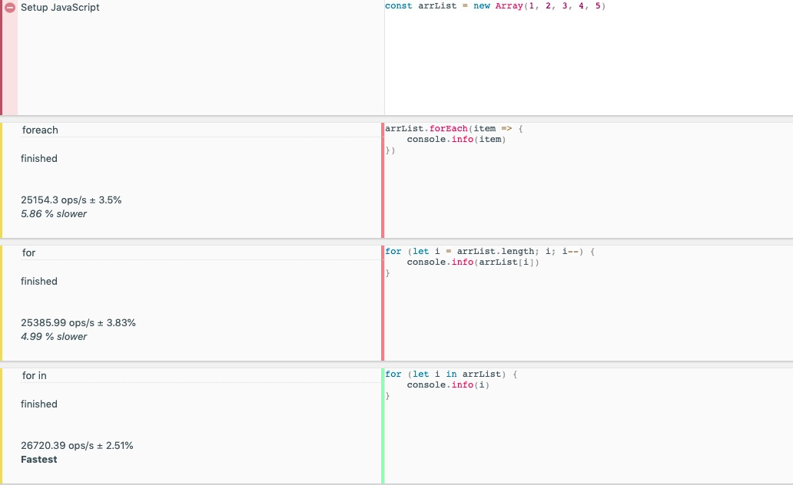

## 如何精准测试JavaScript性能

- 本质上就是采集大量的执行样本进行数学统计和分析
- 作为编码人员无法过多关注数学统计和分析，就使用Benchmark.js的[网站](https://jsperf.com)来完成

### Jsperf使用流程(Jsperf已停止维护，可停止JSBench)

- 使用github账号登录
- 填写个人信息(非必填)
- 填写详细的测试用例信息(title, slug(唯一，会生成空间用来访问测试用例))
- 填写准备代码(DOM操作时经常使用的)
- 填写必要的setup(前置操作，如：打开手机)和teardown(销毁操作，如：释放数据)代码
- 填写测试代码片段

## 慎用全局变量

### 为什么要慎用

- 全局变量定义在全局执行上下文，是所有作用域的顶端
- 全局执行上下文一直存在于上下文执行栈，直到程序退出
    + 这对于GC工作来说也是不利的，因为只要GC发现对象还处于引用状态就不会回收，造成内存的浪费
- 如果某个局部作用域出现了同名变量则会遮蔽或污染全局

> 全局和局部变量的使用示例

```javaScript
// 全局
let i, str = ""
for (i = 0; i < 1000; i++) {
    str += i
}

// 局部

for(let i = 0; i < 1000; i++) {
    let str = ""
    str += i
}
```



图1 性能比较
:::tip
可以看到局部变量的效率远高于全局变量，所以要慎用全局变量
:::

## 缓存全局变量

将使用中无法避免的全局变量缓存到局部

> 示例
```html
<body>
    <input type="button" value="btn" id="btn1">
    <input type="button" value="btn" id="btn2">
    <input type="button" value="btn" id="btn3">
    <p>111</p>
    <input type="button" value="btn" id="btn4">
    <input type="button" value="btn" id="btn5">
    <input type="button" value="btn" id="btn6">
    <p>222</p>
    <input type="button" value="btn" id="btn7">
    <input type="button" value="btn" id="btn8">
    <input type="button" value="btn" id="btn9">
    <p>333</p>
    <script>
        // 缓存前
        function getBtn() {
            let oBtn1 = document.getElementById("btn1")
            let oBtn3 = document.getElementById("btn3")
            let oBtn5 = document.getElementById("btn5")
            let oBtn7 = document.getElementById("btn7")
        }
        // 缓存后
        function getBtn2() {
            let obj = document
            let oBtn1 = obj.getElementById("btn1")
            let oBtn3 = obj.getElementById("btn3")
            let oBtn5 = obj.getElementById("btn5")
            let oBtn7 = obj.getElementById("btn7")
        }
    </script>
</body>
```


图2 缓存全局变量对比图

:::tip
由此可见，当我们在开发中缓存部分全局变量是可取的，性能比不缓存有一定的提升。
:::

## 通过原型新增方法

在原型对象上新增实例对象需要的方法，不需要放在构造函数内部

```javaScript
// 挂载构造函数内部
const fn1 = function() {
    this.foo = function() {
        console.info(111)
    }
}

const f1 = new fn1()

// 挂在原型链上
const fn2 = function() {
}
fn2.prototype.foo = function() {
    console.info(111)
}

const f2 = new fn2()
```

图3 原型新增对比图

:::tip
由此可见，在构造函数中直接使用比放在原型上更慢
:::

## 避开闭包陷阱

### 闭包特点

- 外部具有指向内部的引用
- 在“外“部作用域访问”内“部作用域的数据
- 这个”外“和”内“并不严谨，这个”外“部就是在外部调用父函数，实际上这个函数指向了内部，”内“部调用的是外层函数的变量

```javaScript
// 闭包演示
// 此时外部调用a，就能访问到foo内部的name
function foo() {
    const name = "lg"
    function fn() {
        console.info(name)
    }
    return fn
}
const a = foo()
a()
```

### 关于闭包

- 闭包是一种强大的语法
- 闭包使用不当很容易出现内存泄漏
- 不要为了闭包而闭包

### 闭包陷阱

大量使用无意义的闭包或者代码中无意出现闭包，可能会大量占用内存，造成内存泄漏

```html
<body>
    <button id="btn">add</button>
    <script>
        function foo(params) {
            const el = document.getElementById("btn")
            el.onclick = function() {
                console.info(el.id)
            }
        }
        foo()

        // 上面这个函数就是一个闭包，因为onclick并不在foo作用域下，在点击时调用
        // onclick函数会一直存在，而由于其内部引用的el，那el就一直不会被回收
        // 如果这样的情况很多，对内存的占用就很大，就可能造成内存泄漏

        // 可通过下述解决

        function foo2(params) {
            const el = document.getElementById("btn")
            el.onclick = function() {
                console.info(el.id)
                el = null // 将el置空，只要这样就不会引用document，减少了内存的消耗
            }
        }
        foo2()
    </script>
</body>
```
:::tip
分析上述代码，btn节点存在于DOM中，当我们通过el去引用时，就相当于在内存中引用计数了两次

如果某一时间，DOM中没有了该节点，而onclick中还引用了该节点，那个这个DOM节点就变成了分离DOM，垃圾回收时不会对其进行回收，也就造成了内存泄漏

如果在click中使用了el后将el清空不在引用该DOM节点，那么该节点就会随着DOM的变化来决定是否分配内存
:::

## 避免属性访问方法使用

- JS不需要属性的访问方法，所有属性都是外部可见的
- 使用属性访问方法只会增加一层重定义，没有访问的控制力

> 示例
```javaScript
// 提供成员方法
function Person() {
    this.name = "icoder"
    this.age = 18
    this.getAge = function() {
        return this.age
    }
}
const p1 = new Person()
const a = p1.getAge()

// 直接通过实例访问
function Person2() {
    this.name = "icoder"
    this.age = 18
}

const p2 = new Person2()
const b = p2.age
```
:::tip
由此可见，直接通过实例访问比属性访问方法执行速率快很多，所以推荐直接通过实例访问成员属性，必要时再通过属性访问方法访问
:::

## For循环优化

for循环是一个经常使用的语法结构，很多情况下都需要去遍历实现，所以我们需要对其进行一些诱惑
> 演示，通过具体代码对for循环优化处理
```html
<body>
    <p class="btn">add</p>
    <p class="btn">add</p>
    <p class="btn">add</p>
    <p class="btn">add</p>
    <p class="btn">add</p>
    <p class="btn">add</p>
    <p class="btn">add</p>
    <p class="btn">add</p>
    
    <script>
        const aBtns = document.getElementsByClassName("btn")
        // 方式1
        for (let i = 0; i < aBtns.length; i++) {
            console.info(i)
        }

        // 方式2
        for (let i = 0, len = aBtns.length; i < len; i++) {
            console.info(i)
        }
    </script>
</body>
```

:::tip
方式2较方式1的变化在于将数组的length储存起来，避免每次都去获取

由性能测试可见，方式2将len单独赋值，避免每次获取length的效率更高
:::

## 采用最优循环方式

> 示例分析 forEach、for循环和forin的效率
```javaScript
const arrList = new Array(1, 2, 3, 4, 5)

// foreach
arrList.forEach(item => {
    console.info(item)
})

// for
for (let i = arrList.length; i; i--) {
    console.info(arrList[i])
}

// for in
for (let i in arrList) {
    console.info(i)
}
```

图6 循环比较图示
:::tip
由此可见，三种for循环数组遍历速度： forEach > for > for in
:::
## 节点添加优化

节点的添加操作必然会有回流和重绘

```html
<body>
    <script>
        for (let i = 0; i < 10; i++) {
            let op= = document.createElement("p")
            op.innerHTML = i
            document.body.appendChild(op)
        }

        // 采用文档碎片方式创建虚拟节点
        const fragEle = document.createDocumentFragement()
        for (let i = 0; i < 10; i++) {
            let op= = document.createElement("p")
            op.innerHTML = i
            fragEle.appendChild(op)
        }
        document.body.appendChild(fragEle)
    </script>
</body>
```
分析可见，采用文档碎片优化节点的方式会比直接create和append快一点（差距不大）

## 克隆优化节点操作

```html
<body>
    <p id="box1">old</p>
    <script>
        // 新增
        for (let i = 0; i < 3; i++) {
            let op = document.createElement("p")
            op.innerHTML = i
            document.body.appendChild(op)
        }
        // 克隆
        let oldP = document.getElementById("box1")
        for (let i =0; i < 3; i++) {
            let newP = oldP.cloneNode(false)
            newP.innerHTML = i
            document.body.appendChild(newP)

        }
    </script>
</body>
```

:::tip
方式2较方式1的变化在于将数组的length储存起来，避免每次都去获取

由性能测试可见，方式2将len单独赋值，避免每次获取length的效率更高
:::
将代码分析后可以看出，克隆节点要比新增节点效率高一点点（其实是差不多的）

## 直接量替换Object

```javaScript
const a = [1, 2, 3]
const a1 = new Array(3)
a1[0] = 1
a1[1] = 2
a1[2] = 3
```
将代码分析后可以看出，直接使用字面量创建数组或对象更快，差异很明显

