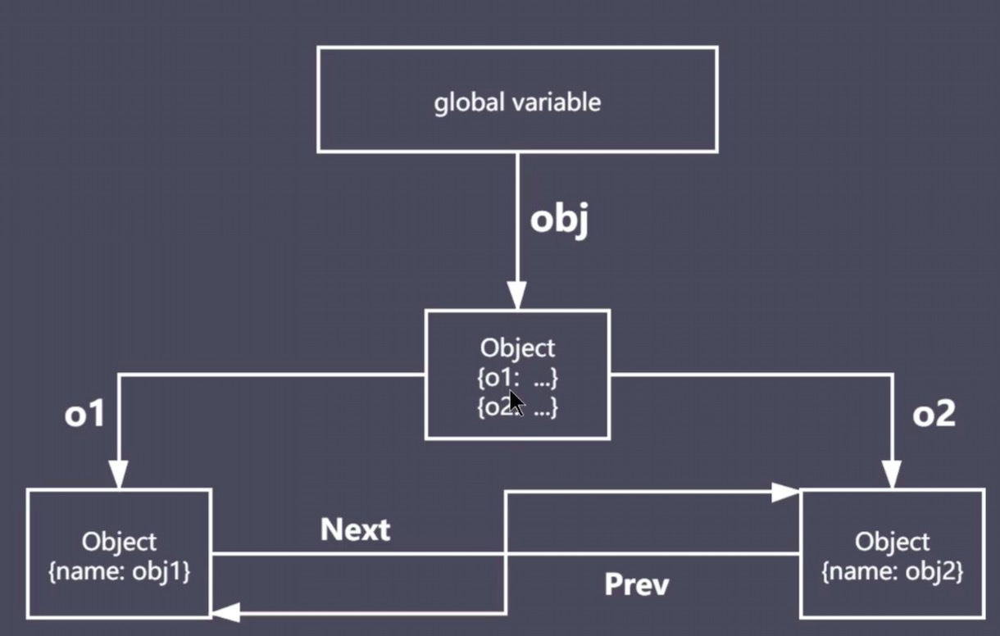
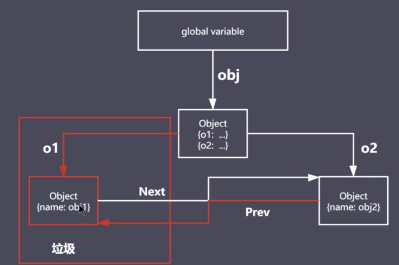

## JavaScript中的垃圾

- JS中的内存管理是自动的
- 当创建一个新的对象(数组、函数等)时，会创建一个新的内存空间，当该对象不再被引用时就会成为垃圾
- 对象不能从根上访问到时就是垃圾

## JavaScript中的可达对象

- 可访问到的对象就是可达对象(引用、作用域链)
- 可达的标准就是从根出发是否能找到
- JavaScript中的根就是可以理解为全局变量对象

## JavaScript中的引用与可达

引用示例如下：

```javaScript
let obj = { name: "rain" }; // 创建了一个rain的空间，相当于当前空间被rain所引用了
// 从全局看obj是可以被全局所找到，即该对象是可达的

let sun = obj // 此时rain的空间就多了一次引用，引用数值就发生了变化(后续引用计数算法中会用到)

obj = null // obj对rain空间的引用断掉了

// 但实际上，它还是可达的，以为sun还在引用obj
```

可达示例如下：

```javaScript
function objGroup(obj1, obj2) {
    // 函数接收两个变量，然后让其互相指引，再返回
    obj1.next = obj2
    obj2.prev = obj1
    
    return {
        o1: obj1,
        o2: obj2
    }
}

let obj = objGroup({ name: "obj1" }, { name: "obj2" })

delete obj.o1 // 断掉obj到o1空间的引用，通过断掉ojb2通过prev对o1空间的引用

console.info(obj)
```

::: tip
分析：通过objGroup({ name: "obj1" }, { name: "obj2" })创建了一个可达对象obj，它有两个属性o1和o2，o1和o2分别指向各自的空间，同时o1通过next属性指向了o2的空间，o2通过prev属性指向了o1的空间，即o1和o2做了一个互相的引用，这样代码里所有的对象都可以通过根去查找，详见图1。
:::


图1

::: tip
分析：当发生delete obj.o1之后，obj通过o1属性指向o1空间的引用就断了，通过obj2通过prev属性指向o1的路也断了。但是o1空间并没有立即清除，在GC垃圾回收开始之前，就无法访问了，如图2所示。
:::


图2

## GC算法

### GC定义与作用

- GC就是垃圾回收机制的简写
- GC可以找到内存中的垃圾、并释放和回收空间

### GC里的垃圾是什么

1. 程序中不再需要使用的对象

```javaScript
function func() {
    name = 'lg'
    return `${name} is a coder`
}

func()

// 当函数调用完成后，name就不再需要了，就会被回收
```

2. 程序中不再访问到的对象

```javaScript
function func() {
    const name = 'lg'
    return `${name} is a coder`
}

func()

// 当函数调用完成后，外部空间无法访问到name，也就找不到它了，就当成垃圾回收了
```

### GC算法是什么

- GC是一种机制，垃圾回收器完成具体的工作
- 工作的内容就是查找垃圾、释放空间、回收空间
- 算法就是工作时查找和回收所遵循的规则


