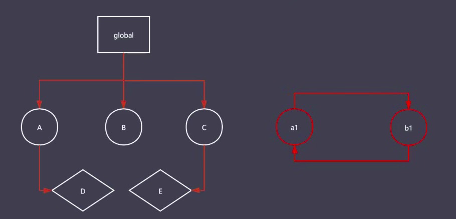
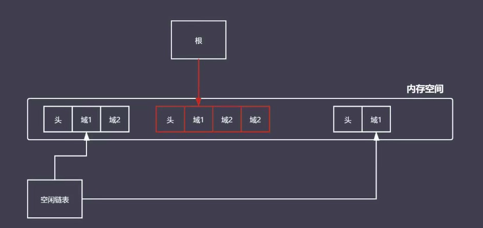
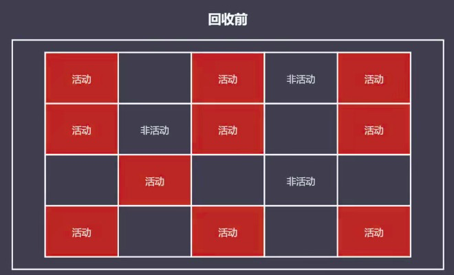
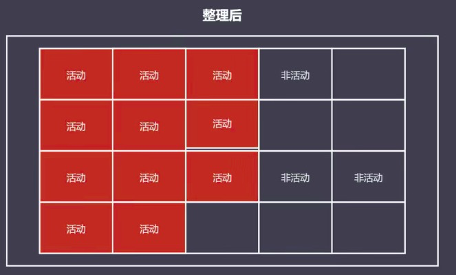
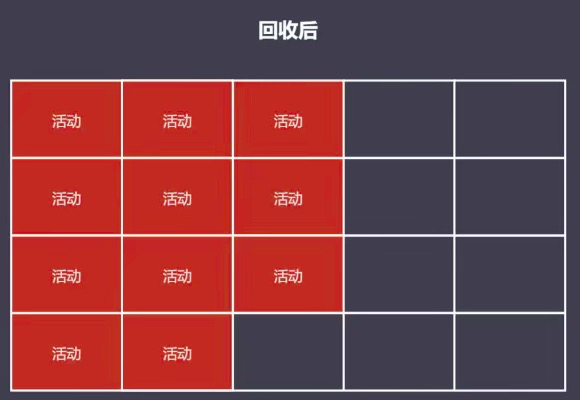

# 常见GC算法

1. 引用计数
2. 标记清除
3. 标记整理
4. 分代回收

## 引用计数算法

+ 核心思想：
    - 设置引用计数，判断当前引用数是否为0，来决定其是否是一个垃圾对象；
    - 当计数变为0，gc就开始对其进行回收释放再使用

- 引用计数器：
    - 引用关系改变时就会修改当前对象对应的引用数值
    - 例如： 代码中一个对象，有一个变量指向它就将它的引用数加1
    - 当引用数字为0时，就立即回收

例如：

```javaScript
const user1 = { age: 11 }
const user2 = { age: 12 }
const user3 = { age: 13 }

const nameList = [user1.age, user2.age, user3.age]

function fn() {
    num1 = 1 // 没有关键字，挂载在window下
    num2 = 2
}

// 在全局作用域下，可以访问user1，user2，user3，num1，num2，它们的引用计数都不是0

// 然后修改fn

function fn() {
    const num1 = 1
    const num2 = 2
    // 此时添加了关键字，num1和num2就不在全局作用域下
    // 当函数执行完毕后，全局作用域下就无法访问num1和num2，其引用计数就变成0，就会被回收
}

fn()

// 当js代码执行一遍后，发现user1、user2、user3都还被userList引用着，就不会回收
```
- 由此可见，引用计数算法就是依赖判断对象的引用计数是否为0来判断是否需要回收，所以缺陷很大

### 引用计数算法的优缺点

#### 优点

- 发现垃圾时立即回收
- 最大限度减少程序暂停
    + 由于堆内存有限，chrome默认限制1.4G
    + 应用程序在执行过程中必然要消耗内存，就会存在内存沾满
    + 引用计数算法时刻监控引用对象，当引用对象的引用计数为0时，就会立即进行是否回收，也就会降低了内存沾满的风险，从而减少程序的暂停

#### 缺点

- 无法回收循环引用的对象
- 时间开销大
    + 时刻监控当前对象的引用数值是否需要修改
    + 引用数值的修改就需要时间，当有很多对象都需要修改引用数值，就会导致时间开销变大

> 循环引用示例

```javaScript
function fn() {
    const obj1 = {}
    const obj2 = {}

    obj1.name = obj2
    ojb2.name = obj1

    return 'lg is coder'
}

fn()
```
:::tip
分析：当fn调用完成后，obj1和obj2就不再在全局访问，此时引用计数就应该为0，但是当我们去找寻obj1准备将其删除时发现，obj2的name属性还在引用着obj1(obj2同理)，就导致了此时obj1和obj2的引用计数不是0，就不会去回收他们，就造成了内存空间的浪费。
:::

## 标记清除算法

+ 核心思想：分标记和清除两个阶段完成
  - 遍历所有可达对象，去标记活动的对象
  - 遍历所有对象清除没有标记的对象
  - 回收相应的空间


图一

:::tip
分析：标记清除算法会从根(global)去找到所有可达的对象，如果该对象有子对象就会递归找到其子对象，进行标记

但是a1和b1是不可达的对象，就不会做标记，就会被GC进行回收
:::

### 标记清除算法的优缺点

#### 优点

- 可以解决循环引用的对象无法回收的问题
    + 由于标记清除算法判断的是该对象是否被标记，图1所示的a1和b1由于不可达，导致没有被标记，所以在回收阶段就会直接被回收，也就解决了循环引用的对象的回收问题

#### 缺点

- 会导致空间碎片化，因为回收的垃圾的对象地址不连续，后续使用时无法一起使用

> 如图例所示


图二

:::tip
分析：
1. 将一个内存空间分为两个部分头(存储空间的源信息，例如：大小)和域(存储对象的信息)
2. 如图2所示，假设将上图看做内存空间的3个部分，A代表根本可达对象空间(中间，已标记)，B和C代表左右不可达的对象空间(左右，为标记)，假设B占两个字的空间和C占一个字的空间，当B和C被垃圾回收后，看似释放了3个字的空间，但是B和C就被A这个3个字空间所分割，导致分配的空间时分散的(地址不连续)，
3. 下一次对象分配空间时，假设一个1.5字空间大小的对象就无法放入C所在的内存空间中，而放入B中却又多了，这就导致了空间的碎片化。
:::

## 标记整理算法

### 标记整理算法原理
- 标记整理可以看做标记清除的增强
- 标记阶段的操作和标记清除一致
- 清除阶段会先执行整理，移动对象位置，再清除没有标记的对象

> 阶段分析





## 常见GC算法总结

+ 引用计数：通过一个对象的引用数值是否归零来决定是否清除
    - 可以即时回收垃圾对象（优）
    - 减少程序卡顿时间（优）
    - 无法回收循环引用的对象（缺）
    - 资源消耗较大，速度较慢（缺）
+ 标记清除：分为标记和清除两个阶段，遍历对象标记活动对象，清除没有标记的对象并取消所以标记
    - 可以回收循环引用的对象（优）
    - 容易产生碎片化空间，浪费空间（缺）
    - 不会立即回收垃圾对象（缺）
+ 标记整理：跟标记清除类似，只是在清除之前先整理空间
    - 减少碎片化空间（优）
    - 不会立即回收垃圾对象（缺）