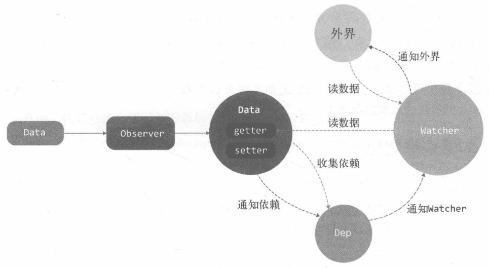

**Vue 最独特的特性之一是看起来并不起眼的响应式系统。 ———— 官方文档**

- **变化侦测**是响应式系统的核心。
- 变化侦测就是侦测数据的变化，当数据发生变化，就通知试图进行更新。

## 什么是变化侦测

- 变化侦测主要解决：在程序内部数据状态变化时，需要通知视图重新渲染，此时如何确定数据变化了
- 变化侦测分为两类：推（push）和拉（pull）
  - 拉：就是当状态变化时，不对比具体是哪个状态变化，直接发信号给框架（有状态发生变化），框架内部收到信号后，进行暴力对比，找出需要重新渲染的 DOM 节点。
  - Angular 和 React 主要采用**拉**的方式；Angular 使用脏检查，而 React 使用虚拟 DOM。
  - 推：即状态发生变化后，通知是哪个状态发生变化。所以**推**知道的信息更多，涉及的颗粒度更细。
  - Vue 就是使用的**推**的方式，而其核心就是响应式。

## 追踪变化

在 JS 中主要用`Object.defineProperty`和`Proxy`来侦测数据的变化，而在 Vue2 中是使用`Object.defineProperty`来完成数据追踪，我们可以定义一个函数来侦测对象的变化

```javascript
function defineReactive(data, key, value) {
  Object.defineProperty(data, key, {
    enumerable: true, // 为true时，该属性才会出现在对象的枚举属性中
    configurable: true, // 为true时，该属性的描述符才能被改变，同时该属性也能从对应的对象上被删除
    get: function () {
      return value;
    },
    set: function (newVal) {
      if (value === newVal) {
        return;
      } else {
        value = newVal;
      }
    },
  });
}
```

应用`defineReactive`方法就可以在读取 data 的 key 时，触发 get 方法，设置 data 的 key 时，触发 set 方法。

## 如何依赖收集

我们之所以要观察数据，是因为我们需要在数据变化时去通知用到该数据的地方，如我们在 template 中使用`value`这个属性，当他变化了就需要通知此处

```html
<template>
  <div>{{value}}</div>
</template>
```

所以我们需要将用到`value`的地方收集起来，在数据变化时通知这些地方，即**在 getter 中收集依赖，在 setter 中触发依赖**

## 依赖收集在哪

我们将每一个 key 的依赖，用数组（dep）进行收集，假设每个依赖是一个函数，将其保存在`window.target`中（将当前依赖存在全局）

```javascript
function defineReactive(data, key, value) {
  let dep = []; // 新增
  Object.defineProperty(data, key, {
    enumerable: true,
    configurable: true,
    get: function () {
      dep.push(window.target);
      return value;
    },
    set: function (newVal) {
      if (value === newVal) {
        return;
      }
      // 新增
      for (let i = 0; i < dep.length; i++) {
        dep[i](newVal, value); // dep[i]是一个函数，传入新增和旧值
      }
      value = newVal;
    },
  });
}
```

在 set 触发时，遍历 dep 数组，来触发依赖。

上诉的代码由于太过耦合，可以将 dep 收集用一个类来实现

```javascript
class Dep {
  constructor() {
    this.subs = [];
  }

  addSub(sub) {
    this.subs.push(this.subs, sub);
  }
  removeSub(sub) {
    remove(sub);
  }
  depend() {
    // 将依赖添加到数组中
    if (window.target) {
      this.addSubs(window.target);
    }
  }
  notify() {
    const subs = this.subs.slice(); // 浅拷贝一下subs
    for (let i = 0; i < subs.length; i++) {
      subs[i].update(); // 更新方法，后续会实现
    }
  }
}
function remove(arr, item) {
  if (arr.length > 0) {
    const index = arr.indexOf(item);
    if (index > -1) {
      return arr.splice(index, 1);
    }
  }
}
```

此时将`defineReactive`进行修改

```javaScript
function defineReactive(data, key, value) {
  const dep = new Dep(); // 新增
  Object.defineProperty(data, key, {
    enumerable: true,
    configurable: true,
    get: function () {
      dep.depend(); // 新增
      return value;
    },
    set: function (newVal) {
      if (value === newVal) {
        return;
      }
      value = newVal;
      dep.notify(); // 新增

    }
  });
}
```

## 依赖是谁（Watcher）

前面假定依赖是一个函数，那么依赖具体是什么，也就是说数据变化时要通知谁

由于使用的地方很多，模板、watch、methods 等中都会使用到数据，我封装一个 Watcher 类来表示依赖

`Watcher`类似一个中介，数据发生变化时通知它，它再通知其它

在 vue 中有一个经典的 watch 使用

```javascript
vm.$watch("a.b.c", function (newVal, oldVal) {});
```

分析实现在 data.a.b.c 变化时，触发第二个参数：我们只需要将 watcher 添加到 data.a.b.c 的 dep 中，在其变化时通知 watcher，watcher 再执行这个函数

```javascript
class Watcher {
  constructor(vm, expOrFn, cb) {
    this.vm = vm;
    // 当执行getter时，就会读取data.a.b.c
    this.getter = parsePath(expOrFn);
    this.cb = cb;
    this.value = this.get();
  }
  get() {
    window.target = this; // 将当前watcher存储再window.target中
    let value = this.getter.call(this.vm, this.vm);
    window.target = null; // 读取后将其置空
    return value;
  }

  update() {
    const oldValue = this.value;
    this.value = this.get();
    this.cb.call(this.vm, this.value, this.oldValue); // 执行第二个参数，并传入新值和旧值
  }
}
// 简单实现parsePath
function parsePath(path) {
  const bailRE = /[^\w.$]/; // 如果以.结尾
  if (bailRE.test(path)) return;
  const temp = path.split(".");
  return function (obj) {
    for (let i = 0; i < temp.length; i++) {
      if (!obj) return;
      obj = obj[temp[i]]; // {a: {b: {c: [value]}}}
    }
    return obj;
  };
}
```

我们在 watcher 的 get 方法中将`window.target`设置为 this，在调用`this.getter`时读取 data.a.b.c，而我们之前将其进行侦听，此时就会触发其 getter，而在`Object.defineProperty`的 getter 中我们会将`window.target`添加到 dep 中，且在 setter 触发时会调用其 update 方法，这样我们就实现了依赖的收集和触发

## 递归侦测所有 key（只针对 Object）

前面只实现了单个属性的侦测，我们需要侦测一个 Object 的所有属性，可以用一个 Observer 类实现。

```javascript
class Observer {
  constructor(value) {
    this.value = value;
    if (!Array.isArray(this.value)) {
      this.walk(value);
    }
  }
  // 在对象为Object时，才会调用walk
  // 该方法将Object的每个属性都添加getter/setter
  walk(obj) {
    const keys = Object.keys(obj);
    for (let i = 0; i < keys.length; i++) {
      defineReactive(obj, keys[i], obj[keys[i]]);
    }
  }
}
function defineReactive(data, key, value) {
  if (typeof value === "object") {
    new Observer(value);
  }
  const dep = new Dep();
  Object.defineProperty(data, key, {
    enumerable: true,
    configurable: true,
    get: function () {
      dep.depend();
      return value;
    },
    set: function (newValue) {
      if (newValue === value) return;
      dep.notify();
      value = newValue;
    },
  });
}
```

- 上诉代码定义了一个 Observer 类，将正常的 Object 变成了一个可侦测的 Object
- 在 Observer 中定义了 walk 方法，该方法专为 Object 服务，可以将 Object 的所有属性添加 getter/setter
- 同时在 defineReactive 中新增`new Observer(value)`来递归子属性，这样整个 Object 的所有属性，包括子属性的属性也会被侦测了

## 关于 Object 的问题

在 vue2 中有些时候数据变化，是侦测不到的

1. 给对象添加一个新的属性

```javascript
new Vue({
  el: "#app",
  data: {
    obj: {},
  },
  methods: {
    action() {
      this.obj.name = "123";
    },
  },
});
```

根据前面的分析，我们会给 obj 的每个属性添加 getter/setter，但是一开始 obj 是没有 name 属性的，我们为其添加 name 属性就无法被监听，所以 vue 提供了`$set`的方式来为对象添加新的属性，这样才能它的变化才能被监听

2. 删除属性

```javascript
new Vue({
  el: "#app",
  data: {
    obj: { name: "aaa" },
  },
  methods: {
    action() {
      delete this.obj.name;
    },
  },
});
```

同理，我们将 obj 的 name 属性删除，但是无法被 Vue 所侦测，就无法监听到它的变化，Vue 提供了`$delete`方法来删除

`Object.defineProperty()`只能侦测数据是否被改变，无法侦测新增和删除，所以会导致以上问题。

## 总结

- 变化侦测就是侦测数据的变化。在数据变化时，侦测其变化并发出通知。
- Object 通过 Object.defineProperty 方法将属性转换成 getter/setter，读取会触发 getter，设置数据就会触发 setter
- 创建 Dep 来完成依赖收集、删除依赖、消息通知等功能
- Watcher 就是依赖，只有 Watcher 触发的 getter 才会收集到 Dep 中，当数据发生变化，就会遍历 Dep 中的 subs，将所有涉及的 Watcher 都通知一遍。
  - Watcher 的原理就是将自己设置到全局指定位置（例如：window.target），然后读取数据，在读取数据时就会触发 getter，而在 getter 中会将其（window.target）收集到 Dep 中，这样 Watcher 就可以主动订阅数据的变化了
- Observer 可以将数据的所有属性转换为响应式的，可以侦测其所有属性的变化。


