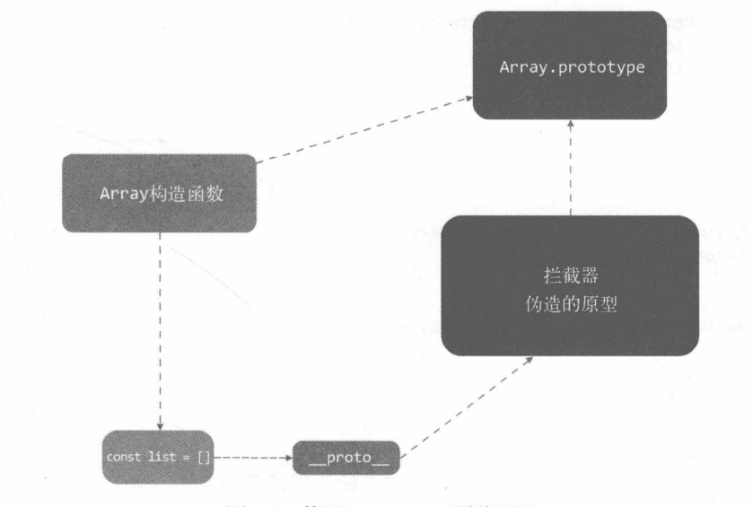
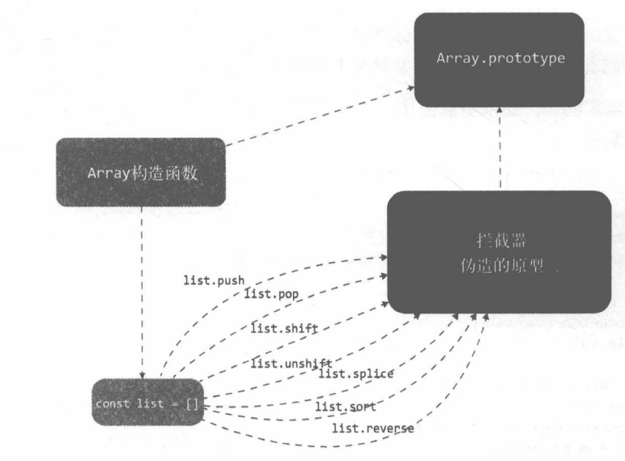

## 拦截器

之前我们是通过给 Object 上的属性添加 getter/setter 来实现侦测，但是由于数组可以调用其原型方法对数组进行改变，我们就无法监听数组的变化。

那么只要用户在使用数组方法时得到通知，可以实现类似 Object 的侦测效果，所以我们需要一个拦截器覆盖 Array.prototype，在我们对数组进行操作时，实际是执行拦截器上的方法实现一些操作，再在拦截器中调用这些数组原始方法

```javascript
const arrayProto = Array.prototype;
export const arrayMethods = Object.create(arrayProto);

// vue主要对这7个方法进行劫持，这也是为什么只有这7种方法改变数组才会触发响应的原因
["push", "pop", "shift", "unshift", "reverse", "splice", "sort"].forEach(
  function (method) {
    // 缓存原始方法
    const original = arrayProto[method];
    Object.defineProperty(arrayMethods, method, {
      value: function mutator(...args) {
        return original.apply(this, args);
      },
      enumerable: true,
      writable: true,
      configurable: true,
    });
  }
);
```

我们使用 arrayMethods 来继承 Array.prototype，它具备 Array.prototype 的所有功能，接着使用 Object.defineProperty 对 arrayMethods 上的 7 大方法进行封装，后面会将 arrayMethods 将 Array.property 覆盖，这样在调用 array.push 时实际调用的是 arrayMethods 上的 push 方法，也就完成了对数据的拦截。

## 使用拦截器覆盖

### 覆盖 Array 原型

定义好了拦截器之后，就需要使用它去覆盖 Array.prototype，但是我们又不能直接覆盖 Array，我们只需要将要监听的数据的原型覆盖就行

```javascript
class Observer {
  constructor(value) {
    this.value = value;
    if (Array.isArray(value)) {
      value.__proto__ = arrayMethods; // 新增
    } else {
      this.walk(value);
    }
  }
}
```

将之前定义的拦截器，赋值给要监听数组的\_\_proto\_\_，就实现对对应数组的原型进行覆盖



## 直接将拦截器挂载在数组的属性上

由于不是所有的浏览器都支持\_\_proto\_\_，那么对于不支持的，可以直接挂在在数组上

```javascript
import { arrayMethods } from "./array";

// 判断是否有__proto__属性
const hasProto = "__proto__" in {};
const arrayKeys = Object.getOwnPropertyNames(arrayMethods); // 获取其属性key数组

class Observer {
  constructor(value) {
    this.value = value;
    if (Array.isArray(value)) {
      const augment = hasProto ? protoAugment : copyAugment;
      augment(value, arrayMethods, arrayKeys);
    } else {
      this.walk(value);
    }
  }
}
function protoAugment(target, src, keys) {
  target.__proto__ = src;
}
function copyAugment(target, src, keys) {
  for (let i = 0; i < keys.length; i++) {
    def(target, keys[i], src[keys[i]]);
  }
}
```

我们通过判断`{}`是否有`__proto__`属性来判断浏览器是否支持`__proto__`，如果支持就直接将其覆盖，如果不支持则使用`copyAugment`方法遍历 7 大方法，然后直接在要监听数组的属性定义方法。



## 收集依赖

上述中我们只实现了数组发生变化以后通过拦截器通知的功能，但是通知的对象却没有。

在 Object 时，我们通过通知 Dep 中收集的依赖 Watcher 来实现，同理数组也是一样，我们在读取数组时，其实也可以通过`Object.defineProperty`来设置 getter/setter，在 getter 中完成依赖的收集，在拦截器中来触发依赖。

我们还需要知道依赖收集列表存在哪，Vue 是将其存在了 Observer 中，因为我们需要在拦截器和 getter 中都能访问到 Dep

name

```javascript
// Observer
class Observer {
  constructor(value) {
    this.value = value;
    this.dep = new Dep();
  }
}
function defineReactive(data, key, value) {
  const childOb = observe(value); // 修改
  const dep = new Dep()
  Object.defineProperty(data, key {
    enumerable: true,
    configurable: true,
    get: function () {
      dep.depend();
      // 新增
      if (childOb) {
        // 数组的依赖收集
        childOb.dep.depend()
      }
      return val;
    },
    set: function (newValue) {
      if (value === newValue) return;
      dep.notify();
      val = newValue;
    }
  })
}
/**
 * 如果value已经存在Observer实例，说明已经被监听，就直接返回
 * 否则就直接创建新的Observer实例，避免重复侦测value的变化
 */
function observe(value) {
  if (!(value instanceof Object)) return;
  let ob
  if (hasOwn(value, '__ob__') && value.__ob__ instanceof Observer){
    // vue会将Observer的实例挂在到观察对象的__ob__属性上，就可以用来判断是否被侦测
    ob = value.__ob__
  } else {
    ob = new Observer(value);
  }
  return ob
}
```

新建 observe 函数来创建 Observer 实例，如果 value 已经存在 Observer 实例，说明已经被监听，就直接返回，否则就直接创建新的 Observer 实例，避免重复侦测 value 的变化。

通过访问Observer实例的dep的depend方法，来为数组进行依赖收集。