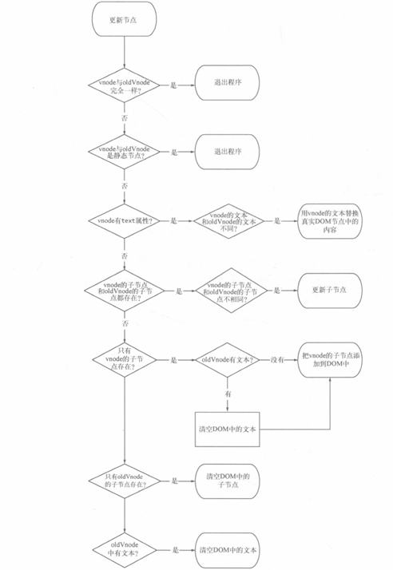
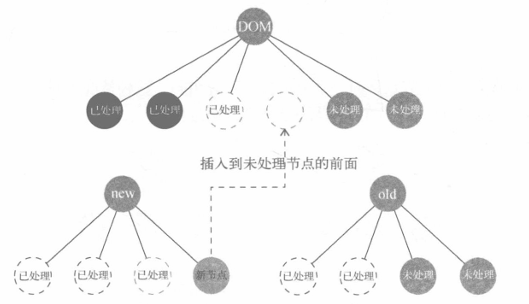

## 虚拟 DOM

虚拟 DOM 是对真实 DOM 节点的抽象，主要用于解决状态发生变化后不需要关心真实 DOM 的变化，解决了频繁的 DOM 操作。

对于 React 和 Angular 来说，由于无法定位状态变化后真实 DOM 的变化，所以引入了虚拟 DOM，而 Vue 是知道哪些节点使用了这个状态，从而可以对这些节点进行更新，Vue1.0 也是这样实现的。

但是由于其粒度太细，每一个绑定都会有一个对应的 watcher 来观察状态的变化，这样会导致内存开销以及依赖追踪的开销很大。因此 Vue2 选择中等粒度，引入了虚拟 DOM，一个状态只会有一个 watcher 来观察，当状态发生变化时通知到组件，组件内部通过虚拟 DOM 进行对比，找出需要变动的真实 DOM，进行修改渲染。

虚拟 DOM 在 Vue.js 中所做的事情主要包括：

1. 提供与真实 DOM 节点所对应的虚拟节点 vnode；
2. 将虚拟节点 vnode 和旧虚拟节点 vnode 进行对比，然后更新视图。

Vue 中通过末班来描述状态与视图之间的映射关系，所以它会将模版编译成渲染函数，然后执行渲染函数生成虚拟节点，最后使用虚拟节点更新视图。

## VNode

vnode 是使用 VNode 类实例化的对象，可以理解成节点描述对象，描述了怎么去创建真实的 DOM 节点。

每次渲染视图时先创建 vnode，使用其创建真实 DOM 插入到页面中，将上一次创建的 vnode 缓存，用作之后重新渲染时与新 vnode 做对比，从而定位到真实 DOM 的变化。

vnode 的类型有以下几种：

1. 注释节点
2. 文本节点
3. 元素节点
4. 组件节点
5. 函数式组件
6. 克隆节点：将现有节点的属性复制到新节点中，让新创建的节点和被克隆节点的属性保持一致，从而实现克隆。它的作用是优化静态节点和插槽节点

## patch

patch 是通过新旧 vnode 之间的对比来实现修改真实 DOM 节点的目的。而 DOM 的修改主要分为三种：

1. 创建新增的节点
   1. oldVnode 不存在，而新的 vnode 存在
   2. oldVnode 和新的 vnode 不同，需要对新 vnode 新增
2. 删除已废弃的节点
   1. oldVnode 存在，而新的 vnode 不存在
   2. oldVnode 和新的 vnode 不同，需要删除 oldVnode
3. 修改需要更新的节点

   1. 如果新节点有子节点而老节点没有子节点，则判断老节点是否有文本内容，如果有就清空老节点的文本内容，然后为其新增子节点。
   2. 如果新节点没有子节点而老节点有子节点，则先删除老节点的子节点，然后设置文本内容。
   3. 如果新节点没有子节点，老节点也没有子节点，则进行文本的比对，然后设置文本内容。
   4. 如果新节点有子节点，老节点也有子节点，则进行新老子节点的比对，然后进行新增、移动、删除的操作，这也就是传说中的 **diff** 算法发生的地方。



### patchNode源码解析

```js
  // diff 的过程
  // 分析当前两个节点的类型
  // 如果是元素，更新双方属性、特性等，同时比较双方子元素，这个递归过程，叫深度优先
  // 如果双方是文本，更新文本
  function patchVnode (
    oldVnode,
    vnode,
    insertedVnodeQueue,
    ownerArray,
    index,
    removeOnly
  ) {
    if (oldVnode === vnode) {
      return
    }
    // 静态节点处理
    // 判断新旧两个虚拟节点是否是静态节点，如果是，就不需要进行更新操作，可以直接跳过更新比对的过程
    if (isTrue(vnode.isStatic) &&
      isTrue(oldVnode.isStatic) &&
      vnode.key === oldVnode.key &&
      (isTrue(vnode.isCloned) || isTrue(vnode.isOnce))
    ) {
      vnode.componentInstance = oldVnode.componentInstance
      return
    }
    
    // 获取双方孩子
    const oldCh = oldVnode.children
    const ch = vnode.children
    // 比较双方属性
    // Vue2在更新元素属性的时候，是暴力全量 diff 更新的。Vue3 则做了很多优化。
    if (isDef(data) && isPatchable(vnode)) {
      for (i = 0; i < cbs.update.length; ++i) cbs.update[i](oldVnode, vnode)
      if (isDef(i = data.hook) && isDef(i = i.update)) i(oldVnode, vnode)
    }
    // 根据双方类型的几种情况分别处理
    if (isUndef(vnode.text)) {// 新节点没有文本
      if (isDef(oldCh) && isDef(ch)) {
        // 双方都有子元素,就进行重排，传说中的 diff 就发生在这里
        if (oldCh !== ch) updateChildren(elm, oldCh, ch, insertedVnodeQueue, removeOnly)
      } else if (isDef(ch)) {
        // 新节点有孩子, 老的没有，新增创建
        if (process.env.NODE_ENV !== 'production') {
          checkDuplicateKeys(ch)
        }
        // 判断老节点是否有文本内容，如果有则先清空
        if (isDef(oldVnode.text)) nodeOps.setTextContent(elm, '')
        // 批量添加子节点
        addVnodes(elm, null, ch, 0, ch.length - 1, insertedVnodeQueue)
      } else if (isDef(oldCh)) {
        // 新节点没有孩子，老的有的，则删除老节点的孩子节点
        removeVnodes(oldCh, 0, oldCh.length - 1)
      } else if (isDef(oldVnode.text)) {
        // 新节点没有文本节点，老的有文本节点，则清空老的文本节点
        nodeOps.setTextContent(elm, '')
      }
    } else if (oldVnode.text !== vnode.text) {
      // 新老节点都是文本节点，则判断新老文本内容是否相同进行文本更新
      nodeOps.setTextContent(elm, vnode.text)
    }
    // 钩子处理
    if (isDef(data)) {
      if (isDef(i = data.hook) && isDef(i = i.postpatch)) i(oldVnode, vnode)
    }
  }

```

## 更新子节点

更新子节点大概分为 4 种操作：更新节点、新增节点、删除节点、移动节点位置

对比新旧两个子节点列表，循环 newChildren，每循环到一个新子节点，就去 oldChildren 种找到和当前节点相同的那个旧节子点。如果找不到，说明当前子节点是由于状态变化而新增的节点，需要进行创建节点并插入视图；如果找到了就更新；如果找到的旧子节点位置和新子节点不同，就需要移动。

### 更新策略

1. 创建子节点

如果在 oldChildren 中没有找到本次循环所指向的新子节点相同的节点，那么说明需要一个新增节点。我们需要执行创建节点的操作，并将新节点插入到 oldChildren 种所有**未处理节点**的前面。

- 插入到未处理的节点的前面的原因：

图 2 中最上面是真实 DOM 节点，左下角是新虚拟节点，右下角是旧的虚拟节点

图 2 中已经对前两个子节点进行了更新，当处理第三个子节点时，在右下角找不到第三个子节点，就需要新增。这是就需要创建并插入到虚线位置，也就是未处理的前面

- 为什么不是插入到已处理的后面

如果插入到已处理的后面就会导致在右侧旧节点中已处理的后面只有两个节点，会导致插入到新增节点的前面



2. 更新子节点

如果新旧两个子节点相同且位置相同，就只需要进行更新操作即可。

3. 移动子节点

当 newChildren 中的某个节点和 oldChildren 中的某个节点是同一个节点，但是位置不同，可以通过`Node.insertBefore()`方法将已有节点移动到指定位置。

对比两个子节点列表是通过从左到右进行处理，那么 newChildren 中当前被循环到的这个节点的左边都是被处理过的，我们只需要将这个旧节点移动到所有未处理节点的最前面即可实现。


4. 删除子节点

当 newChildren 中所有节点都被循环了一遍后，如果 oldChildren 中还有剩余没有被处理的节点，那么这些节点就是被废弃、需要删除的节点。

### 优化策略

通常情况下，新旧子节点的数量位置变化差异不会发生太大变化，如果每一次都去进行循环，会导致性能浪费，所以可以通过 4 种快速查找方式：

- 新前与旧前
- 新后与旧后
- 新后与旧前
- 新前与旧后

在快速查找时，采用双向指针的方式进行查找，即引入四个变量：oldStartIdx（oldChildren 的开始位置下标）、oldEndIdx（oldChildren 的结束位置下标）、newStartIdx（newChildren 的开始位置下标）、newStartIdx（newChildren 的开始位置下标）。并且我们在指针移动时，可以通过判断到还在循环内的就是**未处理的节点**

```js
while (oldStartIdx <= oldEndIdx && newStartIdx <= newEndIdx) {}
```

如果通过这四种方式都没有匹配，那么再采用遍历的方式,即上一节的操作，在未处理的节点中查找匹配对应的节点

1. 新前与旧前

如果新前与旧前是同一个节点，只需要对比进行更新后即可，同时`oldStartIdx++`和`newStartIdx++`；如果不同则向后判断

2. 新后与旧后

如果新后与旧后是同一个节点，只需要对比进行更新后即可，同时`oldEndIdx--`和`newEndIdx--`；如果不同则向后判断

3. 新后与旧前

如果新后与旧前是同一个节点，则需要在对比更新后，将节点移动到 oldChildren 中所有未处理节点的最后面，同时`oldStartIdx++`和`newEndIdx--`；如果不同则向后判断

4. 新前与旧后

如果新前与旧后是同一个节点，则需要在对比更新后，将节点移动到 oldChildren 中所有未处理节点的最前面，同时`oldEndIdx--`和`newStartIdx++`

### vue2 源码 diff 解析

```js
 function updateChildren (parentElm, oldCh, newCh, insertedVnodeQueue, removeOnly) {
    // 4个游标和对应节点
    let oldStartIdx = 0
    let newStartIdx = 0
    let oldEndIdx = oldCh.length - 1
    let oldStartVnode = oldCh[0]
    let oldEndVnode = oldCh[oldEndIdx]
    let newEndIdx = newCh.length - 1
    let newStartVnode = newCh[0]
    let newEndVnode = newCh[newEndIdx]
    // 后续查找需要的变量
    let oldKeyToIdx, idxInOld, vnodeToMove, refElm

    const canMove = !removeOnly

    // 循环条件是游标不能交叉，交叉就结束
    while (oldStartIdx <= oldEndIdx && newStartIdx <= newEndIdx) {
      // 前两个是校正，在之前的比对中可能会删除其中的旧节点，之后就会往前或者往后移动一位
      if (isUndef(oldStartVnode)) {
        oldStartVnode = oldCh[++oldStartIdx] // Vnode has been moved left
      } else if (isUndef(oldEndVnode)) {
        oldEndVnode = oldCh[--oldEndIdx]
      } else if (sameVnode(oldStartVnode, newStartVnode)) {
        // 先查找两个开头节点
        patchVnode(oldStartVnode, newStartVnode, insertedVnodeQueue, newCh, newStartIdx)
        oldStartVnode = oldCh[++oldStartIdx]
        newStartVnode = newCh[++newStartIdx]
      } else if (sameVnode(oldEndVnode, newEndVnode)) {
        // 两个结尾节点
        patchVnode(oldEndVnode, newEndVnode, insertedVnodeQueue, newCh, newEndIdx)
        oldEndVnode = oldCh[--oldEndIdx]
        newEndVnode = newCh[--newEndIdx]
      } else if (sameVnode(oldStartVnode, newEndVnode)) { // Vnode moved right
        // 老的开始节点，新的结尾节点
        patchVnode(oldStartVnode, newEndVnode, insertedVnodeQueue, newCh, newEndIdx)
        // 进行节点移动
        // node.insertBefore(newnode,existingnode) 1.newnode 必需。需要插入的节点对象  2.existingnode 可选。在其之前插入新节点的子节点。如果未规定，则 insertBefore 方法会在结尾插入 newnode。
        canMove && nodeOps.insertBefore(parentElm, oldStartVnode.elm, nodeOps.nextSibling(oldEndVnode.elm))
        oldStartVnode = oldCh[++oldStartIdx]
        newEndVnode = newCh[--newEndIdx]
      } else if (sameVnode(oldEndVnode, newStartVnode)) { // Vnode moved left
        // 老的结尾节点，新的开始节点
        patchVnode(oldEndVnode, newStartVnode, insertedVnodeQueue, newCh, newStartIdx)
        // 进行节点移动
        canMove && nodeOps.insertBefore(parentElm, oldEndVnode.elm, oldStartVnode.elm)
        oldEndVnode = oldCh[--oldEndIdx]
        newStartVnode = newCh[++newStartIdx]
      } else {
        // 首尾没找到
        // 第一次创建一个老的节点的索引 Map，方便后续不需要遍历查找，这是一个空间换时间的方法
        if (isUndef(oldKeyToIdx)) oldKeyToIdx = createKeyToOldIdx(oldCh, oldStartIdx, oldEndIdx)
        // 拿新虚拟DOM开头的第一个节点，去老的虚拟DOM中进行查找
        // 如果我们在模版渲染列表时，为节点设置了属性 key，那么在上面建立的 key 与 index 索引的对应关系时，就生成了一个 key 对应着一个节点下标这样一个对象。
        // 也就是说，如果在节点上设置了属性 key，那么在老的虚拟DOM中找相同节点时，可以直接通过 key 拿到下标，从而获取节点，否则我们就需要每一次都要进行遍历查找。
        // 所以非常推荐在渲染列表时为节点设置 key，最好是后端返回的唯一 ID。
        idxInOld = isDef(newStartVnode.key)
          ? oldKeyToIdx[newStartVnode.key]
          : findIdxInOld(newStartVnode, oldCh, oldStartIdx, oldEndIdx)
        if (isUndef(idxInOld)) { // New element
          // 没找到就进行创建，并且插入到未处理的节点（oldStartVnode.elm）的前面
          createElm(newStartVnode, insertedVnodeQueue, parentElm, oldStartVnode.elm, false, newCh, newStartIdx)
        } else {
          vnodeToMove = oldCh[idxInOld]
          // 找到之后，也要进行判断是否相同节点
          if (sameVnode(vnodeToMove, newStartVnode)) {
            // 递归更新
            patchVnode(vnodeToMove, newStartVnode, insertedVnodeQueue, newCh, newStartIdx)
            oldCh[idxInOld] = undefined
            canMove && nodeOps.insertBefore(parentElm, vnodeToMove.elm, oldStartVnode.elm)
          } else {
            // same key but different element. treat as new element
            // 创建新的节点进行替换
            createElm(newStartVnode, insertedVnodeQueue, parentElm, oldStartVnode.elm, false, newCh, newStartIdx)
          }
        }
        newStartVnode = newCh[++newStartIdx]
      }
    }
    // 循环结束
    // 后续处理工作
    if (oldStartIdx > oldEndIdx) {
      // 老的先结束，判断新的虚拟DOM中是否还有剩下的节点，批量创建
      refElm = isUndef(newCh[newEndIdx + 1]) ? null : newCh[newEndIdx + 1].elm
      addVnodes(parentElm, refElm, newCh, newStartIdx, newEndIdx, insertedVnodeQueue)
    } else if (newStartIdx > newEndIdx) {
      // 新的先结束，判断老的虚拟DOM中是否还剩下，批量删除
      removeVnodes(oldCh, oldStartIdx, oldEndIdx)
    }
  }
```
